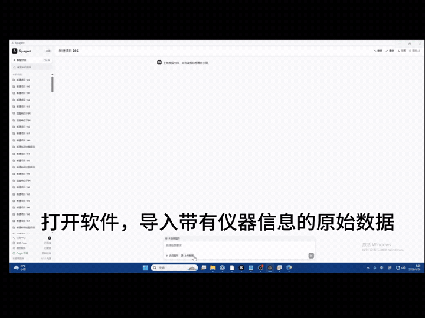
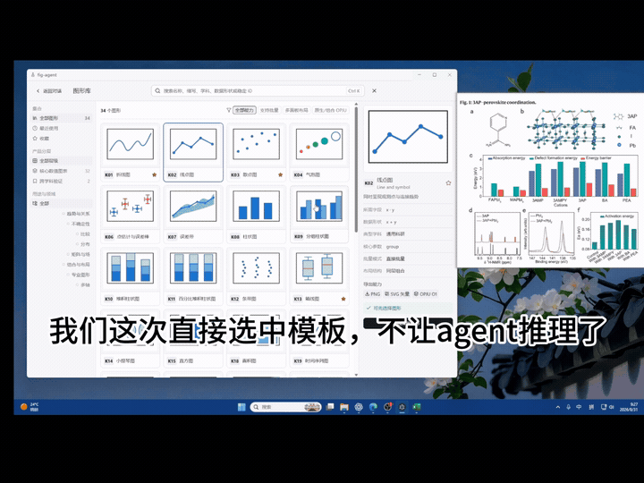
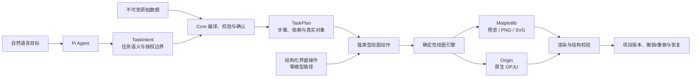

# fig-agent

> 面向科研绘图任务的 Windows 本地 Agent：直接导入原始表格，用图形库或自然语言完成绘图、持续改图，并导出 PNG、SVG 与 Origin 原生可编辑 OPJU。

fig-agent 的核心不是让模型临时生成一段绘图代码，而是提供一套**专门为 AI 调用设计的结构化绘图引擎**。模型负责理解目标、检查数据和形成强类型任务计划；确定性程序负责数据处理、图形执行、版本持久化和结果读回；同一份任务可以落到 Matplotlib 预览和 Origin 原生后端。

**34 种正式单图 · 原始数据直接导入 · 单图/批量/多来源同图 · 自然语言持续改图 · PNG/SVG/OPJU**

[产品网站](https://fig-agent.cn/) · [运行要求](https://fig-agent.cn/#requirements) · [产品决策](docs/PRODUCT-DECISIONS.md) · [系统架构](docs/AGENT-ORCHESTRATION-ARCHITECTURE.md) · [发布证据](docs/PLOTAGENT-RELEASE-COVERAGE-LEDGER.md)

## 实机演示

点击动图可以播放包含声音和完整操作过程的视频。

<table>
  <tr>
    <th>从 XRD 原始数据到 Origin 原生图</th>
    <th>参考论文插图复刻与持续修改</th>
  </tr>
  <tr>
    <td>
      <a href="docs/assets/demo/xrd-workflow.mp4">
        
      </a>
    </td>
    <td>
      <a href="docs/assets/demo/paper-reproduction.mp4">
        
      </a>
    </td>
  </tr>
  <tr>
    <td>导入多份仪器数据，描述叠线与坐标要求，由 Agent 完成绘图并导出 OPJU。</td>
    <td>从论文目标图和公开数据出发，生成初稿，再通过结构化参数持续修改并同步到 Origin。</td>
  </tr>
</table>

## 产品解决什么问题

传统科研绘图往往要求用户先手动整理表格、寻找菜单、反复调整格式，再分别维护预览图和 Origin 工程。fig-agent 将这条流程收敛为一个可持续编辑的项目：

1. 导入 CSV、TSV、TXT、DAT、XLS、XLSX 或 XLSM 原始数据；
2. 选择图形模板，或者直接描述想画什么；
3. Agent 检查数据、必要时请求字段确认，并形成可执行计划；
4. Matplotlib 生成即时预览，后续自然语言和界面修改进入同一图形版本；
5. 导出 PNG、SVG，或生成包含原生工作表和图形对象的 OPJU。

当前正式目录包含 34 种科研单图，覆盖折线、误差、分组柱状、分布、热图、等高线、双 Y 轴、Nyquist 等常见表达。产品支持单图、批量任务和多来源同图，不提供组合图或多面板自由编排。

## 为 AI 调用设计的绘图引擎



这套分工让模型做它擅长的语义判断，让程序承担必须稳定复现的执行责任。

- **模型层**：理解用户目标、选择能力、检查数据充分性、提出受控数据处理和绘图计划。
- **任务协议**：`TaskIntent` 表达目标与授权边界，`TaskPlan` 表达步骤、依赖、确认点和输出对象。
- **绘图引擎**：只接受 Catalog 已声明的强类型参数，不执行任意 Python 或 LabTalk 代码。
- **Matplotlib 后端**：负责快速预览、PNG/SVG 和独立视觉实现。
- **Origin 后端**：使用官方模板和原生对象生成 OPJU，并在保存、重开后读回关键状态。
- **项目运行时**：持久化数据、对话、图形版本和任务状态，支持撤销、重做与中断恢复。

### 为什么不让模型直接生成整段绘图代码

- 同一句修改必须作用于已有图形版本，而不是生成一个无法追踪的新脚本；
- Matplotlib 和 Origin 需要共享语义，同时允许后端采用各自的原生实现；
- 参数是否合法、数据是否充分、导出是否成功，需要程序化校验和读回，而不是依赖模型自述；
- 模型生成的任意代码会扩大数据、文件系统和 Origin 自动化的安全边界。

## 从真实论文任务反推产品能力

项目后期将验证目标从“系统是否按设计运行”调整为“设计是否真的能完成科研绘图任务”。新增能力必须来自真实论文或实际用户任务，并区分：

- 产品能力缺失；
- Agent、Catalog、引擎与后端之间的契约错误；
- 作者公开数据不足；
- 只需受控数据整理即可解决的问题；
- 过于专用、应明确不支持的图形表达。

跨后端视觉审计不从主观参数清单出发，而是逐模板核对 Catalog 已声明参数、同数据的双后端默认外观，以及真实论文提出的新要求。审计记录见 [跨后端视觉契约](docs/CROSS-BACKEND-VISUAL-CONTRACT-AUDIT.md) 和 [真实任务案例台账](docs/REAL-WORLD-CASE-LEDGER.md)。

## 当前验证证据

以下数字来自提交 `840416c` 推送前的本地发布门禁：

| 验证项 | 结果 |
| --- | ---: |
| Python 自动化测试 | 1063 通过 |
| React / Electron 前端测试 | 308 通过 |
| 官网下载流程测试 | 4 通过 |
| TypeScript、ESLint、Electron production build | 通过 |
| K22 跨后端视觉契约首轮实机审计 | 8 / 71 项完成；差异已进入台账 |

完整的 34 图 × 数据 × 编辑 × 导出 × 恢复覆盖关系由生成式台账维护，见 [发布覆盖台账](docs/PLOTAGENT-RELEASE-COVERAGE-LEDGER.md)。这些数字描述工程验证范围，不等同于所有科研场景或所有 Origin 版本均已验证。

## 系统边界

| 当前支持 | 明确不在当前范围 |
| --- | --- |
| Windows 本地桌面应用 | macOS、Linux 与浏览器云端绘图 |
| 34 种正式单图 | 任意组合图、多面板自由编排 |
| 受控数据选择、转换、筛选和排序 | 通用统计分析、拟合与任意代码执行 |
| Matplotlib 预览及 PNG/SVG | 承诺双后端像素级完全一致 |
| Origin 2024（文件版本 10.1.0）原生 OPJU | 其他 Origin 主版本 |
| 结构化 UI 零模型执行、自然语言 Agent 执行 | 用关键词或正则替代模型理解用户目标 |

生成 OPJU 需要本机安装并授权可用的 Origin 2024（文件版本 10.1.0）。其中 OriginPro 2024 SR1（10.1.0.178）已完成完整验证；OriginPro 2024 SR0 与标准版 Origin 2024 不被版本校验拦截，但尚未完成同等范围验证。用户可以在界面中手动选择 Origin 主程序；其他版本会显示真实检测结果并明确提示不兼容，不会伪装成“未安装”。

## 代码结构

```text
src/plotagent/desktop_core   Agent 编排、项目工作流与本地 RPC runtime
src/plotagent/engine         强类型动作、Catalog、数据适配与绘图服务
src/plotagent/engine/backends/matplotlib
                             独立 Matplotlib 渲染器
src/plotagent/engine/backends/origin
                             Origin 官方模板绑定、原生操作与读回
src/main + src/preload       Electron 主进程与安全 IPC 边界
src/renderer                 React 产品界面
schemas                      Task、Agent 与绘图引擎协议
docs                         产品决策、架构、测试与发布证据
```

权威文档入口见 [SPEC-INDEX](docs/SPEC-INDEX.md)。内部 Python 包、协议与历史工程标识继续使用 `plotagent`，用户可见产品名为 `fig-agent`。

## 本地开发

需要 Windows、Node.js 24、pnpm 11 和 Python 3.12。

```powershell
pnpm install
pnpm dev
```

仅在浏览器中检查渲染层：

```powershell
pnpm dev:web
```

Python 环境：

```powershell
python -m venv .venv
.\.venv\Scripts\Activate.ps1
python -m pip install -e ".[dev]"
python -m pytest
```

生产构建与质量检查：

```powershell
pnpm lint
pnpm typecheck
pnpm test
pnpm build
```

Electron 的 `contextIsolation` 和 sandbox 默认开启，渲染层不启用 Node.js 集成。开发态和打包态使用同一受限 `plotagent.desktop_core` RPC runtime，不建立打包专用 mock。

<details>
<summary><strong>Windows 安装包构建与离线校验</strong></summary>

发布环境需要 release 依赖。默认入口只生成明确标记的 unsigned development installer，不会发现或假装使用系统中的证书：

```powershell
python -m pip install -e ".[dev,release]"
pnpm install --frozen-lockfile
.\scripts\release-windows.ps1 -DryRun
.\scripts\release-windows.ps1
```

入口依次构建 wheel、PyInstaller onedir sidecar、Electron/NSIS 和 `release/windows/publish/release-manifest.json`。`.venv`、测试、原始项目数据与 secrets 不在 electron-builder allowlist 中。

```powershell
.\scripts\verify-windows-release.ps1 `
  -ManifestPath .\release\windows\publish\release-manifest.json `
  -AllowUnsignedDevelopment
```

正式签名必须显式提供 PFX、`SecureString` 密码和授权的 timestamp server。严格 verifier 会离线检查 manifest signature、publisher allowlist、文件集合、SHA-256 和 Windows executable 的 Authenticode；本仓库不提交 release 二进制。

</details>

## 使用与许可说明

本仓库当前用于产品研发、技术交流和求职作品集展示，尚未声明开源许可证。论文图片、Origin/OriginPro 名称及其他第三方商标和内容的权利归各自权利人所有；仓库不分发 Origin 安装程序、官方模板或受版权保护的论文原文。
