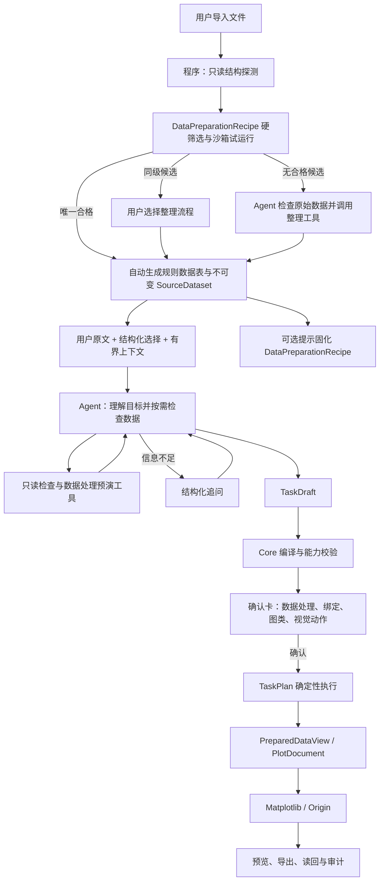

# PlotAgent 程序—Agent 编排架构

> 状态：正式架构与实现合同。
> 适用范围：数据导入与检查、DataPreparationRecipe、自然语言理解、数据处理工具、TaskDraft、TaskPlan、确认、执行与恢复。
> 不改变：34 张正式单图、Matplotlib/Origin 双后端、Origin 原生可编辑产物、T1 公共视觉动作、用户确认与项目版本语义。

相关文档：

- [产品决策](./PRODUCT-DECISIONS.md)
- [产品需求](./PRD.md)
- [Pi Agent 运行时](./PI-AGENT-RUNTIME.md)
- [受控数据准备与单位](./DATA-TRANSFORMS.md)
- [任务运行时](./TASK-RUNTIME.md)
- [Agent Native 绘图引擎](./AGENT-NATIVE-PLOTTING-ENGINE.md)

## 1. 决策摘要

PlotAgent 的边界固定为：

> Agent 负责理解、选择和编排；程序负责读取、验证、执行和留痕。

“程序优先”只表示在数据进入 Agent 前进行廉价、无语义副作用的结构解析，并自动尝试匹配、试运行和复用已经固化的数据整理流程。它不表示程序通过关键词、正则、别名表或字段打分理解用户自然语言。

凡是自然语言请求，都必须将用户原文原样交给 Agent。程序不得先行决定：

- 用户指的是哪个数据源、Sheet、数据块或图形对象；
- 用户要求的图类、字段角色、筛选、排序、转换或单位换算；
- 用户要求的颜色、线型、符号、坐标轴、图例或其他视觉参数；
- 请求属于创建、编辑、批量、同图多源还是失败项修复；
- 哪些自然语言要求可以忽略、替换或降级。

程序可以绕过模型的入口只有两类：

1. 用户直接操作已经结构化的 UI 控件；
2. 原始数据唯一匹配一个已保存、沙箱试运行且输出校验通过的 DataPreparationRecipe。

第二类入口只绕过“原始文件整理为规则数据表”所需的模型调用，不绕过后续自然语言理解、字段绑定、单位换算、图类参数和确认链。用户也可以在多个同级候选中显式选择 Recipe。

## 2. 权威数据流

原始数据和 SourceDataset 永远只读。筛选、排序、reshape、拼接、派生字段和单位换算产生版本化 PreparedDataView，不覆盖输入。

## 3. 程序与 Agent 的职责边界

| 工作 | Agent | 程序 |
|---|---|---|
| 理解自然语言 | 负责 | 不解析、不改写 |
| 解析数据/图形指代 | 负责 | 提供稳定别名、目录和选择状态 |
| 任务拆解与来源—图类映射 | 负责 | 验证对象存在和权限 |
| 字段角色和视觉参数 | 负责提出 | 验证 Profile capability |
| 是否筛选、排序、转换、换单位 | 负责决定 | 不擅自决定 |
| 数据操作计算 | 通过工具提出 | 负责预演与正式执行 |
| 原始数据查看 | 按需调用工具 | 分页、限额、审计、脱敏 |
| 文件编码、Sheet/block、表头候选 | 参考结果 | 机械解析并保留歧义 |
| 单位 | 解释歧义、选择目标单位 | 提取候选、验证量纲、执行换算 |
| 追问 | 决定需要什么业务信息 | 承载结构化问题与续跑状态 |
| 编译、版本、权限、幂等 | 不拥有 | 唯一权威 |
| renderer、Origin、Matplotlib | 不接触 | 确定性执行与读回 |
| 项目提交与导出路径 | 不拥有 | 用户确认和桌面授权后执行 |

模型永远不能输出或执行任意 Python、SQL、JavaScript、Shell、LabTalk、Origin C、文件路径、数据库请求或 renderer 私有参数。

## 4. 数据整理与 Recipe 预匹配

### 4.1 数据整理边界

数据整理只负责把不能直接作为规则数据表消费的原始文件恢复为规则数据表。可以固化的步骤限于不依赖用户绘图语义、可能在其他任务中重复的机械步骤：

- 选择 workbook sheet、TXT/CSV data block 或有效单元格区域；
- 跳过固定仪器说明、空行、页眉和页脚；
- 识别编码、分隔符、decimal mark、表头位置和多行表头；
- 解析数值、日期、缺失值、单位原文和仪器元数据；
- 拆分重复 block/channel/sweep；
- 为恢复原始表格结构所必需的转置或结构整理；
- 输出规则数据表并执行结构校验。

DataPreparationRecipe 不保存也不执行：

- 为某张图选择字段；
- X、Y、group、error、color 等角色绑定；
- 面向绘图目标的筛选、排序、聚合、拼接或长宽转换；
- 目标单位选择与单位换算；
- 派生字段、图类、视觉参数、renderer 或导出动作。

列选择、单位换算等任务语义发生在规则数据表形成之后，由 Agent 决定、程序通过强类型工具执行。原始文件始终只读，Recipe 只产生可追溯的规则数据表和 SourceDataset。

“规则数据表”表示 Agent 可以稳定读取、检查和继续处理的标准结构，不表示已经满足某张具体图的 renderer 合同。它至少满足：

- 数据区域和行列边界明确，结构为可寻址的二维表；
- 每列具有稳定 field ID、原始/显示表头、逻辑类型、单位候选和来源坐标；
- 每行具有稳定 source row ID，并保留原文件、sheet/block/channel/sweep 和原始行坐标；
- 原始行列顺序、缺失值、无法解析值和仪器元数据均被保留或独立记录；
- 一个 sheet/data block 默认形成一张独立表，不自动跨来源合并；
- 表可以保持宽表、长表或矩阵形态，不为了某张图提前改变数据组织。

Agent 默认读取规则表和整理摘要，但可以按需通过有界工具回看原始文件片段、仪器元数据和逐字段来源。Recipe 不得以减少上下文为由切断原始证据。

### 4.2 自动发起

以下事件自动发起一次低成本 Recipe 匹配，不依赖自然语言请求：

- 上传新文件；
- Excel 发现或切换到尚未整理的 sheet；
- TXT/CSV/DAT 发现新的 data block；
- 替换数据源；
- 用户显式选择“重新整理数据”。

程序先生成只读结构探测结果，包括文件类型、编码/分隔符候选、sheet 与 block 目录、前若干行布局、表头候选、列数/逻辑类型分布、单位位置、仪器格式标记和重复数据块形态。探测结果不包含对用户绘图目标的解释。

### 4.3 候选选择

已有 DataPreparationRecipe 按以下确定性流程选择。标准 CSV、普通 Excel 等通用解析器作为低特异性的内置候选参加同一流程，因此“没有用户 Recipe”不等于立即调用 Agent：

1. **硬条件筛选**：按文件类型、容器、分隔符、编码、固定标记、表头行数、数据块形态等排除不兼容项；
2. **特异性排序**：用户为该来源家族固定的 Recipe，高于仪器/导出版本完全匹配，高于表头/单位/布局完全匹配，高于仅有通用格式匹配；
3. **沙箱试运行**：只处理样本或有界范围，检查输出表数量、表头、列数、解析率、错位、误吞数据行和残留说明文本；
4. **确定性决策**：唯一合格候选自动应用；唯一高特异候选优先；多个同级候选交给用户选择；全部失败则由 Agent 接手。

同一 Recipe 家族的版本只能在合同兼容时采用最新稳定版本。历史成功率可以用于诊断和同版本健康度，不能压过结构特异性，也不能让一个结构不匹配的 Recipe 自动执行。

### 4.4 Recipe 合同

DataPreparationRecipe 至少包含：

- `match`：文件格式、固定标记、表头锚点、布局和列结构等适用条件；
- `steps`：定位数据区、跳过前导、解析、拆块、转置或清理空结构的有序机械步骤；
- `validate`：输出表数量、最小有效行、列约束、解析率和必要字段等输出保证；
- Recipe 版本、解析器合同版本、创建来源和用户作用域；
- 每次试运行/正式运行的输入摘要、结果、失败原因和审计事件。

Recipe 不保存具体数据值、具体文件路径、聊天记录、绘图字段绑定或输出位置。初始 Recipe 使用保守匹配合同；扩大适用范围必须形成新版本并经过额外样本验证，不能静默“越用越宽”。

#### 4.4.1 生成与保存时机

当通用解析和已有 Recipe 都不能唯一完成整理时，Agent 或用户通过受控工具得到规则数据表。程序只能从这次 **已经实际成功执行并通过结构校验的整理 trace** 中抽取符合 Recipe 白名单的非语义步骤；不能让模型直接生成任意脚本或把整条 TaskDraft 保存为 Recipe。

规则表预览经用户确认“整理正确”后即可保存 DataPreparationRecipe，不需要等待绘图或导出完成。后续绘图、导出或更多同构文件成功可以登记为验证证据，但不会把字段绑定、单位换算、图类、视觉参数或 renderer 动作追加进 Recipe。

通用解析器已经稳定覆盖的普通格式无需反复提示固化；只有 Agent/用户实际解决了可复用的非平凡数据整理问题时才显示非阻塞保存建议。

#### 4.4.2 初始严格版本与作用域

第一次保存生成严格版本：

- 固定来源格式、关键标记、表头/布局和必要输出保证；
- 允许数据值、日期、样本内容和非合同性行数变化；
- 不从单个样本推断可选标记、宽松通配符或新的来源家族；
- 默认保存到当前用户的个人 Recipe 库；
- 项目只保存 Recipe ID、不可变版本、执行记录和结果引用，并可显式固定版本。

团队共享、发布和信任签名属于后续独立能力，当前不因同名仪器或跨用户文件自动共享。

#### 4.4.3 版本、扩展与健康状态

Recipe 版本不可原地覆盖。修改匹配条件、整理步骤、输出保证或解析器合同必须生成新版本；旧版本和历史运行继续可追溯。

在更多结构样本上成功只增加证据，不自动扩大适用范围。需要支持更宽格式时，UI 展示新增/放宽的 match 条件和验证样本，用户确认后创建新版本。

Recipe 在新来源上沙箱或正式执行失败时：

- 本次立即回退 Agent，不污染原始数据和已有规则表；
- 保存稳定失败原因、来源结构摘要和失败阶段；
- 不自动修改或重写原 Recipe；
- 连续结构性失败达到健康策略阈值后标记为“需检查”，停止自动应用，仍允许用户查看、修订为新版本或退役。

### 4.5 与 renderer 合同的边界

DataPreparationRecipe 以“高质量规则数据表”为目标，不以任何 Profile 或 renderer 为目标。Recipe 可以因为来源格式本身稳定，碰巧把数据整理到只差字段语义绑定即可绘图的程度，但不得为了满足某个 renderer 执行图类相关操作。

用户选定图类后，程序可以对规则数据表执行廉价的 **Profile 机械兼容性检查**，只报告：

- 可用字段数量、逻辑类型和单位量纲；
- 表结构、矩阵形态和行列规模；
- Profile 所需 required/optional/repeatable role 的机械约束；
- 是否不经 reshape 即存在类型兼容的绑定可能；
- 哪些确定性数据操作可能需要由 Agent 进一步决定。

机械兼容性检查不得指定哪个字段是 X/Y/group/error，不得决定目标单位，不得选择筛选、排序、聚合、拼接、长宽转换或派生字段。Agent 结合用户原文、规则表和兼容性结果完成语义绑定；Core 再编译为 EngineDataView 和 renderer 合同。

因此数据合同分为三层：

1. `DataPreparationContract`：原始文件到 Agent 可读规则表；
2. `ProfileInputContract`：Agent 决定字段角色和必要 DataOperation，程序校验；
3. `RendererContract`：Core 编译后的完整 EngineDataView 与公开绘图参数。

### 4.6 正确性、稳定性、时长与成本控制

- Recipe 只允许白名单内无语义、默认无损且可追溯的操作；图类相关、破坏性或不可逆操作没有进入 Recipe 的 Schema 表达。
- 匹配优先固定标记、表头锚点和布局条件，不把一次文件的固定行号、具体值或偶然行数当主要依据。
- 先索引/硬筛选，再对最多若干高特异候选做有界样本试运行；候选未通过不得全量执行。
- 同一输入 hash、Recipe 版本和解析器合同可以复用已验证结果；任一版本或来源结构变化必须重新校验。
- 每个输出表、字段和行保存来源血缘；原始文件与原始顺序不变，用户可查看步骤并撤销派生结果。
- 格式漂移、多个同级候选和输出保证失败均稳定回退 Agent，不使用猜测性 fallback。
- 同一输入与同一合同的输出 hash 必须稳定；自动误匹配在冻结对抗样本中必须为零。
- Recipe 的本地匹配/试运行开销必须显著小于一次模型整理调用；标准输入、成功 Recipe 和重复输入均应零模型完成数据整理。

### 4.7 无 Recipe 时的廉价程序处理

导入器可以在模型调用前完成：

- 文件解码、分隔符和 decimal mark 候选；
- workbook/sheet、TXT block、preamble/postamble 与数据区域候选；
- 显式表头、逻辑类型、缺失与有限性统计；
- 稳定 source/field/row ID、内容 hash 与来源坐标；
- 单位行、括号/方括号单位和仪器元数据中的明确单位；
- 列名后缀中的低置信单位候选及其原文位置。

这些输出都是事实或候选，不是业务解释。存在多个合理解析时保留候选，交给 Agent 或用户确认；不得为了得到唯一结果静默改名、删行、排序、聚合或换单位。Agent 成功完成数据整理后，系统可以提示用户把本次非语义机械步骤固化为 DataPreparationRecipe；未经确认不得保存。

单位大小写必须保留。`MΩ` 与 `mΩ`、`Pa` 与其他大小写组合不得经 `casefold` 合并。`value_m`、`sample_g` 等后缀只形成候选，不能直接确认为单位。

### 4.8 多文件、Sheet 与数据块

DataPreparationRecipe 以一个上传文件容器作为匹配和执行单位，因为编码、仪器/导出标记、preamble/postamble、sheet 目录和 block 边界属于文件级结构。一个 Recipe 可以从同一文件提取多张规则表，但每个 sheet/block/channel/sweep 默认生成独立 SourceDataset；Recipe 不得自动合并这些输出。

多文件导入时，每个文件独立完成探测、候选筛选、沙箱和正式整理。一个文件失败不得回滚其他文件已经验证通过的 SourceDataset；失败文件单独回退 Agent 或提出最小问题。

Agent 获得稳定来源目录，例如 `文件 > Sheet`、`文件 > Block`，以及每张规则表的行列数、schema、单位、质量摘要和预览。文件之间、sheet/block 之间与用户所说数据 A/B/C 的关系由 Agent 根据原始 instruction 和可见来源证据决定，程序和 Recipe 不猜测。

“每张表分别画图”“每份数据各画同一种图”由 Agent 拆成独立 TaskItem。“多份数据绘在同一张图”由 Agent 显式提出同构拼接或 Profile 支持的多来源绑定，程序验证字段结构、逻辑类型、单位、来源分组和重复键策略，并在确认卡展示结果。跨文件 Recipe、自动 join、自动聚合和隐式合并不属于数据整理能力。

## 5. Agent 上下文

WorkflowContext 必须包含：

- 用户原始 instruction，禁止前端或 Core 改写；
- 项目内有权访问的数据源目录及稳定 source alias；
- 用户显式选择的数据源、图类和图形对象，作为结构化硬约束；
- 字段目录、逻辑类型、单位候选及候选来源；
- 当前图形的 profile、版本和公开语义对象；
- 上一 TaskPlan、失败项和稳定错误（适用时）；
- 允许的图类、数据操作、视觉动作、工具与预算。

结构化选择是 Core 可强制执行的硬约束。自然语言要求由 Agent 解释，并完整展示在确认卡中。Core 不通过第二套自然语言解析器声称验证“模型是否理解了用户”；语义忠实度由确认卡、冻结评测和黑盒测试证明。

### 5.1 默认最小上下文

任务开始时不把整个数据文件注入模型。每个用户选中或任务直接相关的规则 SourceDataset 默认提供：

- 安全来源名称（例如 `文件 > Sheet/Block`）、行列数和质量摘要；
- 字段安全 alias、原始/显示名、逻辑类型、单位候选及置信来源；
- 默认前 5 行只读预览；
- DataPreparationRecipe 名称/版本和机械整理摘要；
- 用户选定 Profile 的机械兼容性检查结果；
- 原始来源和仪器元数据可通过哪些工具继续查看。

未被用户选中或批量目录中的其他表默认只提供来源名称、schema 摘要和规模，不附带行数据。预览行数是产品默认值，不是能力上限。

### 5.2 渐进读取

Agent 信息不足时按需调用工具查看连续范围、确定性样本、字段统计、值搜索、schema 差异、仪器元数据、原始文本行/Excel 区域和 Recipe 前后来源对应。小表可以在读取预算内分页读完；大表优先 profile、采样和局部范围；批量任务按具体 TaskItem 读取，不把所有来源一次展开。

Agent 始终可以回看完成判断所需的原始证据，但默认上下文保持最小。达到 WorkflowBudget 或数据披露预算后，Agent必须提出最小问题或明确停止，不能在证据不足时继续猜测。

### 5.3 数据出境与审计

- 工具只接受安全 alias，不返回本机路径、凭据或导出位置；
- 每次披露记录来源、字段、行/单元格范围、scalar/字符串数量和调用目的；
- 用户可以查看“本次 Agent 读取了哪些数据”；
- 使用远程 Provider 时，只发送本轮上下文和工具实际返回的片段，并遵守项目的数据出境授权；
- 原始文本、仪器说明、列名和单元格值全部视为不可信数据证据，不能成为系统指令、工具调用或权限来源；
- 同一 WorkflowRun 内可以缓存已经确定性计算的 schema/profile/采样结果，避免重复 I/O，但缓存不扩大模型可见范围。

## 6. Agent 工具

### 6.1 只读检查

- `list_sources`
- `inspect_source`
- `preview_rows`
- `read_range`
- `sample_rows`
- `profile_field`
- `search_values`
- `compare_schemas`
- `inspect_instrument_metadata`

工具只接受安全别名，不接受路径。每次调用限制行、列、字符串和 scalar 数，并记录披露审计。小数据可分页读完；大数据优先 profile、采样和局部范围。`read_range` 同时支持规则表范围及有来源血缘的原始文本/Excel区域，但不得绕过项目授权读取任意文件。远程 Provider 使用原始数据工具前必须遵守产品的数据出境授权。

### 6.2 数据处理预演

- `preview_select_fields`
- `preview_filter_rows`
- `preview_sort_rows`
- `preview_rename_field`
- `preview_derive_column`
- `preview_convert_unit`
- `preview_reshape_long_to_wide`
- `preview_reshape_wide_to_long`
- `preview_concatenate_sources`

预演工具返回输入/输出 schema、前几行、行列变化、单位变化、警告和规范化 DataOperation；不登记 PreparedDataView、不修改项目版本。Agent 确认结果后把规范化操作写入 TaskDraft。正式执行在用户确认后由同一实现完成，预演与正式执行不得使用两套算法。

`derive_column` 只允许登记过的类型化算子，不接受自由公式。`convert_unit` 只允许注册表内量纲兼容的转换；比例与仿射单位均由程序计算，模型不能提供任意换算因子。

Agent 的数据权限分为三层：

1. **自由预演**：在 WorkflowBudget 和数据披露预算内，Agent 可以自行调用登记的选择、重命名、单位换算、筛选、排序、reshape、同构拼接和派生字段预演，不需要逐次打断用户；预演零项目副作用。
2. **集中确认后执行**：字段选择、显示名、量纲明确的单位换算、无损 reshape、稳定排序和同构纵向拼接可以与 FieldMapping、图类和视觉参数一起进入同一最终确认卡；确认后才生成 PreparedDataView。
3. **重点提示或关闭**：行筛选必须显示谓词、纳入/排除行数和预览；去重、隐式聚合、缺失值填补、异常值删除、任意 join、平滑、标准化、拟合、自由公式和任意代码当前不开放。Agent 不得用多个低风险工具组合出等价的未开放高风险操作。

“低风险”只表示可以合并确认，不表示静默执行。任何正式 DataOperation 都产生新的不可变 PreparedDataView、完整操作序列和来源血缘，不覆盖规则 SourceDataset。

### 6.3 规划与对话

- `validate_task_draft`
- `submit_task_draft`
- `ask_user`

`ask_user` 产生最多四个结构化问题并暂停同一 WorkflowRun；用户回答后续跑，不新建无关任务。验证失败时 Agent 可以在预算内修订 Draft，但不得产生项目副作用。

DataPreparationRecipe 的候选检索、试运行和固化建议属于导入/整理服务，不是 Pi 的绘图规划工具。程序只能从已经实际成功的机械整理 trace 生成候选 Recipe，UI 经用户确认后保存。

## 7. TaskDraft 与确认

TaskDraft 是确认前唯一计划真值，每个 TaskItem 独立保存：

- create、visual edit 或 data rebind/update 的任务种类；
- source alias、目标 plot alias 和依赖；
- DataOperation；
- 字段绑定；
- profile；
- 公共视觉动作；
- Agent 对用户要求的简明解释和需要用户注意的警告。

当前图的数据更新不能伪装成纯视觉 edit。应创建派生 PreparedDataView 和新的 PlotDocument 版本，保留旧版本以支持撤销。

确认卡逐项展示数据预演、字段绑定、图类、视觉动作、单位变化和输出。用户确认前不创建图、不登记派生数据、不导出文件、不增加项目 revision。

## 8. Core 的确定性权威

Core 负责且只负责结构化校验：

- source/field/plot/profile alias 的存在性和授权范围；
- project revision、plot version 与幂等键；
- 图类 required/optional/repeatable roles；
- DataOperation Schema、数据类型、量纲、有限性与结果 schema；
- T1 visual action 和语义对象 capability；
- 依赖图、任务数量、预算和输出权限；
- TaskPlan 编译、确认、事务执行、部分失败、重试和恢复。

Core 不解析用户文本来补充、修正或否决模型的语义解释。能力目录没有的动作通过结构化校验拒绝，无需关键词黑名单。

图类不可分割的固定计算必须二选一：

1. 作为真实 DataOperation 执行并生成可追溯结果；或
2. 作为 Profile 固定渲染合同自动执行。

不得保留 Schema 中可提交、执行器却 `pass` 的名义动作。

## 9. 成本和预算

所有自然语言请求进入同一 Agent 运行时。成本通过“Agent 是否实际调用工具和追加轮次”自然分级，不通过程序先理解文本来选择路由：

- 简单请求：Agent 一轮直接提交 Draft；
- 需要事实：Agent 调用只读或预演工具；
- 信息不足：Agent 追问；
- Draft 被拒：在预算内修订；
- 达到预算：提出一个合并后的最小问题或明确停止。

Core 只依据结构规模、Provider 上限和产品策略设置硬预算，不根据自然语言关键词判定复杂度。

## 10. DataPreparationRecipe

成功形成规则数据表后，UI 可提示：

> 如果经常导入类似格式的数据，可以固化本次数据整理流程，以减少后续等待和模型调用。

未经用户明确确认不得保存。保存后也不得依据自然语言 token 相似度匹配；匹配只使用来源结构合同。正确流程为：

1. 程序在上传或来源变化时生成只读结构探测；
2. 按硬条件、特异性和版本筛选候选；
3. 在有界沙箱中试运行并校验输出；
4. 唯一合格候选自动执行，多个同级候选由用户选择；
5. 无合格候选时由 Agent 使用原始数据工具完成整理；
6. 形成规则数据表后，后续绘图任务照常进入 Agent、TaskDraft、确认与执行链。

Recipe 只保存原始文件到规则数据表的机械步骤、匹配前置条件、输出保证和合同版本。字段选择、字段绑定、单位换算、图类、视觉参数和 renderer 动作不属于 Recipe。

保存授权发生在规则表预览确认之后，而非绘图/导出之后。初版严格匹配并进入个人库；项目固定不可变版本。更多样本只增加验证证据，扩大适用范围或修改步骤必须显式创建新版本。失败执行回退 Agent，不能在原 Recipe 上自我修改。

## 11. 前端边界

前端必须：

- 原样发送用户 instruction；
- 以结构化字段发送用户选中的 source/profile/plot；
- 把项目数据目录、失败 TaskPlan 和当前对象作为上下文，而不是拼进提示词；
- 显示 Agent 的检查、追问、预演、校验和执行阶段；
- 显示确认卡、撤销/重做、局部失败和重试入口。

### 11.1 数据整理状态与确认

数据整理使用真实阶段反馈：结构探测、Recipe 匹配、沙箱试运行、Agent 辅助整理、输出校验和发布。不同结果采用不同交互：

1. **通用解析或唯一 Recipe 成功**：直接发布规则 SourceDataset，不要求重复确认；显示非阻塞结果摘要、Recipe/解析器、输出表数量及“查看步骤 / 查看数据 / 重新整理”。
2. **多个同级 Recipe**：在调用 Agent 前展示候选名称/版本、预计输出表和关键差异；用户选择、放弃或明确交给 Agent。
3. **Agent 辅助整理且已有绘图目标**：Agent 可以基于临时规则表继续完成字段绑定和 TaskDraft；最终确认卡同时展示原始片段、整理后预览、机械步骤、输出表、字段绑定、图类和视觉参数，用户一次确认。
4. **Agent 辅助整理但尚无绘图目标**：使用独立数据整理确认卡；确认后发布规则 SourceDataset。
5. **批量部分失败**：按文件列出成功表数、失败阶段和原因，提供查看、交给 Agent、手动选择区域、跳过和仅重试失败项；不回滚或重跑成功文件。

合并确认只减少交互次数，不合并状态权威。确认后，数据整理作为独立可追溯 TaskItem/依赖先发布；即使后续 renderer 失败，已经确认且成功的规则 SourceDataset 和 PreparedDataView 仍保留，失败图可单独重试。

### 11.2 撤销与重新整理

原始文件和历史 SourceDataset 版本不变。“撤销整理”停用本次派生结果；无下游引用时可以从当前项目视图移除，有 PlotDocument/TaskPlan 引用时必须保留历史对象并显示依赖。“重新整理”始终生成新 SourceDataset 版本，不覆盖旧版本；已有图继续绑定原版本，除非用户明确执行数据重绑定。

前端不得：

- 从 instruction 中寻找数据名、图类、批量、合并或重试关键词；
- 重写 instruction 或追加隐藏的字段绑定句子；
- 在 UI 和 Agent 之间维护第二套来源—图类映射；
- 以伪造进度、隐藏推理或未发生的工具调用包装 Agent。

按钮表达的明确操作可以直接构造结构化请求，例如“仅重试失败项”；这不是自然语言解析。

## 12. 失败恢复

TaskItem 是局部失败与幂等重试的最小单位。程序保留成功项，记录失败阶段、稳定错误码、输入版本和可重试性。Agent 可以基于结构化失败上下文提出修订计划，但：

- 不得重做成功项；
- 不得静默改变其他已确认项；
- 语义变化必须再次确认；
- 同一参数的安全重试可由用户点击结构化重试按钮执行；
- renderer 或 Origin 内部状态不能成为 Agent 工具。

## 13. 实现落点

- `contracts/workflows.py`：WorkflowContext、TaskDraft、问题、工具参数、TaskPlan 与 Recipe 的唯一 Schema 源。
- `workflows/inspection.py`：有界只读检查。
- `workflows/data_ops.py`：数据操作预演和正式执行的唯一实现。
- `workflows/compiler.py`：TaskDraft 进入 TaskPlan 的唯一入口。
- `workflows/executor.py`：确认后逐项执行、幂等和恢复。
- `workflows/data_preparation_recipes.py`：结构探测索引、候选筛选、沙箱试运行、输出校验与版本管理，不解释自然语言。
- `desktop_core/workflow_service.py`：Core 唯一工作流服务，不含自然语言解析器。
- `main/agent/pi-runtime.ts`：Agent 循环、工具和追问，不预解析 instruction。
- renderer：只消费类型化 Engine Action，不理解自然语言、不处理业务数据。

`workflows/natural_language.py`、DeterministicResolver、前端 instruction parser、基于 instruction 的 Core intent validator 和自然语言 goal signature 不属于正式架构，必须删除而不是保留兼容 fallback。

## 14. 验收标准

### 14.1 边界

- 任意自然语言原样进入 Agent；源码搜索不存在前端/Core/Pi 的语义关键词路由。
- 结构化 UI 和唯一匹配且校验通过的 DataPreparationRecipe 可以零模型调用；后者只替代数据整理阶段。
- Core 只校验结构化对象，不使用自然语言解析结果校验 Agent。

### 14.2 数据与工具

- Agent 可以按需读取原始数据、范围、字段 profile、schema 和仪器元数据；所有读取有预算与审计。
- 默认上下文只含相关来源摘要、schema、前 5 行、Recipe 摘要和 Profile 机械兼容结果；小表可按需读完，大表和批量按范围/样本渐进披露。
- 用户可查看本次 Agent 的数据读取清单；远程模型只接收实际需要且已授权的片段，数据内容永远不产生指令权限。
- DataPreparationRecipe 输出的是规则 SourceDataset，不是 Profile/renderer 专属输入；选图后的机械兼容性检查不绑定语义字段。
- 筛选、排序、reshape、拼接、派生字段和单位换算先预演，确认后由同一算法执行。
- Agent 在预算内可自由预演；低风险操作集中到最终确认卡，行筛选重点展示影响，关闭的高风险操作不能通过工具组合绕过。
- 单位候选保留原文、位置、大小写和置信度；不兼容量纲稳定拒绝。
- 原始 SourceDataset 不变，派生结果有操作序列、内容 hash 与行列血缘。
- Recipe 按文件执行并可输出多张独立 SourceDataset；多文件部分失败保留成功项，跨来源关系与合并只能由 Agent 提出并确认。

### 14.3 对话与计划

- 信息不足时 Agent 可结构化追问并续跑同一 WorkflowRun。
- TaskDraft 被 Core 拒绝后可在预算内修订；确认前项目 revision 不变。
- 数据更新当前图生成新版本且可撤销，不被限制为纯视觉 edit。

### 14.4 Recipe 与恢复

- DataPreparationRecipe 在来源导入/变化时自动匹配；自然语言相似不参与匹配。
- 唯一合格候选可自动执行；同级候选必须由用户选择；无合格候选稳定回退 Agent。
- Recipe 只产生规则数据表，不保存或重放字段绑定、单位换算、图类、视觉参数和 renderer 动作。
- 原始文件不变，Recipe 结果可查看步骤、撤销并追溯来源。
- 只有实际成功的整理 trace 且规则表预览经用户确认后才能固化；不要求先完成绘图或导出。
- 初版严格、版本不可变、项目引用固定版本；泛化必须由额外样本证明并经用户确认创建新版本。
- Recipe 失败不自我修复或放宽，稳定回退 Agent；连续结构性失败后停止自动应用并标记需检查。
- 成功项不重复，失败项可局部修复；重试不依赖前端改写 instruction。
- 规则数据表形成后只做非阻塞固化提示，未经同意不学习。

### 14.5 测试

- 单元测试证明 instruction 原样传递和自然语言旁路不存在。
- Agent 工具测试覆盖预算、预演/正式一致性、单位转换、追问和验证修订。
- Recipe 测试覆盖唯一命中、相似误命中拒绝、同级候选、沙箱失败回退、原始数据不变、版本失效与模型调用减少。
- Recipe 测试覆盖标准解析器候选、专用 Recipe 优先级、结构漂移、同输入同版本输出 hash、来源血缘和规则表回看原始片段。
- Profile 机械兼容性测试证明只检查类型/形态/数量，不擅自生成字段角色或数据操作。
- SEQ-70 覆盖简单一轮、数据探索、批量映射、单位转换、失败修复和数据整理 Recipe 建议。
- 正式 Windows Electron 黑盒验证确认卡、真实阶段、撤销/重做、重启、PNG/SVG/OPJU 与可编辑 Origin 数据对象。

#### 14.5.1 数据整理正确性

- 标准 CSV/Excel 通过通用解析零模型生成冻结预期规则表；
- 已知仪器格式唯一命中正确 Recipe；相似但不兼容的格式不得误命中；
- 多个同级候选必须进入用户选择，不能依据历史频率猜测；
- Recipe 输出逐表、逐字段、逐行、类型、单位原文、缺失状态、原始顺序和来源坐标与冻结 oracle 一致；
- 自动误匹配在冻结正常、相似和对抗语料中必须为 0；证据不足时宁可回退 Agent。

#### 14.5.2 稳定性与恢复

- 同一输入 hash、Recipe 版本和解析器合同产生相同规则表内容 hash；
- 重启后 Recipe/SourceDataset 身份、运行记录和输出一致；
- Recipe/解析器版本、来源关键结构或输出保证变化时强制重新校验；
- 格式漂移、沙箱失败和连续结构性失败稳定回退/停用，不污染成功项；
- 多文件部分失败按文件隔离，重新整理生成新版本，旧图继续引用旧 SourceDataset。

#### 14.5.3 时长与成本

- 通用标准格式和唯一 Recipe 命中的数据整理模型调用数均为 0；
- 新格式 Agent 辅助整理记录模型轮次、工具调用、输入/输出 token、整理耗时和端到端耗时；
- 同构格式在保存 Recipe 后的下一次整理必须降为 0 次模型调用；
- 候选选择先索引/硬筛选并限制样本试运行候选，不随 Recipe 总量全量线性执行；
- Recipe 匹配和样本试运行的额外本地耗时必须显著小于一次 Agent 整理调用，并在基准报告中与通用解析/Agent 辅助路径对比；
- 大表和批量默认只披露摘要/样本，不以整表 token 换取少量本地计算。

#### 14.5.4 端到端冻结用例

1. 普通 CSV 直接整理；
2. 普通多 sheet Excel 分别输出；
3. 带仪器说明 TXT 首次由 Agent 辅助整理；
4. 用户确认规则表并保存严格 Recipe；
5. 同构 TXT 再次导入，零模型自动整理；
6. 非合同性内容变化但结构仍匹配时 Recipe 继续工作；
7. 关键表头/结构变化时 Recipe 拒绝并回退 Agent；
8. 两个同级 Recipe 同时通过时用户选择；
9. 多文件中一个失败，其余成功保留；
10. Agent 回看原始片段并纠正整理；
11. 撤销整理和重新整理生成新版本；
12. 数据包含伪指令文本时不改变 Agent 权限；
13. 整理后选图，程序只做机械兼容性检查，Agent 完成语义绑定；
14. 下游 renderer 失败，已确认规则表仍保留。

数据整理能力的发布硬门槛是：冻结测试自动误匹配为 0；Recipe 命中结果可复现；同构来源第二次整理零模型；所有失败稳定回退且不污染原始数据、历史版本或其他成功文件。

## 15. 明确非目标

- 不开放任意代码、表达式、数据库、Shell 或 Origin 私有对象。
- 不让模型直接修改原始数据、项目、renderer 或导出路径。
- 不让程序根据自然语言自动选图、选数据、删行、排序、聚合或换单位。
- 不开放组合图、多面板自由编排、开放式拟合或任意科研分析。
- 不为删除自然语言旁路保留旧 RPC、旧 Schema、别名、双写或 fallback。
- 不因编排重构重写已经通过资格的 Matplotlib/Origin renderer。

本文是判断“代码属于哪里、能拥有什么权限、何时需要模型”的首要对照文档。
