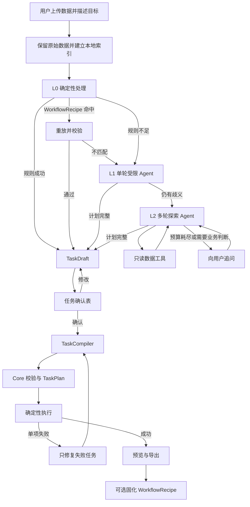
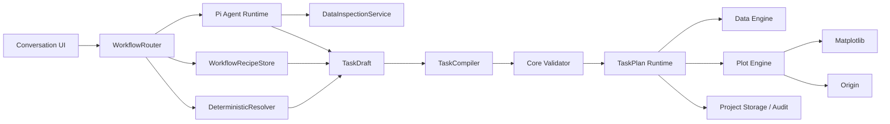

# PlotAgent vNext 成本感知 Agent 编排架构

> 状态：已确认的目标架构与硬切换施工基线。
> 当前实现：仍以“静态上下文 + 单次计划 + Core 校验”为主；施工完成时必须一次性切换到本文架构并删除旧编排。
> 适用范围：数据检查、任务拆解、自然语言参数翻译、分级 Agent 调用、WorkflowRecipe、确认、执行与失败恢复。
> 不改变：34 张正式单图范围、Matplotlib/Origin 双后端、Origin 原生可编辑产物、用户确认、项目版本和类型化引擎动作。

相关文档：

- [Agent Native 绘图引擎](./AGENT-NATIVE-PLOTTING-ENGINE.md)
- [Pi 通用 Agent 运行时](./PI-AGENT-RUNTIME.md)
- [受控数据准备](./DATA-TRANSFORMS.md)
- [任务运行时](./TASK-RUNTIME.md)
- [对话交互](./CONVERSATIONAL-INTERACTION.md)
- [产品决策](./PRODUCT-DECISIONS.md)

## 1. 决策摘要

PlotAgent 不应把每个请求都直接交给大模型，也不应把 Agent 缩减为自动填写字段映射表单。目标架构采用以下顺序：

```text
确定性程序快速路径
  → WorkflowRecipe 匹配与重放
  → 单轮受限 Agent
  → 多轮数据探索 Agent
  → 用户追问
```

Agent 在产品中的职责固定为：

1. **任务编排**：理解目标、解析数据指代、拆分单图或批量任务、处理依赖与失败恢复。
2. **数据检查与处理规划**：按需读取原始数据，通过封闭数据工具提出可审计的数据准备步骤。
3. **参数翻译**：把自然语言转换为强类型的数据处理、字段绑定和绘图参数。

Agent 不直接绘制图形，不执行任意 Python、SQL、LabTalk、Origin C 或 Matplotlib 代码，不直接修改项目数据库，也不能绕过用户确认和 Core 校验。

## 2. 当前编排与目标编排

### 2.1 当前编排


当前优点：

- 确认前无项目副作用。
- Agent 只能提交强类型候选，Core 是领域权威。
- renderer、版本、任务事务和导出边界已经稳定。
- 简单批量、同图多源和明确参数可以工作。

当前问题：

- Agent 只能看到一次性字段、统计和少量样本，不能主动继续查看原始数据。
- 一次回复同时承担指代解析、任务拆解、字段绑定和绘图参数，容易超时或生成局部错误。
- 简单明确任务仍可能调用模型，时间和成本不必要。
- 数据 A/B/C 主要依赖选择顺序和提示词，不是独立的确定性指代解析。
- 成功任务不沉淀为可验证、可重放的本地工作流。
- 失败修正仍以整个 Agent decision 为中心，不以具体失败任务为中心。

### 2.2 目标编排



目标不是给 Agent 任意权限，而是扩大受控读取和规划能力，同时继续收紧修改能力。

## 3. 设计原则

### 3.1 程序优先，Agent 逐级升级

- 能由确定性解析器完成的任务不得调用模型。
- WorkflowRecipe 重放必须早于模型调用。
- 单轮 Agent 只处理有限候选和轻度歧义。
- 多轮 Agent 只处理确实需要查看更多数据的任务。
- 每一级失败只是路由信号，不直接成为用户可见产品错误。

### 3.2 读取、规划和修改权限分离

| 权限 | 边界 |
|---|---|
| 数据读取 | 范围较大，但只读、分页、限额、记录审计 |
| 任务规划 | 范围较大，但只产生候选 TaskDraft，没有项目副作用 |
| 数据处理 | 只能提交封闭 DataOperation，由本地引擎创建新版本 |
| 绘图修改 | 只能提交图类 capability 中登记的强类型动作 |
| 项目提交 | 只由 Core 在用户确认和版本校验后执行 |

### 3.3 用户明确的要求是硬约束

以下内容不得被 Agent 静默替换：

- 用户指定的数据源、Sheet 或数据块。
- 用户指定的图类。
- 用户指定的字段角色。
- 用户指定的绘图参数、阈值、样式和导出格式。
- 用户明确要求保留、排除或排序的数据。

如果硬约束与能力或数据冲突，返回最小追问或明确不支持，不能自动换图或改变科学语义。

### 3.4 原始数据不可变

- 原始文件、SourceDataset 和来源坐标始终只读。
- 数据处理产生新的 `PreparedDataView` 或等价版本化对象。
- 每个处理结果保存输入版本、操作序列、参数、行列影响和内容哈希。
- Agent 不获得任意单元格写入能力。

### 3.5 Renderer 保持确定性

Agent 不接触 renderer 实现。TaskCompiler 输出当前绘图引擎已有的类型化动作，由各图独立 Matplotlib renderer 和 Origin 官方模板绑定器执行。

### 3.6 硬切换，不保留兼容架构

新编排不是包在旧 `agent.engine.decide` 外面的路由层。完成迁移时必须满足：

- 桌面、Core、Pi 和测试只存在一个 Workflow 入口；
- 删除旧 `agent.engine.decide` RPC、`EngineAgentDecision`、`EngineAgentPlan`、旧 binder 和一次性 repair loop；
- Provider 不再接收旧 `ContextEnvelope`，而是通过 WorkflowRun 的 L1 上下文或 L2 只读工具工作；
- TaskDraft 是确认前唯一计划真值，TaskCompiler 是进入 TaskPlan 的唯一入口；
- 不双写旧计划表和新 Workflow 表，不读取旧计划作为 fallback；
- 不保留旧 Schema 的自动迁移、字段别名、旧状态映射或“若新路径失败则走旧路径”；
- 现有 renderer 公共 Engine Action 是稳定的执行边界，不属于要保留的旧 Agent 编排；
- 旧项目中只属于旧 Agent 编排的未执行计划不迁移，明确失效；已经提交的图、数据和导出不受影响。

最终门禁必须用源码搜索和负向测试证明旧模块、RPC、Schema、数据库表和兼容分支已经消失，不能只证明新路径可用。

## 4. 目标模块



### 4.1 WorkflowRouter

负责一次用户目标的分级路由：

- 判断能否走 L0 确定性路径。
- 查询可用 WorkflowRecipe。
- 分配 L1/L2 Agent 预算。
- 记录选择了哪条路径、耗时、模型调用数和成本。
- 不负责字段语义或 renderer 细节。

### 4.2 DeterministicResolver

第一阶段至少处理：

- 数据 A/B/C、第一张表、第二个 Sheet、明确文件名/Sheet 名等指代。
- 正式图类 ID、中英文名称和已登记别名。
- 明确数值参数、颜色、线型、范围、阈值和导出格式。
- 高置信字段名/类型/单位匹配。
- 数据源数量、字段逻辑类型和图类 required roles。
- 单一明确目标对象，例如当前图唯一的 `series_2`。

解析结果必须带来源位置和置信等级，不能只返回字符串。

### 4.3 DataInspectionService

向 Agent 暴露只读工具，不暴露文件系统、数据库连接或任意代码执行：

- `list_data_sources`
- `inspect_data_source`
- `preview_rows`
- `read_range`
- `sample_rows`
- `profile_field`
- `search_values`
- `compare_schemas`
- `inspect_instrument_metadata`
- `validate_task_draft`

所有工具必须：

- 使用稳定 source/field alias。
- 限制行数、列数、字符串长度和总 scalar 数。
- 记录读取范围、用途、调用者和披露摘要。
- 小数据允许分页读完；大数据优先统计、采样和局部范围。
- 不把文件路径、凭据、宏、公式或可执行内容当指令解释。

### 4.4 TaskDraft

`TaskDraft` 是 Agent 与用户确认之间的高层结构，不直接等于绘图引擎动作。

建议最小结构：

```yaml
task_draft_id: task-draft:...
goal_text: 数据 A 画折线图，数据 B 画柱状图
items:
  - item_id: item:1
    source_refs: [source:A]
    chart_profile_id: K01
    data_operations: []
    bindings:
      x: field:time
      y: field:signal
    chart_parameters: {}
    exports: [png]
    confidence: high
    open_questions: []
  - item_id: item:2
    source_refs: [source:B]
    chart_profile_id: K08
    data_operations: []
    bindings:
      category: field:group
      value: field:mean
    chart_parameters:
      y_axis.minimum: 0
    exports: [png, opju]
    confidence: high
    open_questions: []
```

TaskDraft 必须保存每个任务的数据源、图类、字段绑定、数据操作、绘图参数和输出，不允许把批量任务的同名角色扁平合并。

### 4.5 TaskCompiler

TaskCompiler 是 Agent 与绘图引擎之间的确定性边界：

1. 将 DataOperation 编译为数据引擎规格。
2. 将绑定与参数编译为公开绘图引擎动作。
3. 固定 source/field/plot/object 版本。
4. 检查图类、角色、单位和 capability。
5. 生成 TaskPlan、TaskItem、依赖和幂等键。
6. 禁止任何未登记动作或后端专属脚本穿透。

### 4.6 WorkflowRecipeStore

WorkflowRecipe 是用户明确固化的任务处理流程，不等于 Origin renderer 使用的 OriginRecipe。

| 名称 | 用途 |
|---|---|
| WorkflowRecipe | 复用数据识别、处理、字段绑定、图类、参数和导出流程 |
| OriginRecipe | 某张正式图在 Origin 中的官方模板/菜单/X-Function 创建与读回合同 |

两者不能共用表、版本号或身份体系。

## 5. 分级路由

### 5.1 L0：确定性快速路径

典型命中条件：

- 用户已选数据和图类，required roles 存在唯一高置信匹配。
- 用户明确说出字段和参数。
- 当前目标对象唯一且参数解析无歧义。
- WorkflowRecipe 精确命中并通过完整校验。
- 已确认批次中的同构新数据只需重放。

L0 允许直接产生 TaskDraft，但仍然需要用户确认；不得因“不调用模型”而跳过确认。

### 5.2 L1：单轮受限 Agent

适用于：

- 候选字段或对象有限，但规则无法唯一选择。
- 用户用了登记外的自然语言别名，但语义明确。
- 批量任务的数据—图类关系需要一次语义拆解。
- 参数描述需要转换为有限枚举。

L1 获得静态 ContextEnvelope、候选集和一个提交工具。它不能读取额外数据；若仍不确定，应请求升级 L2 或返回 NeedsInput，不得猜测。

### 5.3 L2：多轮探索 Agent

适用于：

- 表头、数据区域或仪器块边界仍有合理歧义。
- 必须查看更多原始值才能判断字段语义。
- 多个数据源需要比较结构或值域。
- 需要设计封闭的数据处理步骤。
- 某个 TaskItem 执行失败，需要针对性诊断和修复。

L2 可以多轮调用 DataInspectionService 和 `validate_task_draft`，但不能调用 Data Engine 或 Plot Engine 执行正式修改。

### 5.4 预算

预算必须由 WorkflowRouter 明确传入，不由模型自行决定：

- 最大模型轮次。
- 最大工具调用次数。
- 最大披露行、列和 scalar 数。
- 最大输入/输出 token。
- 最大墙钟时间。
- 最大估算费用。

达到预算后优先向用户提出一个合并后的最小问题，不进行无限自动修复。

## 6. 自然语言绘图参数

用户明确给出的绘图参数先走本地解析：

```text
“第二条线改成红色虚线，宽度 2”
  → target = series_2
  → color = red
  → line_style = dashed
  → line_width = 2
```

满足以下条件时不调用模型：

- 目标对象唯一。
- 参数名和值能映射到公开 capability。
- Matplotlib 与 Origin 都能表达并读回。
- 不涉及科学语义推断。

若“第二条线”对应多个候选、参数超出能力或后端不一致，再升级 Agent 或追问。

用户参数在 TaskDraft 中标记为 `hard_constraint`。Agent 不能在修复过程中删除、放宽或替换硬约束。

## 7. 数据处理权限

### 7.1 允许的方向

数据处理能力必须以版本化、强类型 `DataOperation` 逐项准入。目标最小集合：

- 选择文件、Sheet、数据块和二维区域。
- 指定表头、单位行、分隔符、编码、decimal mark 和日期解析策略。
- 选择字段、设置显示名和确认逻辑类型。
- 按明确条件筛选或排序，并保存影响行数。
- 宽表/长表的受控 reshape。
- 完全同构数据源 concat，并保留来源身份。
- 图类已有的冻结计算和掩码策略。

是否加入 join、任意公式派生、单位换算、归一化或复杂统计，必须分别定义 Schema、科学边界、双后端影响和验收；本文不自动授权。

### 7.2 禁止

- 任意 Python、SQL、JavaScript、LabTalk、Origin C、Shell 或 UDF。
- 直接修改 SourceDataset 或原始文件。
- 模型输出自由字符串表达式后由本地执行。
- 静默删除异常、填补缺失、排序、聚合或改变单位。
- 因 renderer 需要而在 renderer 内偷偷补列或改变数据。

## 8. 数据指代与批量任务

### 8.1 稳定身份

UI 为提供给 Agent 的每个数据源显示稳定引用：

```text
数据 A · experiment.xlsx > Run1
数据 B · experiment.xlsx > Run2
数据 C · instrument.txt > block_1
```

DeterministicResolver 先把“数据 A”“Run2”“第二个数据块”等解析为 source alias。Agent 接收的是解析后的候选与原文，不负责凭顺序记忆真实对象。

### 8.2 每个任务独立拥有图类

- 单图：用户可以预先选择图类，或在指令中明确图类。
- 同构批量：一个图类可应用于多个数据源。
- 异构批量：每个 TaskItem 分别保存图类和绑定。
- 信息不足时必须追问；不主动推荐或替换图类。

### 8.3 多数据同图

“多份数据画在同一张图”是单图多源任务，不是多面板组合图。TaskDraft 必须保存每个 source 的绑定和来源标签，TaskCompiler 只在图类声明支持且数据通过兼容性校验时编译。

产品没有多面板组合图能力。目标架构不保留组合图专属关键词拦截；能力目录中没有该动作，通用 capability 校验即可阻止生成。

## 9. 确认与对话 UI

### 9.1 用户确认对象

确认界面按 TaskItem 展示：

| 任务 | 数据 | 图类 | 数据处理 | 字段绑定 | 参数 | 输出 |
|---|---|---|---|---|---|---|
| 1 | 数据 A | K01 折线图 | 无 | Time→x, Signal→y | 线宽 2 | PNG |
| 2 | 数据 B | K08 柱状图 | Group 排序 | Group→category, Mean→value | Y 从 0 开始 | PNG, OPJU |

禁止把不同数据源的 `x/y/category/value` 扁平合并成一份绑定摘要。

### 9.2 数据预览

- 确认卡显示原始前几行或当前 PreparedDataView 预览。
- 字段角色贴近原始列名显示。
- 数据预览、Agent 建议和确认操作在视觉上分区。
- 若有数据处理，明确显示输入行数、输出行数和改变了什么。

### 9.3 实时状态

只展示真实阶段：

- 正在匹配已保存流程。
- 正在检查数据结构。
- 正在读取指定数据范围。
- 正在规划任务。
- 正在校验字段绑定。
- 正在等待确认。
- 正在处理数据。
- 正在调用 renderer。
- 正在验证 Origin 项目。

不得展示模型隐藏思维、伪造百分比或虚构剩余时间。

## 10. 执行与失败恢复

TaskPlan 继续由现有任务运行时执行。目标新增以下规则：

- TaskItem 是局部恢复和幂等重试的最小单位。
- 成功项不得因其他项失败而重复执行。
- 执行错误包含稳定 code、失败阶段、对象版本和可修复类别。
- 确定性参数错误先交给本地修正器。
- 需要重新解释数据或目标时，只把失败 TaskItem 送回 Agent。
- Agent 修复不得改变其他已确认 TaskItem 或用户硬约束。
- 修复方案仍需确认，除非只是无语义变化的安全重试。

## 11. WorkflowRecipe

### 11.1 触发

当任务成功执行并至少完成一次正式导出后，UI 可以显示一次非阻塞提示：

> 如果经常使用类似的数据绘图，可以固化本次数据处理与绘图流程。下次遇到同构数据时可直接复用，以节省时间和模型成本。

按钮：

- `固化流程`
- `查看流程`
- `暂不`

未经用户明确选择，不得静默保存 WorkflowRecipe。

### 11.2 内容

WorkflowRecipe 保存：

- 适用数据结构指纹。
- 文件格式、Sheet/block/区域和解析规则。
- 字段类型、单位、语义槽位和匹配规则。
- DataOperation。
- 图类、字段绑定和绘图参数。
- 导出设置。
- 创建时的数据引擎、图类 profile、renderer 和 Recipe schema 版本。
- 通过的机械验证和用户确认记录。

不保存：

- 原始真实数据值。
- 凭据、绝对敏感路径或对话全文。
- 任意脚本或可执行表达式。
- 未确认的模型推断。

### 11.3 匹配等级

| 等级 | 行为 |
|---|---|
| exact | 自动重放、完整校验、直接进入确认 |
| compatible | 显示结构差异，用户确认后重放 |
| weak | 不重放，只作为 Agent 候选参考 |
| invalid | 版本或能力已失效，阻止使用并说明原因 |

任何重放都必须重新校验字段、单位、角色、数据范围要求、图类 capability 和 renderer 版本。

### 11.4 生命周期

- WorkflowRecipe 本地保存并版本化。
- 修改 Recipe 创建新版本，不静默改变历史任务。
- renderer、profile、DataOperation schema 或解析器发生不兼容升级时自动失效。
- 用户可以查看、重命名、归档和删除；被历史任务引用的版本保留审计身份。

## 12. 状态与审计

建议新增规划状态：

```text
routing
deterministic_attempt
recipe_matching
recipe_replay
agent_single_turn
agent_exploration
needs_input
draft_ready
awaiting_confirmation
compiling
executing
repairing_failed_items
completed / partially_succeeded / failed / cancelled
```

每次 WorkflowRun 至少记录：

- 进入和退出的路由等级。
- 程序规则、Recipe 和模型版本。
- Agent 轮次与工具调用数。
- 披露字段、行、scalar 数摘要。
- token、延迟和估算成本。
- TaskDraft hash、确认版本和 TaskPlan ID。
- 成功、失败、跳过和重试的 TaskItem。
- 是否提示固化、用户是否接受。

## 13. 接口草案

### 13.1 WorkflowRouter

```python
route(goal, project_context, budget) -> RouteDecision
```

`RouteDecision` 只允许：

- `deterministic`
- `recipe_replay`
- `agent_single_turn`
- `agent_exploration`
- `needs_input`
- `unsupported`

### 13.2 DataInspectionService

```python
inspect_source(source_alias) -> SourceInspection
preview_rows(source_alias, columns, offset, limit) -> RowPage
profile_field(source_alias, field_alias) -> FieldProfile
compare_schemas(source_aliases) -> SchemaComparison
```

### 13.3 TaskCompiler

```python
validate_draft(task_draft, project_context) -> DraftValidation
compile_draft(task_draft, expected_revision) -> TaskPlan
```

### 13.4 WorkflowRecipeStore

```python
find_candidates(data_fingerprint, goal_signature) -> RecipeMatches
replay(recipe_version, source_refs) -> TaskDraft
save_from_success(workflow_run_id, user_confirmation) -> WorkflowRecipeVersion
```

## 14. 施工顺序

### M0：文档与 Schema 冻结

- 冻结 TaskDraft、DataInspection tool、WorkflowRecipe 和 RouteDecision Schema。
- 在产品决策中记录新权限模型。
- 明确旧文档中“无数据处理 Agent”和“Pi 只能单次提交”的替代范围。
- 冻结硬切换删除清单；施工期间可按内部提交拆分，但正式入口不得长期双轨。

### M1：确定性快速路径

- 实现 WorkflowRouter 与 DeterministicResolver。
- 把图类、数据指代、明确参数和字段类型校验迁出 prompt 猜测。
- 简单明确任务实现 0 次模型调用。
- 删除组合图专属关键词拦截，仅保留通用 capability 校验。

### M2：TaskDraft 与确认界面

- 引入高层 TaskDraft。
- 批量确认按 TaskItem 展示完整数据—图类—绑定关系。
- TaskCompiler 编译到现有 engine action 和 TaskPlan。
- 保持现有 renderer 与执行路径不变。

### M3：只读数据工具与 L2 Agent

- 实现 DataInspectionService。
- Pi 增加只读工具、多轮预算和 steering/cancel。
- Agent 可以查看原始数据但不能执行处理或绘图。
- 增加披露、调用次数、token 和费用门禁。

### M4：封闭数据处理

- 逐项增加强类型 DataOperation。
- 建立 PreparedDataView、血缘和版本。
- Agent 只能提出操作，Core 编译和执行。
- 每类操作补科学边界、规模限制和黑盒。

### M5：WorkflowRecipe

- 成功导出后的固化提示。
- Recipe 指纹、匹配、重放、失效和版本管理。
- exact replay 走 0 次模型调用。
- 增加与 OriginRecipe 的命名、存储和测试隔离。

### M6：局部失败恢复与成本优化

- 只把失败 TaskItem 送回 Agent。
- 成功项幂等保留，不重复执行。
- 建立路径命中率、模型轮次、成本、延迟和 Recipe 复用率指标。

### M7：硬切换与旧编排删除

- Electron 只调用新 Workflow RPC，Core 只注册新 Workflow 服务。
- 删除旧 Agent decision/binder/orchestrator、旧生成 Schema、旧任务表与迁移代码。
- 删除旧 UI 状态、旧 IPC 方法和所有 compatibility/fallback 分支。
- 更新正式文档，不再把旧编排描述为可用路径。
- 全量门禁与正式 UI 验收均只从新入口运行。

## 15. 验收标准

### 15.1 确定性路径

- 明确单图、字段和参数的任务 0 次模型调用。
- 明确三数据三图任务由本地解析保存正确 source 对应关系。
- 参数解析结果在确认卡和两个后端读回一致。

### 15.2 数据探索

- Agent 能按需读取原始数据范围、字段 profile 和多源 schema。
- 未授权字段、超预算范围和任意路径读取稳定拒绝。
- 所有读取有审计，读取本身不改变项目版本。

### 15.3 TaskDraft 与执行

- 批量 TaskItem 不扁平丢失数据源身份。
- 确认前项目版本不变。
- 编译后仍只使用公开 engine action。
- 部分失败不重复成功项，修复只改变失败项。

### 15.4 WorkflowRecipe

- 成功导出后只提示一次，未经确认不保存。
- exact 同构数据重放 0 次模型调用并通过完整机械验证。
- 非同构数据不得因列名相似而误命中。
- 版本不兼容时稳定失效，不静默迁移。

### 15.5 成本与体验

- 报告 L0、Recipe、L1、L2 的命中率。
- 记录模型调用次数、token、估算成本和端到端延迟。
- 相比全量 Agent 路径，简单任务和 Recipe 重放显著降低延迟与成本。
- 用户始终能看到真实阶段、取消当前规划，并理解为什么需要追问。

### 15.6 迁移完整性

- 产品源码不存在 `agent.engine.decide`、`EngineAgentPlan`、`EngineAgentDecision` 或旧计划兼容表。
- 正式生成合同不再包含旧 ContextEnvelope/engine-agent.v1 Schema。
- Electron、Core、Pi、持久化和 UI 不存在双入口、双写、fallback 或旧状态映射。
- 旧编排专属测试已删除；新测试直接覆盖 WorkflowRouter、TaskDraft、TaskCompiler、L0/L1/L2、Recipe 与失败项修复。
- 从正式 Windows Electron UI 发出的每个任务都能在审计中定位唯一 WorkflowRun 和 RouteDecision。

## 16. 明确非目标

- 不让 Agent 自主推荐或替换用户未确认的图类。
- 不开放多面板组合图。
- 不开放任意代码、Shell、SQL、Python、LabTalk 或 Origin C。
- 不允许 Agent 直接修改原始数据、项目数据库或 renderer 文件。
- 不用模型隐藏思维作为产品日志或审计证据。
- 不因引入 WorkflowRecipe 建立未经同意的跨项目隐式偏好。
- 不为新编排重写已经通过验收的 Matplotlib/Origin renderer。

## 17. 施工对照表

| 目标能力 | 当前状态 | 施工模块 | 最早里程碑 |
|---|---|---|---|
| 确定性图类/参数解析 | 部分散落在前置校验和 prompt | DeterministicResolver | M1 |
| 数据 A/B/C 稳定解析 | 主要依赖选择顺序和 Agent | DeterministicResolver | M1 |
| 简单任务 0 模型调用 | 仅少量 NeedsInput/校验 | WorkflowRouter | M1 |
| 高层 TaskDraft | 尚无，当前直接生成 engine decision | TaskDraft/TaskCompiler | M2 |
| 批量逐项确认 | 有 TaskPlan，但绑定摘要会扁平 | Confirmation UI | M2 |
| Agent 主动读取原始数据 | 尚无 | DataInspectionService/Pi tools | M3 |
| 多轮探索与预算 | Pi 仅有限决策修正 | Pi runtime/WorkflowRouter | M3 |
| Agent 数据处理规划 | 尚无 | DataOperation/Data Engine | M4 |
| 成功工作流固化 | 尚无 | WorkflowRecipeStore | M5 |
| 失败项 Agent 局部修复 | 任务层部分具备，Agent 编排未闭环 | TaskRuntime/WorkflowRouter | M6 |
| 旧编排彻底删除 | 尚未开始 | Electron/Core/Pi/Storage/UI | M7 |

本文是施工时判断“新代码属于哪里、能拥有什么权限、何时应调用模型”的首要对照文档。Renderer 结构、正式图类和 Origin 原生证据仍以各自权威文档为准。
