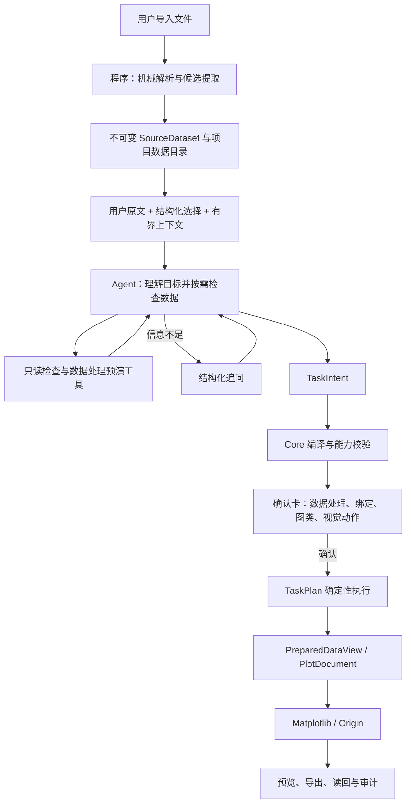

# PlotAgent 程序—Agent 编排架构

> 状态：正式架构与实现合同。
> 适用范围：数据导入与检查、自然语言理解、Agent 工具、TaskIntent、TaskPlan、确认、执行与恢复。
> 不改变：34 张正式单图、Matplotlib/Origin 双后端、Origin 原生可编辑产物、T1 公共视觉动作、用户确认与项目版本语义。

相关文档：

- [产品决策](./PRODUCT-DECISIONS.md)
- [产品需求](./PRD.md)
- [Pi Agent 运行时](./PI-AGENT-RUNTIME.md)
- [受控数据准备与单位](./DATA-TRANSFORMS.md)
- [任务运行时](./TASK-RUNTIME.md)
- [Agent Native 绘图引擎](./AGENT-NATIVE-PLOTTING-ENGINE.md)

## 1. 决策摘要

PlotAgent 的边界固定为：

> Agent 负责理解、选择和编排；程序负责读取、验证、执行和留痕。

“程序优先”只表示在数据进入 Agent 前进行廉价、无语义副作用的结构解析。它不表示程序通过关键词、正则、别名表或字段打分理解用户自然语言。

凡是自然语言请求，都必须将用户原文原样交给 Agent。程序不得先行决定：

- 用户指的是哪个数据源、Sheet、数据块或图形对象；
- 用户要求的图类、字段角色、筛选、排序、转换或单位换算；
- 用户要求的颜色、线型、符号、坐标轴、图例或其他视觉参数；
- 请求属于创建、编辑、批量、同图多源还是失败项修复；
- 哪些自然语言要求可以忽略、替换或降级。

程序可以绕过模型的入口只有用户直接操作已经结构化的 UI 控件。该入口仍进入同一 Engine capability、版本事务和 renderer 链；正式桌面当前不公开 WorkflowRecipe 保存或重放。

## 2. 权威数据流

原始数据和 SourceDataset 永远只读。筛选、排序、reshape、拼接、派生字段和单位换算产生版本化 PreparedDataView，不覆盖输入。

## 3. 程序与 Agent 的职责边界

| 工作 | Agent | 程序 |
|---|---|---|
| 理解自然语言 | 负责 | 不解析、不改写 |
| 解析数据/图形指代 | 负责 | 提供稳定别名、目录和选择状态 |
| 任务拆解与来源—图类映射 | 负责 | 验证对象存在和权限 |
| 字段角色和视觉参数 | 负责提出 | 验证 Profile capability |
| 是否筛选、排序、转换、换单位 | 负责决定 | 不擅自决定 |
| 数据操作计算 | 通过工具提出 | 负责预演与正式执行 |
| 原始数据查看 | 按需调用工具 | 分页、限额、审计、脱敏 |
| 文件编码、Sheet/block、表头候选 | 参考结果 | 机械解析并保留歧义 |
| 单位 | 解释歧义、选择目标单位 | 提取候选、验证量纲、执行换算 |
| 追问 | 决定需要什么业务信息 | 承载结构化问题与续跑状态 |
| 编译、版本、权限、幂等 | 不拥有 | 唯一权威 |
| renderer、Origin、Matplotlib | 不接触 | 确定性执行与读回 |
| 项目提交与导出路径 | 不拥有 | 用户确认和桌面授权后执行 |

模型永远不能输出或执行任意 Python、SQL、JavaScript、Shell、LabTalk、Origin C、文件路径、数据库请求或 renderer 私有参数。

## 4. 导入前的廉价程序处理

导入器可以在模型调用前完成：

- 文件解码、分隔符和 decimal mark 候选；
- workbook/sheet、TXT block、preamble/postamble 与数据区域候选；
- 显式表头、逻辑类型、缺失与有限性统计；
- 数据块内“标签行 + 后续同列数值行”的确定性表头识别，以及尾部分隔符造成的全空序列化字段清理；
- 稳定 source/field/row ID、内容 hash 与来源坐标；
- 单位行、括号/方括号单位和仪器元数据中的明确单位；
- 列名后缀中的低置信单位候选及其原文位置。

这些输出都是事实或候选，不是业务解释。存在多个合理解析时保留候选，交给 Agent 或用户确认；不得为了得到唯一结果静默改名、删行、排序、聚合或换单位。

单位大小写必须保留。`MΩ` 与 `mΩ`、`Pa` 与其他大小写组合不得经 `casefold` 合并。`value_m`、`sample_g` 等后缀只形成候选，不能直接确认为单位。

## 5. Agent 上下文

AgentActivation 中的 ContextSnapshot 必须包含：

- 用户原始 instruction，禁止前端或 Core 改写；
- 项目内有权访问的数据源目录及稳定 source alias；
- 用户显式选择的数据源、图类和图形对象，作为结构化硬约束；
- 字段目录、逻辑类型、单位候选及候选来源；
- 当前图形的 profile、版本和公开语义对象；
- 上一 TaskPlan、失败项和稳定错误（适用时）；
- 允许的图类、数据操作、视觉动作、工具与预算。

结构化选择是 Core 可强制执行的硬约束。自然语言要求由 Agent 解释，并完整展示在确认卡中。Core 不通过第二套自然语言解析器声称验证“模型是否理解了用户”；语义忠实度由确认卡、冻结评测和黑盒测试证明。

## 6. Agent 工具

### 6.1 只读检查

- `list_sources`
- `inspect_source`
- `preview_rows`
- `read_range`
- `sample_rows`
- `profile_field`
- `search_values`
- `compare_schemas`
- `inspect_instrument_metadata`

工具只接受安全别名，不接受路径。每次调用限制行、列、字符串和 scalar 数，并记录披露审计。小数据可分页读完；大数据优先 profile、采样和局部范围。远程 Provider 使用原始数据工具前必须遵守产品的数据出境授权。

### 6.2 数据处理预演

- `preview_select_fields`
- `preview_filter_rows`
- `preview_sort_rows`
- `preview_exclude_rows`
- `preview_drop_empty_fields`
- `preview_convert_type`
- `preview_rename_field`
- `preview_derive_column`
- `preview_convert_unit`
- `preview_reshape_long_to_wide`
- `preview_reshape_wide_to_long`
- `preview_concatenate_sources`
- `preview_align_sources_on_x`

预演工具返回输入/输出 schema、前几行、行列变化、单位变化、警告和规范化 DataOperation；不登记 PreparedDataView、不修改项目版本。Agent 把规范化操作写入 TaskIntent item。正式执行在用户确认后由同一实现完成，预演与正式执行不得使用两套算法。

`derive_column` 只允许登记过的类型化算子，不接受自由公式。`convert_unit` 只允许注册表内量纲兼容的转换；比例与仿射单位均由程序计算，模型不能提供任意换算因子。

`convert_type` 必须严格失败并报告来源行，不能把非法文本静默改为缺失。`align_sources_on_x` 只处理“每个来源一个 X/数值系列，且 X 已按相同顺序对齐”的情形；它生成 renderer 可直接绑定的宽表，但绝不代替排序、插值或科学配准。X 不一致时 Agent 必须根据用户目标另行处理或追问。

### 6.3 规划与对话

- `validate_task_draft`
- `submit_task_draft`
- `ask_user`

`needs_input` 产生结构化问题并暂停同一 durable task；用户回答后续跑，不新建无关任务。验证失败时 Agent 可以在预算内修订 Intent，但不得产生项目副作用。

## 7. TaskIntent 与确认

TaskIntent 是模型提交的结构化任务语义；Core 接受后编译为唯一可确认 TaskPlan。每个 item 独立保存：

- create、visual edit 或 data rebind/update 的任务种类；
- source alias、目标 plot alias 和依赖；
- DataOperation；
- 字段绑定；
- profile；
- 公共视觉动作；
- Agent 对用户要求的简明解释和需要用户注意的警告。

当前图的数据更新不能伪装成纯视觉 edit。应创建派生 PreparedDataView 和新的 PlotDocument 版本，保留旧版本以支持撤销。

确认卡逐项展示数据预演、字段绑定、图类、视觉动作、单位变化和输出。用户确认前不创建图、不登记派生数据、不导出文件、不增加项目 revision。

## 8. Core 的确定性权威

Core 负责且只负责结构化校验：

- source/field/plot/profile alias 的存在性和授权范围；
- project revision、plot version 与幂等键；
- 图类 required/optional/repeatable roles；
- DataOperation Schema、数据类型、量纲、有限性与结果 schema；
- T1 visual action 和语义对象 capability；
- 依赖图、任务数量、预算和输出权限；
- TaskPlan 编译、确认、事务执行、部分失败、重试和恢复。

Core 不解析用户文本来补充、修正或否决模型的语义解释。能力目录没有的动作通过结构化校验拒绝，无需关键词黑名单。

图类不可分割的固定计算必须二选一：

1. 作为真实 DataOperation 执行并生成可追溯结果；或
2. 作为 Profile 固定渲染合同自动执行。

不得保留 Schema 中可提交、执行器却 `pass` 的名义动作。

## 9. 成本和预算

所有自然语言请求进入同一 Agent 运行时。成本通过“Agent 是否实际调用工具和追加轮次”自然分级，不通过程序先理解文本来选择路由：

- 简单请求：Agent 一轮直接提交 Draft；
- 需要事实：Agent 调用只读或预演工具；
- 信息不足：Agent 追问；
- Draft 被拒：在预算内修订；
- 达到预算：提出一个合并后的最小问题或明确停止。

Core 只依据结构规模、Provider 上限和产品策略设置硬预算，不根据自然语言关键词判定复杂度。

## 10. WorkflowRecipe 边界

仓库保留 WorkflowRecipe Schema、repository 和非公开服务作为未来受控复用的技术储备；正式桌面、Pi activation 和公开 RPC 当前不提供保存、匹配或重放入口，因此它不是当前用户工作流，也不进入黑盒通过项。

未来若重新开放，必须另行完成产品决策、UI、权限、版本校验、确认和完整测试；不得因为底层类型存在而自动启用。

## 11. 前端边界

前端必须：

- 原样发送用户 instruction；
- 以结构化字段发送用户选中的 source/profile/plot；
- plot 选择必须携带用户实际看到的 `plot_id + plot_version`，不得由 Main 静默改取最新版本；
- 把项目数据目录、失败 TaskPlan 和当前对象作为上下文，而不是拼进提示词；
- 显示 Agent 的检查、追问、预演、校验和执行阶段；
- 显示确认卡、撤销/重做、局部失败和重试入口。

前端不得：

- 从 instruction 中寻找数据名、图类、批量、合并或重试关键词；
- 重写 instruction 或追加隐藏的字段绑定句子；
- 在 UI 和 Agent 之间维护第二套来源—图类映射；
- 以伪造进度、隐藏推理或未发生的工具调用包装 Agent。

按钮表达的明确操作可以直接构造结构化请求，例如“仅重试失败项”；这不是自然语言解析。

续轮回答仍属于同一 durable task。若用户在回答追问时新选了数据、图类或 `@图N`，Main 必须把这些结构化选择随 `UserTaskEvent.context_update` 一起写入 ledger；Core 在后续 activation 中折叠原始 TaskEnvelope 与所有已授权更新。原始 envelope 保持不可变以供审计，续轮上下文不得只存在于 React 状态、聊天文本或 Main 内存中。

## 12. 失败恢复

TaskItem 是局部失败与幂等重试的最小单位。程序保留成功项，记录失败阶段、稳定错误码、输入版本和可重试性。Agent 可以基于结构化失败上下文提出修订计划，但：

- 不得重做成功项；
- 不得静默改变其他已确认项；
- 语义变化必须再次确认；
- 同一参数的安全重试可由用户点击结构化重试按钮执行；
- renderer 或 Origin 内部状态不能成为 Agent 工具。

## 13. 实现落点

- `contracts/agent_tasks.py`：TaskEnvelope、TaskIntent、AgentActivation/Yield、grant、checkpoint 与验证报告；item 结构复用 `contracts/workflows.py` 的强类型数据操作定义。
- `desktop_core/agent_foundation.py`：Core-owned task 协调、上下文、编译和 activation host。
- `tasking/`：durable task ledger、状态转换、lease、事件与恢复。
- `tooling/`：受限数据/领域工具的唯一 Gateway；工具不接受任意路径或代码。
- `workflows/inspection.py`、`data_ops.py` 与 `compiler.py`：有界检查、规范化数据操作和本地计划编译。
- `main/agent/pi-runtime-v2.ts` 与 `agent-foundation-runtime.ts`：消费 activation 的 Pi 循环与桌面协调，不预解析 instruction。
- renderer：只消费类型化 Engine Action，不理解自然语言、不处理业务数据。

`workflows/natural_language.py`、DeterministicResolver、前端 instruction parser、基于 instruction 的 Core intent validator 和自然语言 goal signature 不属于正式架构，必须删除而不是保留兼容 fallback。

## 14. 验收标准

### 14.1 边界

- 任意自然语言原样进入 Agent；源码搜索不存在前端/Core/Pi 的语义关键词路由。
- 结构化 UI 可以零模型调用；Recipe 当前没有公开入口。
- Core 只校验结构化对象，不使用自然语言解析结果校验 Agent。

### 14.2 数据与工具

- Agent 可以按需读取原始数据、范围、字段 profile、schema 和仪器元数据；所有读取有预算与审计。
- 筛选、排序、reshape、拼接、派生字段和单位换算先预演，确认后由同一算法执行。
- 单位候选保留原文、位置、大小写和置信度；不兼容量纲稳定拒绝。
- 原始 SourceDataset 不变，派生结果有操作序列、内容 hash 与行列血缘。

### 14.3 对话与计划

- 信息不足时 Agent 可结构化追问并续跑同一 durable task。
- 追问后通过图形库、数据选择器或 `@图N` 补充的上下文必须进入同一 task；精确 plot 版本、source 版本与项目 revision 均可在重启后恢复。
- TaskIntent 被 Core 拒绝后可在预算内修订；确认前项目 revision 不变。
- 数据更新当前图生成新版本且可撤销，不被限制为纯视觉 edit。

### 14.4 恢复

- 成功项不重复，失败项可局部修复；重试不依赖前端改写 instruction。
- 产品不因一次成功任务自动学习、保存或重放流程。

### 14.5 测试

- 单元测试证明 instruction 原样传递和自然语言旁路不存在。
- Agent 工具测试覆盖预算、预演/正式一致性、单位转换、追问和验证修订。
- SEQ-70 覆盖简单一轮、数据探索、批量映射、单位转换和失败修复。
- 正式 Windows Electron 黑盒验证确认卡、真实阶段、撤销/重做、重启、PNG/SVG/OPJU 与可编辑 Origin 数据对象。

## 15. 明确非目标

- 不开放任意代码、表达式、数据库、Shell 或 Origin 私有对象。
- 不让模型直接修改原始数据、项目、renderer 或导出路径。
- 不让程序根据自然语言自动选图、选数据、删行、排序、聚合或换单位。
- 不开放组合图、多面板自由编排、开放式拟合或任意科研分析。
- 不为删除自然语言旁路保留旧 RPC、旧 Schema、别名、双写或 fallback。
- 不因编排重构重写已经通过资格的 Matplotlib/Origin renderer。

本文是判断“代码属于哪里、能拥有什么权限、何时需要模型”的首要对照文档。
