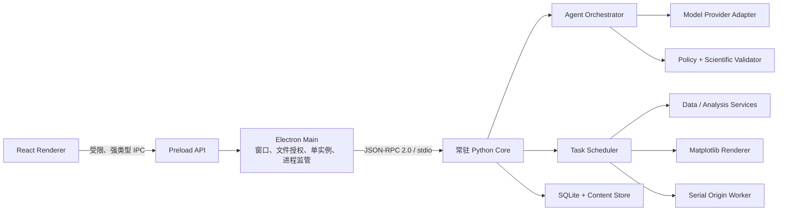

# PlotAgent 后端与 Agent 架构

> 状态：第一轮架构基线已确认  
> 日期：2026-08-05  
> 适用范围：Windows 桌面端、数值数据绘图、自然语言规划、本地执行、PNG/SVG/OPJU 导出  
> 相关文档：[领域契约与 Schema 设计](./DOMAIN-CONTRACTS.md)、[项目存储、项目包与数据导入](./PROJECT-STORAGE.md)、[产品决策基线](./PRODUCT-DECISIONS.md)、[产品需求文档](./PRD.md)

## 1. 架构结论

第一轮采用以下组合：

- 单 Agent 规划，不采用多 Agent 系统。
- 一个由 Electron 主进程监管的常驻 Python Core。
- Electron 与 Python 通过带版本的 JSON-RPC over stdio 通信，不开放本地 HTTP 端口。
- Agent 只输出符合 JSON Schema 的 ActionPlan，不生成或执行任意 Python、Matplotlib、Origin 或文件系统代码。
- 版本化 PlotSpec 是图表唯一结构化真值；Matplotlib 与 Origin 都是 PlotSpec 的下游适配器。
- 手动界面操作与自然语言操作进入同一套计划、校验、执行、验证和事务链。
- Matplotlib 是第一轮唯一正式预览、PNG 和 SVG 渲染器；Plotly/Kaleido 不进入第一轮正式渲染链。
- Origin 导出使用单独的串行受控 Worker。

## 2. 进程结构



### 2.1 React Renderer

- 只负责界面状态、展示和用户输入。
- 不读取任意本地路径，不直接启动 Python，不连接 Origin，不持有模型密钥。
- 只调用 preload 暴露的逐项方法，例如 `importData()`、`submitCommand()`、`cancelTask()` 和 `exportArtifact()`。

### 2.2 Electron Main

- 管理窗口、单实例、文件选择器、系统凭据和应用退出。
- 启动、监控、重启和关闭 Python Core。
- 校验所有 renderer 请求，并把用户通过文件选择器授权的路径转换为受控资源引用。
- 把 Python 的任务事件转发给 renderer，不向 renderer 暴露原始 stdio。

Electron 官方将主进程、renderer 和 preload 作为不同权限边界，并建议在 context isolation 下通过 `contextBridge` 暴露参数受限的逐项 IPC API：

- [Electron Process Model](https://www.electronjs.org/docs/latest/tutorial/process-model)
- [Electron Context Isolation](https://www.electronjs.org/docs/latest/tutorial/context-isolation)
- [Electron IPC](https://www.electronjs.org/docs/latest/tutorial/ipc)

### 2.3 Python Core

- 随桌面应用启动并常驻，避免每次任务重复初始化科学计算库。
- 负责项目、数据、PlotSpec、分析、绘图、任务、缓存和导出。
- 只接受 Electron Main 发来的协议消息，不监听 TCP 端口。
- 崩溃后由 Electron Main 拉起，并从 SQLite 任务状态恢复到最后一个完整事务。

## 3. 本地通信协议

### 3.1 传输

- 使用 stdin/stdout，协议为带版本的 JSON-RPC 2.0 风格消息。
- 使用明确帧边界，不以裸换行作为复杂 JSON 的唯一分隔方式。
- stdout 只传协议消息；诊断日志写 stderr，并由主进程结构化收集。
- 大型表格、图像字节和 OPJU 文件不内联传输，只传对象 ID、摘要或受控临时资源引用。

### 3.2 消息类型

- Request/Response：导入、创建图、修改图、保存项目、导出等短请求。
- Task Event：阶段、进度、警告、部分失败、完成和取消结果。
- Health Event：Python 版本、引擎版本、内存、Origin 状态和协议版本。
- Shutdown：等待任务、取消任务、清理资源和退出。

### 3.3 可靠性

- 每个写操作携带 `request_id`、`idempotency_key`、`project_id` 和 `expected_version`。
- 重复请求不得生成重复对象或重复导出。
- 协议与 PlotSpec 分别版本化，兼容性不依赖应用版本字符串猜测。

## 4. PlotSpec 与 ActionPlan

本节描述架构职责，字段、联合类型、白名单 Patch、Action 上限与兼容规则以 [领域契约与 Schema 设计](./DOMAIN-CONTRACTS.md) 为准。

### 4.1 PlotSpec

PlotSpec 是独立于 Matplotlib、SVG 和 Origin 的图表定义：

```text
PlotSpec
├─ schema_version
├─ chart_type_id
├─ dataset_version_ids
├─ field_mapping
├─ transform_refs
├─ analysis_spec
├─ axes
├─ series
├─ style_reference
├─ annotations
├─ layout
├─ publication_profile
└─ renderer_contract
```

要求：

- 所有字段使用 Pydantic 模型和 JSON Schema 校验。
- 图形类型使用稳定 ID，例如 K02、S31、S61。
- 数据、样式、发表规格和渲染器都引用明确版本。
- 图表子对象具有稳定语义 ID，例如 `series:control`、`axis:y-left`、`legend:main`。
- PlotSpec 不包含可执行 Python、LabTalk、JavaScript 或任意模板代码。

### 4.2 PlotPatch

自然语言改图转换为小范围、可审计的 PlotPatch：

```json
{
  "target_id": "series:control",
  "operation": "set_line_width",
  "value": { "value": 0.8, "unit": "pt" },
  "expected_plot_version": "plot-v3"
}
```

- Patch 只允许白名单操作。
- Patch 应用前验证目标、单位、范围与版本。
- 修改成功后生成新 PlotSpec 版本，不就地改写历史版本。

### 4.3 ActionPlan

Agent 与手动 UI 最终都生成同一种 ActionPlan：

```text
ActionPlan
├─ intent
├─ project_id
├─ target_ids
├─ scope
├─ operations[]
├─ required_inputs[]
├─ confirmation_level
└─ expected_versions
```

手动 UI 可以直接构建 ActionPlan 并绕过模型，因此离线模式和在线 Agent 使用同一执行后端。

## 5. Agent 架构

### 5.1 单 Agent，有界执行

第一轮不使用多 Agent，也不建立开放式自主循环。一次请求采用固定上限流程：

1. Context Builder 读取目标对象、项目规则、字段结构、单位、摘要和少量样本。
2. Model Provider 返回符合 JSON Schema 的 ActionPlan。
3. Policy Engine 检查用户是否明确选择图形、统计方法和作用目标。
4. Scientific Validator 检查字段、单位、完全同构条件、坐标和统计参数。
5. Executor 调用白名单领域服务。
6. Verifier 检查生成对象、科研约束和导出契约。
7. Transaction Manager 原子提交对象与版本。
8. Response Builder 根据结构化结果生成界面回复。

### 5.2 失败与重试

- 缺少必要信息或目标歧义时返回结构化追问，不执行猜测方案。
- 业务校验失败不触发模型自动改方法或改图形。
- 瞬时基础设施错误可做有限、确定性重试。
- 不允许模型无限重新规划或不断修改代码尝试解决错误。
- 执行结果正文由结构化结果生成，不让模型虚构成功状态、路径或统计值。

### 5.3 模型适配层

内部只依赖 `ModelProvider.plan(context, schema)` 抽象：

- OpenAI Adapter：使用 Responses API 的函数调用或结构化输出。
- OpenAI-compatible Adapter：启动时探测 Responses、Chat Completions、JSON Schema 和工具调用能力，再选择兼容路径。
- 不支持严格结构化输出的模型不得直接执行写操作，只能返回草案并经过本地解析与完整校验。
- 模型供应商的会话 ID、推理项或工具格式不能进入 PlotSpec 和项目核心对象。

OpenAI 当前建议通过 Responses API 处理推理与工具调用，但 PlotAgent 的 ActionPlan 和工具协议保持供应商无关：[OpenAI Model Guidance](https://developers.openai.com/api/docs/guides/latest-model)

## 6. 白名单领域服务

第一轮服务边界：

- `ProjectService`：项目、事务、资源、版本和回收站。
- `DatasetService`：导入、摘要、数据签名、数据版本和只读访问。
- `TransformService`：受限表达式、筛选、聚合、单位转换和派生数据。
- `PlotService`：PlotSpec 创建、Patch、验证和版本。
- `AnalysisService`：用户明确指定的误差、拟合、检验和统计。
- `BatchService`：完全同构验证、任务展开、部分失败和事务撤销。
- `CompositionService`：固定数值面板布局和源图版本引用。
- `ExportService`：PNG、SVG、OPJU 和正式导出记录。
- `OriginService`：受控实例、原生对象重建和重新打开验证。
- `TaskService`：队列、阶段、取消、重试、恢复和事件。

模型只能选择这些服务提供的高层操作，不能直接传任意路径、SQL、Python、命令行或 Origin 脚本。

## 7. 数据与持久化

### 7.1 存储职责

- `%LOCALAPPDATA%\PlotAgent\catalog.sqlite3` 只保存项目目录、最近打开和应用设置。
- 每个 `projects/<uuid>/project.sqlite3` 保存对话、对象关系、版本 DAG、任务、PlotSpec、AnalysisSpec 和操作记录。
- `objects/sha256` 保存原始副本、Parquet、持久化规格与导出等不可变大对象；原始数据不可变。
- `cache` 只保存可再生内容，不进入项目包；`tmp` 和 `project.lock` 分别管理未提交产物和单写入工作区。
- SQLite WAL 仅用于本机活动工作区，由 Python Core 单写入器管理。

### 7.2 Python 数据栈

- PyArrow：表格交换、Parquet 和模式信息。
- Pandas：Excel、Matplotlib、SciPy 与 Origin 兼容边界，不作为唯一持久化真值。
- NumPy/SciPy：数值计算及用户明确指定的统计与拟合。
- OpenPyXL：XLSX 与多工作表解析。
- Matplotlib：第一轮正式预览、PNG 和 SVG。

第一轮不需要 FastAPI、Uvicorn、python-multipart、Plotly 或 Kaleido 进入运行时核心依赖；是否彻底移除由实现任务在依赖审计时确认。

### 7.3 `.plotproj`

- 活跃项目使用本机事务工作区持续自动保存；`.plotproj` 是可搬运快照，不是实时数据库。
- 打开项目包时导入本机工作副本，后续不修改原包；同一包默认回到已有副本，也可明确“作为新副本导入”。
- 包含 `manifest.json`、SQLite Online Backup 快照、`objects/sha256` 和 `checksums.sha256`；禁止直接复制活动 WAL 数据库。
- 完整项目包包含原始、派生与历史；结果项目包省略原始但保留改图和导出所需派生数值，并明确限制依赖原始数据的重算。
- 项目包、活动数据库和 WAL 不在网络文件系统中直接打开或持续写入。

### 7.4 数据导入

- 文件授权后先在 `tmp` 复制并哈希，再识别格式、编码、工作表和表头。
- 必要问题解决后完整分块解析为 Arrow/Parquet，生成质量摘要和同构候选。
- 校验成功后移动不可变对象，并在单个 SQLite 事务中注册 ImportRecipe 与 DatasetVersion；失败不污染正式项目。
- 系统先形成结构候选，再只进行一次用户字段映射；最终语义签名包含字段集合、逻辑类型、单位、语义和映射。
- 详细目录、包模式、快照、ImportRecipe、同构与 SQLite 约束以 [项目存储、项目包与数据导入](./PROJECT-STORAGE.md) 为准。

## 8. 渲染与 Origin

### 8.1 Matplotlib Renderer

- PlotSpec 到 Matplotlib 的转换按图形类型注册 renderer。
- 界面正式预览、PNG 与 SVG 使用同一渲染链，避免预览和导出采用不同图形系统。
- renderer 返回输出文件、尺寸、DPI、字体、警告和验证结果，不返回不可追溯的全局 pyplot 状态。
- CPU 密集型渲染可进入受控进程池，任务提交仍由 Python Core 协调。

### 8.2 Origin Worker

- Origin 任务进入单独串行队列。
- 不连接用户当前 Origin，不调用 `op.attach()`。
- 每次从空白项目启动受控实例，依据 PlotSpec 创建工作表、图层、轴、图例和标注。
- 保存临时 OPJU 后，在新的受控实例中重新打开验证；成功后原子移动。
- 异常和正常结束都调用 `op.exit()` 并清理临时资源。

Origin 官方说明外部 `originpro` 通过 COM 控制本机 Origin，仅支持 Windows，并要求安装 Origin 2021 或更高版本：

- [Origin External Python](https://docs.originlab.com/externalpython/)
- [Origin External Python Samples](https://docs.originlab.com/externalpython/external-python-code-samples/)

## 9. 任务与事务

- 普通导入、计算和渲染可并发；Origin 导出串行。
- 每个任务持久化 `queued/running/paused/cancelling/succeeded/partial/failed/cancelled` 状态。
- 阶段输出先写临时对象，只有完整阶段通过校验后才注册正式对象。
- 批量任务允许成功项提交和失败项保留，但整个批次命令作为一个可审计事务。
- 取消和崩溃后保留完成项，未完成项明确标记；恢复由用户手动触发。

## 10. 安全与隐私

- Renderer 保持 sandbox、context isolation 和关闭 Node integration。
- preload 每个方法单独暴露并验证参数，不暴露通用 IPC 发送器。
- 模型只能看到产品允许的数据摘要和用户授权样本。
- 文件路径由 Electron 文件选择器授权，模型只引用资源 ID。
- 凭据存入 Windows Credential Manager，不进入项目、日志或模型上下文。
- 日志和诊断不记录原始数据、任何用户提示、文件名或列值。
- 所有派生变换、统计和导出保留操作记录与输入版本。

## 11. 推荐实现顺序

1. 定义协议版本、错误码、Pydantic RPC 模型和 TypeScript 镜像类型。
2. 实现 Electron PythonSupervisor、健康检查、stdio framing 和安全 preload API。
3. 实现 SQLite 项目存储、内容对象存储、事务和数据版本。
4. 实现数据导入、DatasetSignature、摘要与完全同构判断。
5. 实现 PlotSpec、PlotPatch、K01–K03 最小渲染垂直切片。
6. 接入任务事件、取消、失败恢复和批量事务。
7. 接入 ModelProvider 与单 Agent ActionPlan。
8. 扩展 31 项图形 renderer 与科研校验。
9. 最后接入独立 Origin Worker 和 OPJU 重新打开验证。
