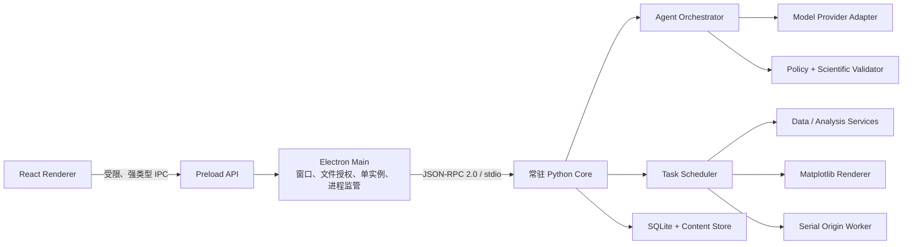

# PlotAgent 后端与 Agent 架构

> 状态：第一轮架构基线已确认  
> 日期：2026-08-05  
> 适用范围：Windows 桌面端、数值数据绘图、自然语言规划、本地执行、PNG/SVG/OPJU 导出  
> 相关文档：[小规模 Beta 性能测试与发布门禁契约](./PERFORMANCE-TEST-RELEASE.md)、[Agent 上下文、模型供应商与数据出境契约](./AGENT-CONTEXT-AND-PROVIDERS.md)、[邀请、共享额度与最小 Beta 云控制面契约](./CLOUD-CONTROL-PLANE.md)、[本地安全、诊断与 Beta Schema 兼容契约](./LOCAL-SECURITY-MIGRATION-DIAGNOSTICS.md)、[领域契约与 Schema 设计](./DOMAIN-CONTRACTS.md)、[项目存储、项目包与数据导入](./PROJECT-STORAGE.md)、[派生数据、单位与血缘契约](./DATA-TRANSFORMS.md)、[任务运行时、取消与崩溃恢复](./TASK-RUNTIME.md)、[分析计算层与科学边界](./ANALYSIS-ENGINE.md)、[拟合系统契约](./FITTING-SYSTEM.md)、[渲染管线与跨 Renderer 一致性契约](./RENDERING-PIPELINE.md)、[原生 Origin OPJU 导出契约](./ORIGIN-EXPORT.md)、[产品决策基线](./PRODUCT-DECISIONS.md)、[产品需求文档](./PRD.md)

## 1. 架构结论

第一轮采用以下组合：

- 单 Agent 规划，不采用多 Agent 系统。
- 一个由 Electron 主进程监管的常驻 Python Core。
- Electron 与 Python 通过带版本的 JSON-RPC over stdio 通信，不开放本地 HTTP 端口。
- Agent 只输出符合 JSON Schema 的 `AgentDecision`；其中 `ActionPlan` 也只是候选，必须经过本地校验后执行。模型没有工具循环、文件/数据库/Origin/URL 访问或任意代码执行能力。
- 版本化 PlotSpec 是图表结构化真值；单一 resolver 把它与固定数据、分析、样式和发表规格解析为 ResolvedRenderPlan，Matplotlib 与 Origin 都只适配该 Plan。
- 手动界面操作与自然语言操作进入同一套计划、校验、执行、验证和事务链。
- Matplotlib 是第一轮唯一正式预览、PNG 和 SVG 渲染器；Plotly/Kaleido 不进入第一轮正式渲染链。
- Origin 导出使用单独的串行受控 Worker。

## 2. 进程结构



### 2.1 React Renderer

- 只负责界面状态、展示和用户输入。
- 不读取任意本地路径，不直接启动 Python，不连接 Origin，不持有模型密钥。
- 只调用 preload 暴露的逐项方法，例如 `importData()`、`submitCommand()`、`cancelTask()` 和 `exportArtifact()`。

### 2.2 Electron Main

- 管理窗口、单实例、文件选择器、系统凭据和应用退出。
- 启动、监控、重启和关闭 Python Core。
- 校验所有 renderer 请求，并把用户通过文件选择器授权的路径转换为受控资源引用。
- 把 Python 的任务事件转发给 renderer，不向 renderer 暴露原始 stdio。

Electron 官方将主进程、renderer 和 preload 作为不同权限边界，并建议在 context isolation 下通过 `contextBridge` 暴露参数受限的逐项 IPC API：

- [Electron Process Model](https://www.electronjs.org/docs/latest/tutorial/process-model)
- [Electron Context Isolation](https://www.electronjs.org/docs/latest/tutorial/context-isolation)
- [Electron IPC](https://www.electronjs.org/docs/latest/tutorial/ipc)

### 2.3 Python Core

- 随桌面应用启动并常驻，避免每次任务重复初始化科学计算库。
- 负责项目、数据、PlotSpec、分析、绘图、任务、缓存和导出。
- 只接受 Electron Main 发来的协议消息，不监听 TCP 端口。
- 崩溃后由 Electron Main 拉起，并从 SQLite 任务状态恢复到最后一个完整事务。

## 3. 本地通信协议

### 3.1 传输

- 使用 stdin/stdout，协议为带版本的 JSON-RPC 2.0 风格消息。
- 使用明确帧边界，不以裸换行作为复杂 JSON 的唯一分隔方式。
- stdout 只传协议消息；诊断日志写 stderr，并由主进程结构化收集。
- 大型表格、图像字节和 OPJU 文件不内联传输，只传对象 ID、摘要或受控临时资源引用。

### 3.2 消息类型

- Request/Response：导入、创建图、修改图、保存项目、导出等短请求。
- Task Event：阶段、进度、警告、部分失败、完成和取消结果。
- Health Event：Python 版本、引擎版本、内存、Origin 状态和协议版本。
- Shutdown：等待任务、取消任务、清理资源和退出。

### 3.3 可靠性

- 每个写操作携带 `request_id`、`idempotency_key`、`project_id` 和 `expected_version`。
- 重复请求不得生成重复对象或重复导出。
- 协议与 PlotSpec 分别版本化，兼容性不依赖应用版本字符串猜测。

## 4. PlotSpec 与 ActionPlan

本节描述架构职责，字段、联合类型、白名单 Patch、Action 上限与兼容规则以 [领域契约与 Schema 设计](./DOMAIN-CONTRACTS.md) 为准。

### 4.1 PlotSpec

PlotSpec 是独立于 Matplotlib、SVG 和 Origin 的图表定义：

```text
PlotSpec
├─ schema_version
├─ chart_type_id
├─ dataset_version_ids
├─ field_mapping
├─ transform_refs
├─ analysis_spec
├─ axes
├─ series
├─ style_reference
├─ annotations
├─ layout
├─ publication_profile
└─ renderer_contract
```

要求：

- 所有字段使用 Pydantic 模型和 JSON Schema 校验。
- 图形类型使用稳定 ID，例如 K02、S31、S61。
- 数据、样式、发表规格和渲染器都引用明确版本。
- 图表子对象具有稳定语义 ID，例如 `series:control`、`axis:y-left`、`legend:main`。
- PlotSpec 不包含可执行 Python、LabTalk、JavaScript 或任意模板代码。

### 4.2 PlotPatch

自然语言改图转换为小范围、可审计的 PlotPatch：

```json
{
  "target_id": "series:control",
  "operation": "set_line_width",
  "value": { "value": 0.8, "unit": "pt" },
  "expected_plot_version": "plot-v3"
}
```

- Patch 只允许白名单操作。
- Patch 应用前验证目标、单位、范围与版本。
- 修改成功后生成新 PlotSpec 版本，不就地改写历史版本。

### 4.3 ActionPlan

Agent 与手动 UI 最终都生成同一种 ActionPlan：

```text
ActionPlan
├─ intent
├─ project_id
├─ target_ids
├─ scope
├─ operations[]
├─ required_inputs[]
├─ confirmation_level
└─ expected_versions
```

手动 UI 可以直接构建 ActionPlan 并绕过模型，因此离线模式和在线 Agent 使用同一执行后端。

## 5. Agent 架构

### 5.1 单 Agent，有界执行

第一轮不使用多 Agent，也不建立开放式自主循环。一次请求采用固定上限流程：

1. 本地 ContextBuilder 从权威对象、ConversationState 与用户授权的数据范围构建最小 ContextEnvelope。
2. ModelProvider 返回唯一 `AgentDecision = ActionPlan | NeedsInput | Unsupported | NoChange` 候选。
3. 本地 validator 检查 Schema、对象版本、图形能力、权限、数据出境与科研业务规则。
4. 被接受的 ActionPlan 才由 Executor 映射到白名单领域服务；模型从不获得这些服务的调用权。
5. Verifier 检查生成对象、科研约束和导出契约，Transaction Manager 原子提交对象与版本。
6. ConversationState reducer 只根据权威对象和执行结果归约本地状态，Response Builder 生成界面结果。

### 5.2 失败与重试

- 缺少必要信息或目标歧义时返回结构化追问，不执行猜测方案。
- 业务校验失败不触发模型自动改方法或改图形。
- 瞬时基础设施错误可做有限、确定性重试。
- 不允许模型无限重新规划或不断修改代码尝试解决错误。
- 执行结果正文由结构化结果生成，不让模型虚构成功状态、路径或统计值。

### 5.3 模型适配层

内部只依赖 capability-based `ModelProvider` 抽象。自定义 OpenAI-compatible endpoint 先探测 `/v1/responses`，再回退 `/v1/chat/completions`；探测只使用合成数据。P1 支持严格 JSON Schema，P2 仅支持 JSON 并在本地失败后最多 repair 一次，P0 不准入。

Provider 的 response format 或 function-calling 只作为单次结构化传输机制，不能形成工具循环。模型不接收本地工具、任意路径或 URL，也不使用供应商托管 conversation、`previous_response_id` 或隐藏 server state；官方 OpenAI adapter 固定 `store:false`。完整 ContextEnvelope、DataDisclosure、凭据、网络、审计、保留说明与错误契约见 [Agent 上下文、模型供应商与数据出境契约](./AGENT-CONTEXT-AND-PROVIDERS.md)。

## 6. 白名单领域服务

第一轮服务边界：

- `ProjectService`：项目、事务、资源、版本和回收站。
- `DatasetService`：导入、摘要、数据签名、数据版本和只读访问。
- `TransformService`：执行 Pydantic discriminated union 白名单步骤、单位运算、预检和三层 lineage，原子创建派生 DatasetVersion。
- `PlotService`：PlotSpec 创建、Patch、验证和版本。
- `RenderService`：解析版本化坐标、ticks、物理布局、字体、样式、数据完整性与 ResolvedRenderPlan hash。
- `AnalysisService`：按版本化白名单执行用户明确指定的绘图计算与科学分析，持久化 AnalysisSpec、AnalysisResult 和命名输出端口。
- `BatchService`：完全同构验证、任务展开、部分失败和事务撤销。
- `CompositionService`：固定数值面板布局和源图版本引用。
- `ExportService`：PNG、SVG、OPJU 和正式导出记录。
- `OriginService`：OriginAdapter/OriginExportPlan、preflight、隔离实例、原生对象重建、两阶段验证和整文件原子提交。
- `TaskService`：队列、阶段、取消、重试、恢复和事件。

本地 Executor 只能把已通过校验的 Action 映射到这些服务；模型不能直接选择/调用服务，也不能传任意路径、URL、SQL、Python、命令行或 Origin 脚本。

### 6.1 数据变换、单位与血缘

- 一次 `create_derived_dataset` 最多执行 16 步线性 TransformPipeline，只发布最终 DatasetVersion；Join/Concat 可以有多个精确父级。
- TransformStep 只接受带 discriminator 的白名单结构与类型化 AST，不接收 SQL、Python、字符串表达式或 UDF。
- TransformSpec 只做确定性表变换；统计、拟合、KDE、平滑和检验由 AnalysisSpec 产生 AnalysisResult。普通表只通过 `materialize_analysis_output` 显式物化结果端口。
- UnitSpec 由项目数据库权威保存，Parquet metadata 只镜像；Core 使用 pinned Pint registry，单位换算与 plot-local 换算都创建派生版本。
- 对象级 parent/recipe/hash、字段级稳定 ID/expression AST 和行级 source/composite/member lineage 全部持久化。
- 正式 apply 前展示行列变化、字段与单位、非有限值、Join expansion 和 before/after sample；歧义返回 NeedsInput。
- 完整步骤注册表、单位代数、异常策略与批量规则以 [派生数据、单位与血缘契约](./DATA-TRANSFORMS.md) 为准。

### 6.2 分析计算边界

- 直接绘图不创建隐藏统计量；分箱、箱线统计、KDE、平滑、拟合、区间、检验和混淆矩阵归一化均产生 AnalysisResult。
- 字段映射与计算设置在同一确认卡完成；模板只能预填可见参数，Agent 不替用户选择方法，误差语义缺失时返回 NeedsInput。
- AnalysisSpec 固定方法与实现版本、DatasetVersion、字段与设计、缺失策略、参数、权重、区间、比较、校正、种子和输出端口。
- AnalysisResult 保存规格与输入哈希、样本纳入排除、统计结果、区间、诊断、收敛、结果表和依赖库版本。
- PlotSpec 只引用 AnalysisResult 的命名输出端口；renderer、Matplotlib 和 Origin 均不重新计算分析。
- 数值计算使用完整数据、float64 和固定随机种子，不插补、不自动排除离群值；数据更新只把旧结果标为 stale。
- FitSpec 使用版本化模型白名单、显式输入层级与权重语义、有界确定性 multistart；FitResult 持久化曲线、区间、残差、mask 与全部求解诊断，导出端不重新拟合。
- 方法注册表、显著性白名单、学科图形边界与批量一致性以 [分析计算层与科学边界](./ANALYSIS-ENGINE.md) 为准。
- 完整拟合公式、失败边界与导出约束以 [拟合系统契约](./FITTING-SYSTEM.md) 为准。

## 7. 数据与持久化

### 7.1 存储职责

- `%LOCALAPPDATA%\PlotAgent\catalog.sqlite3` 只保存项目目录、最近打开和应用设置。
- 每个 `projects/<uuid>/project.sqlite3` 保存对话、对象关系、版本 DAG、任务、PlotSpec、AnalysisSpec 和操作记录。
- `objects/sha256` 保存原始副本、Parquet、持久化规格与导出等不可变大对象；原始数据不可变。
- `cache` 只保存可再生内容，不进入项目包；`tmp` 和 `project.lock` 分别管理未提交产物和单写入工作区。
- SQLite WAL 仅用于本机活动工作区，由 Python Core 单写入器管理。

### 7.2 Python 数据栈

- PyArrow：表格交换、Parquet 和模式信息。
- Pandas：Excel、Matplotlib、SciPy 与 Origin 兼容边界，不作为唯一持久化真值。
- NumPy/SciPy：数值计算及用户明确指定的统计与拟合。
- OpenPyXL：XLSX 与多工作表解析。
- Matplotlib：第一轮正式预览、PNG 和 SVG。
- Pint：使用固定 registry version 解析 UnitSpec 与执行单位代数；项目 alias 不修改标准单位定义。

第一轮不需要 FastAPI、Uvicorn、python-multipart、Plotly 或 Kaleido 进入运行时核心依赖；是否彻底移除由实现任务在依赖审计时确认。

### 7.3 `.plotproj`

- 活跃项目使用本机事务工作区持续自动保存；`.plotproj` 是可搬运快照，不是实时数据库。
- 打开项目包时导入本机工作副本，后续不修改原包；同一包默认回到已有副本，也可明确“作为新副本导入”。
- 包含 `manifest.json`、SQLite Online Backup 快照、`objects/sha256` 和 `checksums.sha256`；禁止直接复制活动 WAL 数据库。
- 完整项目包包含原始、派生与历史；结果项目包省略原始但保留改图和导出所需派生数值，并明确限制依赖原始数据的重算。
- 项目包、活动数据库和 WAL 不在网络文件系统中直接打开或持续写入。

### 7.4 数据导入

- 文件授权后先在 `tmp` 复制并哈希，再识别格式、编码、工作表和表头。
- 必要问题解决后完整分块解析为 Arrow/Parquet，生成质量摘要和同构候选。
- 校验成功后移动不可变对象，并在单个 SQLite 事务中注册 ImportRecipe 与 DatasetVersion；失败不污染正式项目。
- 系统先形成结构候选，再只进行一次用户字段映射；最终语义签名包含字段集合、逻辑类型、单位、语义和映射。
- 详细目录、包模式、快照、ImportRecipe、同构与 SQLite 约束以 [项目存储、项目包与数据导入](./PROJECT-STORAGE.md) 为准。

## 8. 渲染与 Origin

### 8.1 Matplotlib Renderer

- Render Resolver 先把 PlotSpec/FigureSpec 与固定引用解析为 ResolvedRenderPlan；Matplotlib adapter 不自行 autoscale、选择 ticks、换单位、fallback 字体或重算分析。
- thumbnail、interactive 与 formal 使用同一语义 resolver；前两者可记录并显示确定性视觉降采样，formal PNG/SVG 使用完整数据。
- Plan 固定 mm/pt 物理尺寸、sRGB、SafeRichText AST、六类第一轮 axis、range、ticks、legend/annotation placement 与 font file hash。
- PNG、SVG 和 Origin 使用同一 Plan 与语义容差；目标是 semantic parity，不要求 pixel identity。
- renderer 返回输出文件、plan hash、尺寸、DPI、字体、警告和验证结果，不返回不可追溯的全局 pyplot 状态。
- CPU 密集型渲染可进入受控进程池，任务提交仍由 Python Core 协调。
- 完整 resolver、autoscale、tick、SVG 和验证规则以 [渲染管线与跨 Renderer 一致性契约](./RENDERING-PIPELINE.md) 为准。

### 8.2 Origin Worker

- Origin 任务进入单独串行队列。
- OPJU 是 target-scoped self-contained editable delivery，不是 `.plotproj`；只带目标图实际使用的数据、分析端口和 metadata，不带对话、secret 或绝对路径。
- OriginExportPlan 由 ExportSpec、ResolvedRenderPlan 和版本化 OriginAdapter 本地生成；Worker 不接受模型脚本、任意 property string 或模板路径。
- 第一轮 OriginAdapter 只使用 `originpro`/Python 类型化固定映射，禁止模型、数据或 app-owned LabTalk；需要 LabTalk 的能力判为缺失。
- 第一轮 31 项正式图形都要求 O1 full native semantic parity；不能用 raster/SVG 嵌入或运行时降级冒充原生。
- Preflight 检查 Origin exact version/build/bitness 精确命中当前 Beta build 的唯一 qualification 声明，并检查 license、originpro、字体、签名 template、adapter、目录和文件锁；其他版本返回 `VERSION_UNSUPPORTED`。
- 不连接用户当前 Origin，不调用 `op.attach()`；构建和验证分别从新的 dedicated blank instance 开始，也不终止用户实例。
- Live structural validation 通过后保存同目录临时 OPJU；退出，再用新实例打开并读回 books/sheets/rows/columns/designations/Units、pages/layers/plots/data links、axes/ticks/legend/page/style 与数值/missing 语义。
- 一个 OPJU 整体原子；任一目标失败不发布。排除目标必须由用户创建新 ExportSpec，不能静默跳过。
- 成功后记录外部 path/hash/size/mtime 与 spec/plan hash；外部修改不回写，同路径覆盖前检测并要求确认或 Save As。
- 异常和正常结束都清理 PlotAgent 管理实例与临时资源；完整内容、adapter、安全、错误与恢复规则见 [原生 Origin OPJU 导出契约](./ORIGIN-EXPORT.md)。

Origin 官方说明外部 `originpro` 通过 COM 控制本机 Origin，仅支持 Windows，并要求安装 Origin 2021 或更高版本：

- [Origin External Python](https://docs.originlab.com/externalpython/)
- [Origin External Python Samples](https://docs.originlab.com/externalpython/external-python-code-samples/)

这是 originpro 的上游技术条件，不是 PlotAgent 的产品支持范围。每个 Beta build 只支持一个完成完整 qualification 的 Origin exact version；即使满足上游最低条件，其他版本仍返回 `VERSION_UNSUPPORTED`。

## 9. 任务与事务

- InteractionRun 负责模型规划和停止生成；ExecutionTask 负责可取消的本地执行。NeedsInput 结束 InteractionRun，不创建后台任务。
- ExecutionTask 使用 `queued/preparing/running/committing/succeeded` 主链，并支持 `cancelling/cancelled/failed/partially_succeeded/interrupted`；`committing` 不可取消，第一轮没有暂停。
- 控制与 SQLite 提交由 Core 单写入器负责；计算默认最多 2 个隔离进程并可因内存压力降为 1；Origin 严格串行。
- 交互预览高优先级，同一图的新预览可替代尚未开始的旧预览。
- 单图、改图、分析、派生数据和多文件导入会话按各自契约原子提交；批量保留完成项；每个导出文件临时写入、校验后原子替换。
- 取消先使用 cooperative token，宽限期后只终止隔离工作进程；Origin 无响应时重建 PlotAgent 管理实例，不强杀 Core。
- 每个任务固定输入版本并使用 expected version 与 `(task_id, action_id, output_slot)` 幂等键；活跃任务引用阻止对象删除。
- Electron监督Core心跳；任务预先持久化并只在阶段边界写记录，用于确认原子提交和清理temp。遗留任务标记为interrupted，正式任务不自动续跑/重试，由用户明确重试。
- 详细状态、取消、调度、提交、恢复和关闭流程以 [任务运行时、取消与崩溃恢复](./TASK-RUNTIME.md) 为准。

## 10. 安全与隐私

- Renderer 保持 sandbox、context isolation 和关闭 Node integration。
- preload 每个方法单独暴露并验证参数，不暴露通用 IPC 发送器。
- 模型只能看到 ContextEnvelope 明示的字段元数据、摘要与用户授权样本；默认样本不超过 20 行、12 个字段和 200 个 scalar，超宽表先在本地筛选候选字段。
- 文件路径由 Electron 文件选择器授权，模型只引用资源 ID。
- 自定义 API key 与内置设备令牌只存 Windows Credential Manager，不进入 renderer、项目、`.plotproj`、SQLite 普通字段、日志、诊断、命令行或模型上下文。
- 日志和诊断不记录原始数据、任何用户提示、文件名或列值。
- 所有派生变换、统计和导出保留操作记录与输入版本。
- 数据、列名和单元格文本是不可信 data；其中 URL 不抓取，其中指令不执行。非 loopback provider 强制 HTTPS，TLS 不可关闭，带凭据的跨 origin redirect 被阻止。

## 11. Beta 最小云控制面与人工分发

最小云控制面是独立外部边界：InviteGrant 拥有共享额度，随机设备使用长期 DeviceCredential 鉴权；服务端以 `(invite_id, client_run_id)` 唯一记录和原子共享计数保证重试不重复调用/扣费。第一轮不实现 access/refresh rotation、reserve/settle/reconcile、CloudConfig 或应用内更新。应用启动与项目事务不依赖云端；Beta 安装包由用户人工取得并校验发布签名、SHA-256 与 Windows code signature。完整契约见 [邀请、共享额度与最小 Beta 云控制面契约](./CLOUD-CONTROL-PLANE.md)。

## 12. 本地安全与项目生命周期

- NetworkMode 明确区分 builtin proxy、custom provider 与 local_only；local_only 由网络策略层阻止全部远程出站，手动 ActionPlan 和本地三格式导出链保持不变。
- 不可信 `.plotproj`/archive、Excel/CSV、对话/模型文本和 Electron IPC 都在进入权威对象前执行类型化安全校验；活动 SQLite/WAL 只在本机固定磁盘。
- 本地日志使用allowlist；第一轮无analytics。LocalDiagnosticBundle由用户逐项预览后只保存本地，项目内容、prompt、路径、字段和值不得泄露。
- 不兼容schema默认稳定拒绝。确有需要时只为一个明确source→target版本对使用一致快照、新temp workspace、语义验证与原子切换；第一轮无每日自动备份或恢复UI。
- 详细 NetworkMode、安全导入、日志/本地诊断、Beta兼容、错误与重试规则见 [本地安全、诊断与 Beta Schema 兼容契约](./LOCAL-SECURITY-MIGRATION-DIAGNOSTICS.md)。

## 13. 推荐实现顺序

实施按W0–W10依赖DAG和M0–M7 evidence里程碑推进。先完成contracts/tooling与四个risk spikes，再做manual K01垂直切片；Origin K01 O1验证必须在M0前置，不能作为31图完成后的最后接入项。完整workstream范围、并行边界、错误归属与完成定义见 [实施拆分与里程碑计划](./IMPLEMENTATION-PLAN.md)，权威文档与requirement/evidence映射见 [规格索引与设计冻结基线](./SPEC-INDEX.md)。
