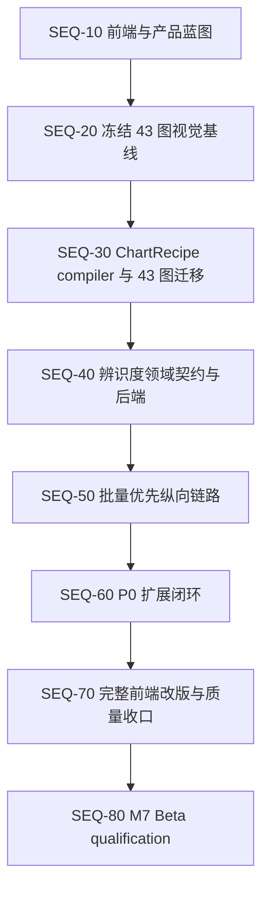

# PlotAgent 前端、P0 与产品辨识度实施顺序

> 状态：执行顺序基线已冻结，后续实施按阶段更新状态与证据
> 日期：2026-08-07
> 适用范围：前端改版、Origin 绘图 P0、批量绘图与自然语言画图/改图的产品辨识度
> 相关文档：[产品需求文档](./PRD.md)、[产品决策基线](./PRODUCT-DECISIONS.md)、[领域契约](./DOMAIN-CONTRACTS.md)、[渲染管线](./RENDERING-PIPELINE.md)、[实施计划](./IMPLEMENTATION-PLAN.md)、[Beta 测试与发布门禁](./PERFORMANCE-TEST-RELEASE.md)

## 1. 文档目的

本文件冻结“先做什么、后做什么、何时允许进入下一阶段”。它用于避免三类返工：

1. 在 ChartRecipe 和语义对象尚未稳定前重写精确编辑器、对象树与组合搭建器。
2. 在现有 43 图视觉基线未冻结前迁移渲染架构，导致无法判断视觉差异来自旧问题还是迁移回归。
3. 把批量绘图和自然语言能力作为单图完成后的附加按钮，错失 PlotAgent 的产品辨识度。

本文件不扩大 v1 科学范围。任意单元格编辑、通用数据变换、分析/拟合、图像处理、LabTalk/Python/公式节点和插件市场仍不进入当前实现。

## 2. 已冻结的判断

- 前端设计可以先开始，但第一阶段只冻结信息架构、关键流程、对象语法、状态和视觉系统，不立即重写全部生产页面。
- 现有 43 图的视觉资格先于 ChartRecipe 迁移完成，迁移不得通过修改旧 oracle 或放宽容差获得通过。
- ChartRecipe compiler 与 43 图同构迁移是对象树、完整图形模板和用户搭建器的共同底座，虽然实现最难，仍须前置。
- 产品辨识度的第一条纵向链路是“多数据导入 → 明确指定图形 → 一次映射 → 批量生成 → 缩略图审阅 → 选中/全局自然语言修改 → ChangeSet 核对 → 批量导出”。
- 主对话保持无常驻右栏；批量审阅和聚焦编辑使用独立全窗口工作模式。
- 用户必须明确指定图形。允许用户在自然语言中说出图形名称或 ID，不允许 Agent 推荐、猜测或静默替换图形。

## 3. P0 纯实现难度

难度只表示工程复杂度，不代表执行顺序。视觉资格的工程难度较低，但人工审计量较大；ChartRecipe 难度最高，但属于依赖根节点。

| 难度顺序 | P0 | 难度 | 主要风险 |
| --- | --- | --- | --- |
| 1 | 43 图完整视觉资格 | 2/5 | 人工证据量、参考图与同源数据缺口、非默认状态覆盖 |
| 2 | 样式预设复用 | 2.5/5 | 样式优先级、批量局部覆盖、版本与来源追溯 |
| 3 | 批量视觉审阅工作台 | 3/5 | 缩略图资源、选择状态、部分成功、局部重试和大批次性能 |
| 4 | Agent 可核对 ChangeSet | 3.5/5 | 精确目标、版本冲突、事务原子性、撤销和不适用项说明 |
| 5 | 数据替换与重放 | 3.5/5 | 字段签名变化、映射失配、旧版本保留和批次部分兼容 |
| 6 | 精确编辑器与对象树 | 4/5 | 语义选择、多选、层级重排、实时预览和键盘路径 |
| 7 | ChartRecipe compiler 与 43 图迁移 | 5/5 | Schema、validator、compiler、动态布局、双 renderer、Origin parity 和 golden 迁移 |
| 8 | 完整图形模板 | 5/5 | 依赖 ChartRecipe；结构、槽位、轴关系、样式和兼容版本必须同时保存 |

“样式预设”和“完整图形模板”必须分开：前者只保存已有强类型样式状态，可以较早交付；后者保存图形结构和语义槽位，必须等待 ChartRecipe。

## 4. 总体依赖与执行顺序



可并行边界：

- SEQ-10 可以与剩余视觉证据整理并行，但不得提交依赖未冻结领域对象的生产型精确编辑界面。
- SEQ-40 的 Schema 草案可在 SEQ-30 后半段开始；产品运行时接入必须等待 ChartRecipe compiler 和迁移 gate 通过。
- 样式预设的存储契约可与 SEQ-40 并行；完整图形模板不得提前。
- 前端 tokens、基础控件和无障碍原语可以持续整理；屏幕级大改按本文件阶段执行。

## 5. 阶段状态总表

状态取值固定为：`未开始`、`进行中`、`工程门禁通过`、`完成`、`阻塞`。`阻塞`必须记录稳定阻塞原因；一般工作未完成不能标为阻塞。

| 阶段 | 当前状态 | 进入条件 | 退出结果 |
| --- | --- | --- | --- |
| SEQ-10 前端与产品蓝图 | 未开始 | 本顺序基线确认 | 三工作区 IA、关键流程、对象语法、状态矩阵、设计方向冻结 |
| SEQ-20 43 图视觉基线 | 进行中 | Phase A/B 工程门禁通过 | 43 图默认与代表性非默认状态的可追溯视觉基线 |
| SEQ-30 ChartRecipe 与迁移 | 未开始 | SEQ-20 完成 | 43 图由同一版本化配方运行时确定性生成 |
| SEQ-40 辨识度契约与后端 | 未开始 | SEQ-30 gate 通过 | SelectionScope、ChangeSet、BatchReview、StylePreset、DataReplacementPlan 可执行 |
| SEQ-50 批量优先纵向链路 | 未开始 | SEQ-40 最小闭环通过 | 一条从多数据到批量自然语言改图再到导出的真实链路 |
| SEQ-60 P0 扩展闭环 | 未开始 | SEQ-50 用户路径稳定 | 数据重放、精确对象树、完整模板与后续搭建器按依赖交付 |
| SEQ-70 完整前端改版 | 未开始 | SEQ-60 对象和操作稳定 | 全应用视觉、交互、无障碍、错误与边界状态收口 |
| SEQ-80 M7 Beta qualification | 未开始 | M6 全部退出条件通过 | 完整发布 evidence 和邀请制 Beta go/no-go |

## 6. SEQ-10：前端与产品蓝图

### 6.1 目标

先决定界面承载什么对象、用户如何从一种工作模式进入另一种工作模式，再决定具体页面外观。前端辨识度来自任务结构，不来自装饰。

### 6.2 必须冻结的三个工作区

1. **对话工作区：** 导入、明确选图、映射、创建任务、展示结构化结果、发起自然语言操作。
2. **批量审阅工作区：** 缩略图网格/列表/轮播、多选、筛选、统一比较、部分失败修复、批量导出。
3. **聚焦编辑工作区：** 单图精确编辑、语义对象选择、结构树和后续图形搭建。

组合图继续使用全窗口专业模式，但其结构编辑待 ChartRecipe 稳定后定稿。

### 6.3 必须产出

- 三个工作区的低保真流程与导航关系。
- 桌面 1920×1080、100%/150% DPI 下的基础布局。
- 数据集、映射、批次、图、版本、ChangeSet、导出记录的一致对象语法。
- 作用对象和范围的选择规则：当前图、选中图、整个批次、组合图。
- 空状态、处理中、部分成功、失败、NeedsInput、Unsupported、版本冲突和撤销状态。
- 设计 tokens 和基础控件词汇；保持“校准工作台”、浅色克制、图形优先、无卡片堆叠。

### 6.4 本阶段禁止

- 不把当前所有页面先换皮。
- 不实现依赖 ChartRecipe 的最终对象树、图层增删、轴归属和完整模板 UI。
- 不用 mock 交互冒充 Core/Agent 已有能力。
- 不因追求辨识度改变无账号、本地优先、用户明确选图和无通用分析平台的边界。

### 6.5 退出证据

- 一份被确认的屏幕/流程清单。
- 每个关键操作对应稳定领域对象或明确标记“等待 SEQ-30/40”。
- 设计评审确认批量与自然语言是主流程，不是单图卡片后的附加操作。

## 7. SEQ-20：冻结 43 图视觉基线

### 7.1 当前基础

- Phase A 基础泛化和 Phase B 通用/专属编辑工程门禁已通过。
- 全部 43 个正式图已完成一次合并 Origin build/save/fresh-reopen 工程测试。
- 该工程测试不等于完整人工视觉资格。

### 7.2 必须完成

- 43 图默认状态的参考依据、同源数据、Matplotlib、Origin 并排证据。
- 适用图形的非默认通用编辑、专属编辑和 Origin fresh-reopen 证据。
- X24/S07 继续明确标注为冻结合成视觉验证，不能冒充 Origin 官方同源证据。
- 缺少同源数据的图不生成伪视觉结论；记录缺口和恢复条件。
- 固定 baseline hash、fixture、renderer/adapter/Origin exact version 和审计结论。

### 7.3 退出条件

- 迁移前视觉 baseline 可独立复现。
- 已知差异有明确 chart/state/evidence 归属。
- SEQ-30 不需要通过修改 SEQ-20 oracle 才能开始。

## 8. SEQ-30：ChartRecipe compiler 与 43 图迁移

### 8.1 实施顺序

1. 冻结 StructureUnitDefinition、ChartRecipe、语义端口和封闭关系 Schema。
2. 实现 graph validator、canonical normalization、version/hash 和稳定错误。
3. 实现 Recipe → PlotSpec/ResolvedRenderPlan 的确定性 compiler。
4. 先迁移每种结构签名的代表图，再迁移全部 43 个正式图。
5. 九个 `internal_hidden` adapter 保持内部回归，不扩大产品范围。
6. 对照 SEQ-20 验证 Matplotlib、SVG/PNG、OriginPlan、OPJU 和 fresh-reopen parity。

### 8.2 完成条件

- 正式 43 图没有第二套按 chart ID 隐藏布局真值。
- 配方不包含真实数据、FieldId、文件路径、计算结果或可执行代码。
- 动态组数、类别数、范围、误差、双 Y、分面和偏移仍通过既有泛化 oracle。
- 用户搭建器尚未开放，但内部 runtime 已能表达已批准组合。

## 9. SEQ-40：辨识度领域契约与后端

### 9.1 最小新增对象

```text
SelectionScope
├─ current_plot
├─ selected_plots[]
├─ batch
└─ figure

AgentChangeSet
├─ source versions
├─ target scope
├─ accepted patches[]
├─ unsupported/skipped targets[]
├─ resulting versions
└─ reversible transaction reference

BatchReviewItem
├─ plot/version/preview
├─ execution state
├─ validation warnings
├─ selection state
└─ retry eligibility

StylePreset
├─ versioned typed style state
├─ applicable capabilities
└─ override precedence

DataReplacementPlan
├─ old/new dataset signatures
├─ reusable mappings
├─ mismatches requiring confirmation
└─ affected plots/batches
```

### 9.2 约束

- ChangeSet 是本地校验后的实际执行结果，不是模型解释文本。
- 批量操作允许部分成功，但同一目标内部保持原子；失败项不改变原版本。
- “按上次样式/批次处理”引用已保存的版本化对象，不回放自由聊天文本。
- 数据替换生成新 SourceDataset/PreparedDataset/PlotSpec 版本，不覆盖原始数据和旧图。

## 10. SEQ-50：批量优先辨识度纵向链路

### 10.1 必须实现的真实路径

```text
导入多份文件或多工作表
→ 选择同构数据范围
→ 用户用界面或自然语言明确指定图形
→ 系统准备一次字段映射并请求确认
→ 创建批次任务
→ 缩略图网格持续显示真实进度
→ 用户多选图或选择整个批次
→ 输入自然语言修改
→ 展示并执行可核对 ChangeSet
→ 查看成功、跳过和失败项
→ 撤销或继续修改
→ 导出 PNG/SVG/OPJU
```

### 10.2 产品辨识度验收

- 批量入口不依赖先完成一张单图。
- 同一批次至少支持“当前、选中、全部”三种真实作用范围。
- Agent 指令前后都显示精确对象和版本；不以笼统“修改成功”代替结果。
- 批次级统一字体、色板、画布、图例和适用坐标范围可以一次执行，并列出不适用项。
- 部分失败只修复和重试失败项，成功项不重复运行。
- 缩略图审阅显示真实 Core 产物，不使用占位图冒充。
- 导出记录保留批次版本、成员版本、ChangeSet 和 artifact hash。

## 11. SEQ-60：P0 扩展闭环

在 SEQ-50 稳定后按以下顺序实施：

1. **样式预设：** 保存当前强类型样式，应用到单图、选中图或批次，支持局部覆盖。
2. **数据替换与重放：** 导入新一期文件，比较签名，复用可证明兼容的映射、配方和样式。
3. **精确编辑器与对象树：** 语义选中、增删/排序、轴归属、图层关系和事务撤销。
4. **完整图形模板：** 保存 ChartRecipe、语义槽位、默认样式和兼容性要求。
5. **用户搭建器：** 默认从当前图开始，空白搭建作为进阶入口；不提供自由脚本或任意画布。

每项只能消费同一领域对象，不建立前端私有模板 JSON、renderer 参数或第二套组合模型。

## 12. SEQ-70：完整前端改版与质量收口

### 12.1 实施范围

- 应用壳层、项目与对话导航。
- 对话中的数据、映射、批次、图、ChangeSet 和导出对象。
- 批量审阅工作区。
- 聚焦编辑器和结构树。
- 组合编辑器与后续搭建器。
- 加载、错误、部分成功、离线、Origin 不可用、版本冲突和取消状态。

### 12.2 设计约束

- 纯白图表画布，低色度工作区，品牌色只表达主操作、选择和状态。
- 不使用传统后台卡片网格、玻璃效果、装饰渐变、超大圆角或宽柔阴影。
- 参数渐进展开；主对话不长期显示复杂属性栏。
- 桌面工具优先使用熟悉的按钮、标签页、树、列表、选择和键盘路径，不为辨识度发明陌生控件。
- WCAG 2.2 AA、完整键盘路径、清晰焦点和 `prefers-reduced-motion` 是完成条件。

### 12.3 退出证据

- 真实桌面 build 的关键路径截图与交互录屏。
- 100%/150% DPI、最小支持窗口、长中英文和大批次状态验证。
- 前端 E2E、无障碍、视觉回归和错误状态矩阵通过。
- UI 中没有展示后端尚未实现的假按钮或模拟产品能力。

## 13. 不允许提前的实现

- SEQ-20 未完成前，不迁移或重写视觉 oracle。
- SEQ-30 未完成前，不实现最终对象树、完整图形模板或用户搭建器。
- SEQ-40 未完成前，不让前端从模型文本自行推断 ChangeSet、选择范围或重试对象。
- SEQ-50 未通过前，不以单图参数数量增加冒充产品辨识度完成。
- SEQ-60 对象稳定前，不进行全应用屏幕级视觉重写。
- M6 所有退出条件未通过前，不启动或宣称 M7 Beta qualification。

## 14. 后续对照与更新规则

每次进入或完成一个阶段时，在本文件“阶段状态总表”更新状态，并在对应阶段末尾追加一次 evidence 记录：

```text
日期：
阶段：SEQ-xx
提交：
完成范围：
测试与证据：
未完成项：
实现选择与原因：
是否允许进入下一阶段：是/否
```

更新状态不能只写“已实现”。必须给出提交、自动测试、Origin/视觉证据、已知差异和下一阶段进入判断。若后续用户确认改变顺序或范围，先更新 `PRODUCT-DECISIONS.md`，再同步本文件、PRD、领域契约和实施计划。
