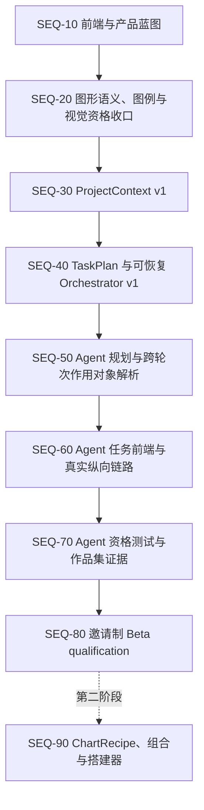

# PlotAgent 前端、P0 与产品辨识度实施顺序

> 状态：执行顺序已按“项目上下文与任务编排优先”重新冻结
> 日期：2026-08-08
> 适用范围：前端、Origin 绘图 P0、项目级上下文、可恢复任务编排与自然语言画图/改图的产品辨识度
> 相关文档：[产品需求文档](./PRD.md)、[产品决策基线](./PRODUCT-DECISIONS.md)、[领域契约](./DOMAIN-CONTRACTS.md)、[渲染管线](./RENDERING-PIPELINE.md)、[实施计划](./IMPLEMENTATION-PLAN.md)、[Beta 测试与发布门禁](./PERFORMANCE-TEST-RELEASE.md)

> 阅读规则：本文记录的45图视觉批次与SEQ-20证据属于重构前工作；当前正式38图模板优先引擎的机械/视觉资格不得由这些历史状态继承。

## 1. 文档目的

本文件冻结“先做什么、后做什么、何时允许进入下一阶段”。它用于避免三类返工：

1. 在 ChartRecipe 和语义对象尚未稳定前重写精确编辑器、对象树与组合搭建器。
2. 在首批迁移图的视觉基线未冻结前迁移渲染架构，导致无法判断视觉差异来自旧问题还是迁移回归。
3. 把批量绘图和自然语言能力作为单图完成后的附加按钮，或只做一次模型调用而没有项目上下文、计划、部分失败和恢复，错失 PlotAgent 的产品辨识度。

本文件不扩大 v1 科学范围。任意单元格编辑、通用数据变换、分析/拟合、图像处理、LabTalk/Python/公式节点和插件市场仍不进入当前实现。

## 2. 已冻结的判断

- 前端蓝图阶段先冻结信息架构、关键流程、对象语法、状态和视觉系统，不立即接入全部生产页面；第一阶段后半程在真实批量链路稳定后完成全生产前端重做。
- 当前先收口图形语义、Origin 图例和同源视觉证据。X02/X03 目录错位、Line Series/Before-After 缺项及正式范围更新必须以独立提交和新证据闭合；在实现完成前不得用目标数量替代当前真实能力。
- ChartRecipe compiler 是对象树、完整图形模板和用户搭建器的候选共同底座，但不再是首轮 Agent 纵向链路的前置条件；首批 14 图迁移整体后移到第二阶段。
- 第一阶段重做完整生产前端，而不是只改三张核心页面；信息架构与视觉蓝图先冻结，生产接入等待最小领域契约和真实批量链路稳定，避免把新界面绑定到临时对象。
- 产品辨识度的第一条纵向链路是“读取项目上下文 → Agent 提出任务计划 → 用户在必要确认点确认 → 本地编排批量执行 → 展示部分成功/失败 → 修复并恢复失败项 → 跨轮次继续修改 → 批量导出”。
- `ProjectContext`、`TaskPlan`、作用对象解析、权限、确认、事务和恢复属于 PlotAgent 自有领域层；通用模型 runtime 可以复用或替换，但不得成为这些语义的权威来源。
- 主对话保持无常驻右栏；批量审阅和聚焦编辑使用独立全窗口工作模式。
- 用户仍必须明确指定图形。Agent 可以整理计划、建议字段映射与批量范围，但不推荐、猜测或静默替换图形类型。

## 3. P0 纯实现难度

难度只表示工程复杂度，不代表执行顺序。视觉资格的工程难度较低，但人工审计量较大；ChartRecipe 难度最高，但属于依赖根节点。

| 难度顺序 | P0 | 难度 | 主要风险 |
| --- | --- | --- | --- |
| 1 | 当前图形语义与 Origin 视觉债务收口 | 2.5/5 | 图例样例、目录语义、同源证据、昂贵 COM 重跑与人工签名 |
| 2 | ProjectContext v1 | 3/5 | 权威来源、稳定 ID/版本、最小披露、跨对话共享边界与陈旧检测 |
| 3 | TaskPlan 与确定性 Orchestrator v1 | 3.5/5 | 依赖、确认点、幂等、部分成功、journal、取消和恢复边界 |
| 4 | 跨轮次作用对象解析 | 3.5/5 | 指代歧义、当前/选中/批次范围、版本冲突与最少追问 |
| 5 | Agent 计划/执行纵向链路 | 3.5/5 | 模型不稳定、结构化输出、计划合法性、本地绑定与成本/延迟 |
| 6 | Agent 任务前端与批量审阅 | 4/5 | 计划确认、NeedsInput、真实进度、部分失败、恢复、E2E 与无障碍 |
| 7 | Agent 资格测试与作品集证据 | 3/5 | 可复现任务集、指标口径、真实用户样本与演示叙事 |
| 8 | ChartRecipe compiler v1 与首批迁移 | 4/5 | 第二阶段依赖；Schema、compiler、双 renderer parity 和 golden 迁移 |
| 9 | 完整图形模板/用户搭建器 | 5/5 | 依赖 ChartRecipe；结构、槽位、轴关系、样式和兼容版本必须同时保存 |

“样式预设”和“完整图形模板”必须分开：前者只保存已有强类型样式状态，可以较早交付；后者保存图形结构和语义槽位，必须等待 ChartRecipe。

## 4. 总体依赖与执行顺序



可并行边界：

- SEQ-20 的同源证据整理可以与 SEQ-30 的只读 ProjectContext Schema 草案并行；共享 renderer/Origin 变化后必须重建受影响视觉证据。
- SEQ-30 后半段可以并行起草 TaskPlan Schema，但持久化和执行必须等待 ProjectContext 的对象/版本/陈旧语义冻结。
- SEQ-40 的确定性 executor、journal 和恢复测试可与 SEQ-50 的提示词/Provider 适配测试并行；真实模型不得绕过未通过的本地计划校验器。
- 前端 tokens、基础控件和无障碍原语已经由 SEQ-10 建设；SEQ-60 只接入 SEQ-30–50 的真实对象，不再进行整体视觉重做。
- 持久化样式预设、数据替换/重放、精确对象树、完整图形模板和用户搭建器属于第二阶段，不阻塞第一阶段前端重做或邀请制试用。

## 5. 阶段状态总表

状态取值固定为：`未开始`、`进行中`、`证据生成完成 / NO-GO`、`完成`、`阻塞`。`证据生成完成 / NO-GO` 表示证据可以复现但阶段资格仍失败，绝不能简称为“门禁通过”；`阻塞`必须记录稳定阻塞原因，一般工作未完成不能标为阻塞。

| 阶段 | 当前状态 | 进入条件 | 退出结果 |
| --- | --- | --- | --- |
| SEQ-10 前端与产品蓝图 | 完成 | 本顺序基线确认 | 三工作区 IA、关键流程、对象语法、状态矩阵、设计方向冻结 |
| SEQ-20 图形语义、图例与视觉资格 | 证据生成完成 / NO-GO | Phase A/B 工程门禁通过 | 45 图目录语义和共享 Origin 图例已收口；机械阻断已清零，缺同源证据图与人工视觉签名继续明确 NO-GO |
| SEQ-30 ProjectContext v1 | 完成 | 共享对象/图形 ID 已冻结 | 项目级权威上下文可持久化、可最小披露、可检测陈旧并跨轮次复用 |
| SEQ-40 TaskPlan/Orchestrator v1 | 完成 | SEQ-30 Schema/版本语义通过 | 可确认、可部分成功、可局部重试、可从已提交边界恢复的确定性任务链 |
| SEQ-50 Agent 规划与作用对象解析 | 完成 | SEQ-40 本地执行闭环通过 | 真实模型候选计划经本地绑定和校验后执行，跨轮次指代绑定精确对象/范围 |
| SEQ-60 Agent 任务前端与纵向链路 | 完成 | SEQ-50 工程链路通过 | 对话真实呈现计划、确认、进度、NeedsInput、部分失败、恢复、ChangeSet 和导出记录 |
| SEQ-70 Agent 资格/作品集证据 | 未开始 | SEQ-60 E2E 通过 | 三条核心演示、机器指标、5–10 名科研用户试用材料与架构/取舍说明 |
| SEQ-80 邀请制 Beta qualification | 未开始 | SEQ-70 无不可豁免 P0 | 完整发布 evidence 和邀请制 Beta go/no-go |
| SEQ-90 ChartRecipe/组合/搭建器 | 第二阶段 | SEQ-80 后按反馈重新确认 | 有限 compiler、首批迁移和后续用户搭建能力；不阻塞首轮 Agent |

## 6. SEQ-10：前端与产品蓝图

### 6.1 目标

先决定界面承载什么对象、用户如何从一种工作模式进入另一种工作模式，再决定具体页面外观。前端辨识度来自任务结构，不来自装饰。

### 6.2 必须冻结的三个工作区

1. **对话工作区：** 导入、明确选图、映射、创建任务、展示结构化结果、发起自然语言操作。
2. **批量审阅工作区：** 第一阶段使用真实缩略图网格、多选、状态筛选、异常标记、部分失败修复和批量导出；列表/轮播、自由排序和叠加比较后移。
3. **聚焦编辑工作区：** 第一阶段承载现有通用/专属强类型单图编辑；精确对象树、图层增删/排序和后续图形搭建属于第二阶段。

组合图继续使用全窗口专业模式，但其结构编辑待 ChartRecipe 稳定后定稿。

### 6.3 必须产出

- 三个工作区的低保真流程与导航关系。
- 桌面 1920×1080、100%/150% DPI 下的基础布局。
- 数据集、映射、批次、图、版本、ChangeSet、导出记录的一致对象语法。
- 作用对象和范围的选择规则：当前图、选中图、整个批次、组合图。
- 空状态、处理中、部分成功、失败、NeedsInput、Unsupported、版本冲突和撤销状态。
- 设计 tokens 和基础控件词汇；保持“校准工作台”、浅色克制、图形优先、无卡片堆叠。

### 6.4 本阶段禁止

- 不把当前所有页面先换皮。
- 不实现依赖 ChartRecipe 的最终对象树、图层增删、轴归属和完整模板 UI。
- 不用 mock 交互冒充 Core/Agent 已有能力。
- 不因追求辨识度改变无账号、本地优先、用户明确选图和无通用分析平台的边界。

### 6.5 退出证据

- 一份被确认的屏幕/流程清单。
- 每个关键操作对应稳定领域对象或明确标记“等待 SEQ-30/40”。
- 设计评审确认批量与自然语言是主流程，不是单图卡片后的附加操作。

### 6.6 入口对比审计（2026-08-07）

- 已完成参考前端 `C:\Users\pc\Desktop\PLOT-windows-local` / `http://127.0.0.1:8000/` 与当前 v3 的独立设计评审、运行时 DOM/ARIA 检查和确定性源码扫描。
- 审计结论：以 v3 的领域对象、桌面架构和本地信任边界为产品基线；采用参考页的灰白黑配色、组件视觉语法、对话区尺寸以及提案确认/即时反馈/结果旁版本入口/编辑撤销重做，但不把参考页作为信息架构母版。
- 已冻结方向：项目包含多对话；主对话无常驻右栏；批量审阅与聚焦编辑使用全窗口模式；多数据可直接进入首批 14 图批量链路；指令前显示真实可用范围，指令后展示可核对 ChangeSet。
- 已登记 P1：连续对话历史、批量主链路、范围/ChangeSet 闭环、清除旧文案/假动作/演示数据。
- 已登记 P2：默认可读性、dialog 焦点进入/圈闭/恢复、统一状态语义、上下文帮助与批量状态视觉。
- 详细证据与实施选择见 [SEQ-10 前端差距审计](./SEQ-10-FRONTEND-GAP-AUDIT.md)。本记录是 SEQ-10 的入口证据，不代表阶段完成；低保真屏幕/流程、DPI 布局与基础控件规范仍待确认。

### 6.7 视觉与组件补充确认（2026-08-07）

- 采用参考 PLOT 的产品界面色板、基础组件观感和对话区尺寸；不恢复常驻右栏。
- 尺寸基线固定为 `920px` 对话内容轴、`840px` Composer、`780px` 普通消息/提案、`640px` 或 `82%` 用户消息、`720px` 单图预览、`258px` 左侧项目/对话栏。复杂结构化对象可按真实信息扩展到 `920px`。
- 组件基线覆盖按钮、输入、消息、提案/结果、状态/引用 pill、菜单、Popover、Dialog/Drawer 和 Composer；组件状态必须完整，并修正参考实现中的对比度、焦点和边框/宽阴影组合问题。
- 其他交互借鉴 Windows、Notion、Linear、Figma、Raycast 的成熟原则，具体取舍服从真实能力、认知负担、简洁性、键盘可达与科研可信度，不复制其业务或外观。
- 本确认替代先前以苔绿/靛蓝作为产品品牌主色的方向；科研图表的 Origin 对照色板不受影响。

### 6.8 已接入的前端基础（2026-08-07）

- 已在现有 renderer 中接入冻结色板、间距/圆角令牌和 `258/230/920/720/840px` 主布局几何；未恢复常驻右栏。
- 已把侧栏项目搜索和任务范围切换改为真实本地行为，并移除尚未接通的资源、应用设置和帮助假入口。
- 已为 Provider、图形库和任务中心统一焦点进入、Tab 圈闭、背景 `inert` 与关闭后焦点恢复；错误主消息不再直接暴露内部代码。
- 工程门禁：TypeScript、ESLint、Web build、renderer 18 条真实桌面工作流测试及确定性 detector 通过；1440×900、1100×720 无横向溢出。全量套件仅 Python Core supervisor 的独立启动握手超时。
- 本切片只建设可复用原语与现有真实启动/Core 状态，不提前实现批量、ChangeSet 或对象树界面，因此 SEQ-10 状态仍为“进行中”。

### 6.9 阶段收口（2026-08-08）

- **提交：** `358ae97`、`f00ea97`、`8e8ef56`、`0c0b142`、`417178b`。
- **完成范围：** 对话优先应用壳、仅项目名的左栏与三点操作、无常驻右栏；首次入口、导入、图形库、批量审阅、聚焦编辑、任务中心和模型服务使用统一灰白黑组件语法；主流程不再强制把导入与选图拆成线性向导；成功反馈回到 Composer 上方并自动消失。
- **测试与证据：** renderer 84/84；ESLint、两套 TypeScript typecheck、Web production build、Electron build 和确定性 UI detector 全通过；已在 1440×900 与 1100×720 真实浏览器状态检查启动页、项目/对话、数据导入、图形库、批量审阅、焦点样式及反馈遮挡。截图位于 `docs/screenshots/`，差距与选择见 `SEQ-10-FRONTEND-GAP-AUDIT.md`。
- **已知边界：** 当前只冻结信息架构、组件、布局、状态原语与真实已有入口；ChangeSet、14 图真实批量闭环和最终对象语法仍按 SEQ-40/50 接入。无常驻右栏、无账号、本地优先、用户明确选图、无假按钮继续是硬边界。后续只修缺陷、无障碍和真实能力接入，不再重做整体布局。
- **实现选择与原因：** 采用成熟桌面产品的低色度工作区、单层导航、渐进披露、明确焦点和短反馈；不复制参考产品业务对象，也不恢复解释性说明堆叠。
- **是否允许进入下一阶段：** 是。SEQ-10 已冻结，允许继续 SEQ-20；后续前端改动不得反向改变领域契约或视觉 oracle。

## 7. SEQ-20：冻结首迁 14 图视觉基线

### 7.1 当前基础

- Phase A 基础泛化和 Phase B 通用/专属编辑工程门禁已通过。
- 全部 43 个正式图已完成一次合并 Origin build/save/fresh-reopen 工程测试。
- 该工程测试不等于完整人工视觉资格。

### 7.2 必须完成

- 首迁 14 图默认状态的参考依据、同源数据、Matplotlib、Origin 并排证据。
- 首迁 14 图适用的非默认通用编辑、专属编辑和 Origin fresh-reopen 证据。
- X24/S07 继续明确标注为冻结合成视觉验证，不能冒充 Origin 官方同源证据。
- 其余 29 图缺少同源数据时不生成伪视觉结论；记录缺口和恢复条件，并继续通过现有路径运行。
- 固定 baseline hash、fixture、renderer/adapter/Origin exact version 和审计结论。

### 7.3 退出条件

- 首迁 14 图的迁移前视觉 baseline 可独立复现。
- 已知差异有明确 chart/state/evidence 归属。
- SEQ-30 不需要通过修改 SEQ-20 oracle 才能开始；其余 29 图视觉资格未完成不阻塞本门槛。

### 7.4 第一批 evidence（2026-08-08）

- **范围：** K01、K02、K03、K08、K18；均为同源 Origin A/C 级证据，不含合成数据。
- **冻结输入：** `tests/fixtures/visual_regression/seq20/` 保存逐图 `data.csv`、`reference.png`、provenance 和 `batch-1.manifest.json`；manifest 固定来源 SHA-256、数据/参考图 SHA-256、PlotSpec/RenderPlan hash、Matplotlib/Origin PNG hash、adapter 与 exact Origin 环境。
- **运行产物：** `build/visual-audit/seq20-origin-baseline/batch-1/index.html`；默认态和代表性编辑态分别生成一份合并 O1 OPJU，并通过 build/save/独立 fresh-reopen 精确读回。
- **环境：** Origin 2024 SR1 `10.10.178` / runtime `10.100178` / 64-bit，`originpro=1.1.15`；Origin adapter `1.0.0`。
- **自动证据结论：** 两个状态的 fresh-reopen validation 均完全一致；冻结数据与参考图 hash 完整性检查通过。该结论只说明证据可复现，不是视觉 gate 通过。
- **P0 自动阻断：** K02 当前产品默认把同一 Line+Symbol 数据的线与点解析为不同系列颜色，而 Origin 参考把二者视为同一系列；归类为 `SERIES_IDENTITY_MISMATCH`。它必须进入 `blocking_observations` 并使视觉 gate 失败，不能只作为说明性观察保留。

### 7.5 第二批 evidence（2026-08-08）

- **范围：** X01、X02、X09、K05、K09；均已锚定同源 Origin A/C 级参考图与数据，不含合成数据。
- **冻结输入：** 对应逐图 fixture、参考图、provenance 和 `batch-2.manifest.json` 位于 `tests/fixtures/visual_regression/seq20/`。
- **运行产物：** `build/visual-audit/seq20-origin-baseline/batch-2/index.html`；默认态与代表性编辑态均完成 Matplotlib、合并 O1 OPJU 和独立 fresh-reopen 导出。
- **自动证据结论：** 两个状态的 Origin build/fresh-reopen validation 完全一致；来源、数据、参考图、PlotSpec、RenderPlan、PNG 与 OPJU hash 均已固定。这仍然只是证据完整性，不是视觉 gate 通过。
- **P0 自动阻断：** K05 原生置信带填充错误归类为 `NATIVE_BAND_FILL_MISMATCH`；K09 三组 Origin 柱发生重叠归类为 `GROUPED_BAR_OVERLAP`。两项必须进入 `blocking_observations`，任一未关闭都自动 NO-GO。
- **人工视觉签名项：** X01/K05 标题位置、X09 区间图例语义等仍需在并排证据上人工判断；它们不靠未经校准的像素阈值自动通过或失败，但没有人工签名时整体视觉资格仍为 NO-GO。
- **阶段判断：** 第二批工程 evidence 完成，但上述视觉差异与用户人工签名未收口，暂不允许据此进入 SEQ-30。

### 7.6 第三批与阶段判断（2026-08-08）

- **提交：** `9d4ed7d`（第一批）、`72759c3`（第二批）、`033a3a0`（第三批）。
- **范围：** K10、S05、S25、X03。K10/X03 直接锚定随附 Origin 图页；S05 使用官方三重复剂量反应数据，把逐剂量均值和 min/max 明确冻结为用户提供曲线/带，不执行拟合；S25 使用官方 Absorbance Spectra 工作表，并因随附 Graph1 只显示 940–1000 局部谱段而改用 Origin 系统 `LINE` 模板做 C 级全数据自动范围重建。安装的旧 `spectra.OTP` 会反转 Y 轴并注入 time/frequency 语义，不适合作为吸收光谱默认规范。
- **冻结输入：** 对应逐图 fixture、参考图、provenance 和 `batch-3.manifest.json` 位于 `tests/fixtures/visual_regression/seq20/`；三批合计严格覆盖 K01、K02、K03、K08、K18、X01、X02、X09、K05、K09、K10、S05、S25、X03。
- **运行产物：** `build/visual-audit/seq20-origin-baseline/batch-3/index.html`；默认态与代表性编辑态均完成 Matplotlib、合并 O1 OPJU 和独立 fresh-reopen 导出。
- **自动证据结论：** 三批 14 图均存在同源参考图与冻结数据，默认/编辑两种状态均固定 PlotSpec、RenderPlan、Matplotlib、Origin PNG、OPJU、adapter、exact Origin version 与 hash；所有 OPJU build/fresh-reopen validation 完全一致。无同源数据、合成数据或旧 oracle 改写进入本基线。该结论只证明证据生成完成。
- **测试：** `tests/rendering/test_seq20_visual_baseline.py` 只检查三批同源证据完整性，不再使用“qualification/gate passed”命名。`tests/rendering/test_seq20_visual_qualification_gate.py` 固定验证：已知 blocking observation 非空必为 NO-GO、缺少 source build identity 必为 NO-GO、共享渲染源码变化使旧资格变为 stale、标题/图例等人工观察必须由人工视觉签名收口。此前 Python/Origin/前端回归数字继续作为历史证据，不得替代该视觉 gate。
- **第三批视觉观察：** S05 Origin 图例右侧被页面边缘截断且标题未置顶；S25/X03 Origin 标题未置顶。K10 的堆积结构与数据总量一致。
- **未完成项：** K02 `SERIES_IDENTITY_MISMATCH`、K05 `NATIVE_BAND_FILL_MISMATCH`、K09 `GROUPED_BAR_OVERLAP` 三个可机械验证 P0 尚未关闭；用户尚未对标题、图例及其余并排证据完成视觉签名。
- **是否允许进入下一阶段：** **否（视觉 NO-GO）。** 当前只完成证据生成与完整性校验，不存在“SEQ-20 自动工程门禁已通过”的结论。修复必须保持冻结数据与参考图不变，不得修改旧 oracle 或放宽容差；三个 P0 自动阻断项清零、证据绑定当前 source build identity 且取得用户视觉签名后，方可把 SEQ-20 标为“完成”并进入 SEQ-30。

### 7.7 视觉资格门禁记录契约

冻结的 reference/data/manifest 是历史证据，不在本次语义纠正中原地改写。下一次由生成器重建证据时，每个 batch manifest 必须新增以下 `qualification` 对象：

```json
{
  "qualification": {
    "source_build_identity": {
      "scope_version": "seq20-rendering-v1",
      "git_commit": "40-char lowercase git commit",
      "source_sha256": "sha256 over the frozen shared rendering source scope"
    },
    "blocking_observations": [
      {
        "chart_type_id": "K02",
        "code": "SERIES_IDENTITY_MISMATCH",
        "states": ["default", "edited"]
      }
    ],
    "human_visual_signature": {
      "status": "pending | approved",
      "reviewer": null,
      "signed_at": null
    },
    "decision": "NO-GO | GO"
  }
}
```

门禁规则固定如下：

1. `git_commit` 精确记录生成证据的提交，`source_sha256` 覆盖 `pyproject.toml`、charts、rendering contracts/styles、共享 rendering 与 Origin 源码；同一 `scope_version` 下任一文件变化都使旧资格成为 `SOURCE_BUILD_STALE`。文档或测试单独变化不会错误使渲染资格陈旧。
2. `blocking_observations` 必须存在且语义固定为“当前未关闭的阻断项”；只要列表非空，整体自动 NO-GO。问题关闭后从该列表移出并可另记历史处置，不能在列表内标 `closed` 来获得通过，也不能把 P0 移回 `visual_observations` 规避门禁。
3. K02 系列身份、K05 native band 填充和 K09 分组柱几何属于可机械验证 P0；标题位置、图例布局/语义等保留为人工视觉签名项，不臆造不可靠的像素阈值。
4. `human_visual_signature.status` 不是 `approved` 时整体 NO-GO。签名只能针对同一 source identity、冻结 reference/data 和本次生成产物，不能沿用旧图片。
5. 只有 source identity 当前、P0 阻断列表为空、人工签名批准且原有同源/fresh-reopen 完整性检查全部通过，生成器才可写 `decision=GO`；否则必须写 `NO-GO`。

### 7.8 当前收口范围与进入 SEQ-30 的边界（2026-08-08）

- 早期 K02 系列身份、K05 原生带填充、K09 分组柱重叠及共享标题/边距问题已经过独立修复和重跑，但用户后续视觉检查发现 Origin 图例普遍只有文字、缺少对应线/点/柱样例；这说明旧门禁只验证了对象/文本/fresh-reopen，不能解释为视觉资格通过。
- 共享 Origin 图例的 logical-series→native-plot sample 映射、安全标签和 build/fresh 校验已由提交 `eafc716` 实现；受影响的正式资格 evidence 必须基于该源码重新生成，旧 manifest 只能作为历史证据。
- 图形目录需同步纠正：X02 恢复为连续型垂线图，X03 恢复为支持 2+ 系列的 Origin 棒棒糖图；两系列棒棒糖可作为“哑铃图”搜索别名/预设，不另占正式 ID；新增 Line Series 与 Before-After 后，目标正式范围由 43 调整为 45。该范围只在 registry、双 renderer、Origin O1、同源数据/参考图和测试全部提交后生效。
- SEQ-30 的入口不是“45 图全部取得 A 级参考图”。后续实施决定把非渲染 Agent 工程层与人工视觉签名解耦：共享图形 ID/语义冻结、Origin 图例 P0 和可测试图机械阻断清零后即可实现 ProjectContext/TaskPlan；同源数据缺口和用户视觉签名继续作为 SEQ-20/Beta 的独立 NO-GO，不能被后续 Agent 阶段的完成状态覆盖。
- **最终工程证据（2026-08-09）：** `77f2a01` 冻结共享 Origin 图例/隐藏图例行为；`44cbdc8`、`583dcd3`、`1d6223c`、`5a33895`、`2fd6ed1` 分别完整重建 fixed、structural、matrix 和 SEQ-20 四批资格。37 张有 A/C 级同源数据的图均生成 default/edited Matplotlib、O1 OPJU 和 fresh-reopen 证据，自动 `blocking_observations` 为空；S07、K24、K25、S01、K21、S21、S31、S34 因缺同源证据未测试。全部 manifest 的人工签名仍为 pending，因此 SEQ-20 保持 NO-GO。

## 8. SEQ-30：ProjectContext v1

### 8.1 权威对象

```text
ProjectContext
├─ project/conversation identity
├─ datasets/sheets/blocks + versions + field signatures
├─ confirmed mappings + applicable data scope
├─ plots/versions + batches/members + previews
├─ current/selected/batch target scope
├─ shared style/publication policy
├─ unresolved issues/NeedsInput
├─ last committed ChangeSet
└─ resumable/interrupted task summaries
```

它是本地权威对象的结构化投影，不是聊天全文摘要，也不依赖供应商隐藏 memory。跨对话共享项目资源和状态，但不自动把其他对话原文发送给模型。

### 8.2 实施顺序

1. 冻结 `ProjectContextSnapshot`、资源引用、版本、scope 和 staleness Schema，并生成 TypeScript 类型。
2. 从现有项目 SQLite、数据集、映射、PlotSpec DAG、Batch、ConversationState 和 TaskEvent 构建只读 snapshot；不复制第二份业务真值。
3. 实现 Context diff 与 `expected_version` 检查；任一输入对象改变后，旧计划必须变为 stale，不能静默重绑。
4. 实现最小披露视图：本地执行使用完整资源 ID/版本，模型只看到任务所需字段元数据、摘要、授权样本和稳定别名。
5. 持久化当前作用对象、选择范围、未解决问题和最近任务引用；重启后可恢复同一项目语义。

### 8.3 完成条件

- 同一项目在不同对话中能引用同一数据、批次和图版本，但不会泄露其他对话原文。
- “上一批”“第三张”“这些图”“除了失败的两个”等引用有可枚举本地候选；候选不唯一时 Context 明确标记歧义。
- snapshot 可确定性重建并有稳定 hash；对象删除、版本推进或选择变化使旧 snapshot/plan 稳定过期。
- 模型上下文继续遵守数据出境上限，路径、secret、SQLite ID 和未授权单元格不进入 Provider 请求。

### 8.4 实现记录（2026-08-08）

- **提交：** `26e5f56`。新增版本化 `ProjectContextSnapshot`、稳定对象/字段别名、确定性 snapshot hash、作用对象优先级和 staleness 结果；权威对象继续来自项目 SQLite 与现有领域仓储，没有建立第二份“AI memory”真值。
- **持久化与重启：** ConversationState、当前/选中对象、确认字段、最近计划结果和上下文 hash 写入本地 Agent runtime 表；Core 重启后使用同一对象 ID、版本和 content hash 恢复，不依赖 Provider 会话记忆。
- **最小披露：** Provider 只获得稳定别名、必要字段元数据、受限统计/样本和显式作用范围；本机路径、凭据、SQLite 内部位置和未授权单元格不进入请求。
- **陈旧与歧义：** composer scope、显式本轮引用、conversation target、最近计划输出和唯一候选按固定优先级解析；版本/content hash 变化稳定产生 stale，多候选只返回本地有界候选与一个必要问题。

## 9. SEQ-40：TaskPlan 与可恢复 Orchestrator v1

### 9.1 最小对象

```text
TaskPlan
├─ user_goal
├─ context_snapshot_hash
├─ frozen inputs/target scope
├─ items[] + dependencies[]
├─ confirmation checkpoints[]
├─ expected versions + idempotency keys
└─ overall state

TaskItemState
Draft → NeedsInput → Ready → Running
      → PartiallySucceeded → Completed
      → Failed | Cancelled | Interrupted
```

`AgentChangeSet` 和 `BatchReviewItem` 不再是孤立辨识度对象，而是 TaskPlan 已执行结果与成员视图。ChangeSet 始终来自本地校验后的实际执行结果，不是模型解释文本。

### 9.2 执行与恢复规则

- 计划先持久化，再执行；每个 item 固定输入版本、输出槽位、幂等键和可重试性。
- 模型不直接调用 Import/Plot/Render/Origin；确定性 `TaskOrchestrator` 把已验证 action 映射到现有白名单领域服务。
- 同一目标内部原子；批量允许部分成功。成功项立即成为正式对象并保留，失败项不改变原版本。
- journal 只记录稳定阶段和已提交边界，不保存 Python/Origin 进程内部状态。崩溃后标记 `Interrupted`，由用户明确选择“继续未完成项”或“取消”。
- 恢复时重新检查 context hash、expected versions、外部文件和 Origin 条件；条件不再成立则进入 `NeedsInput` 或 `Stale`，不得静默从头重跑。
- 失败项局部重试复用合法成功输出，不重复扣费、不重做成功项；整个计划仍提供一次可核对的 ChangeSet/撤销引用。

### 9.3 第一条本地纵向链路

不接模型也必须先完成：多工作表/多文件 → 用户明确图形 → 一次映射确认 → 生成 TaskPlan → 部分成功 → 修复一个失败映射 → 仅恢复失败项 → 批量导出。手动 UI 可构建同一种计划，用于证明编排不是提示词脚本。

### 9.4 完成条件

- 计划、item、依赖、确认、进度、结果与错误均可从 SQLite 重建。
- 取消、Core 崩溃、应用重启、Origin 中断和版本冲突都有确定性结果；不存在半成品图版本。
- 同一幂等键重复提交不会生成重复 Plot/ExportRecord 或重复执行已成功项。
- 单元测试覆盖状态机；集成测试覆盖部分失败、局部重试、重启恢复、stale 拒绝和 committing 边界。

### 9.5 实现记录（2026-08-08）

- **提交：** `b013482`、`0ed4a81`。`TaskPlanSnapshot`、TaskItem、attempt、checkpoint 和事件 journal 全部持久化；确认、拒绝、执行、取消、partial success、interrupted、stale 与 resume 使用同一状态机。
- **确定性执行：** 模型和手动 UI 都只产生白名单业务 action；本地 compiler 冻结 context hash、expected object versions、依赖、输出槽位和幂等键，再由 Orchestrator 调用现有领域服务。模型不持有 Shell、文件、数据库、Origin 或开放工具循环。
- **真实批量链路：** 多工作表手动批量现在生成 N 个 `CreatePlotAction` 和 1 个依赖全部成员的 `CreateBatchAction`，不再旁路为旧 `BatchService` 前端任务。每个成员独立提交；一个可重试失败会使最终组装暂时 blocked，恢复时只重跑失败成员并复用成功 Plot 输出。
- **集成证据：** 两工作表用例验证计划确认、3 个 TaskItem、权威 BatchSpec、幂等重复执行和重启后批次作用对象；故障注入验证第一次为 succeeded/failed/blocked，恢复后的 attempt 次数为 1/2/1，成功成员未重做。

## 10. SEQ-50：Agent 规划与跨轮次作用对象解析

### 10.1 架构边界

- 保留当前 Python Core、`ModelProvider`、ContextBuilder 和四路 `AgentDecision` 基础；新增薄且可替换的 `AgentRuntime` 接口，不重写通用 provider/transport。
- PlotAgent 自有 ProjectContext、TaskPlan、TargetResolver、Policy、Validator、TaskOrchestrator、journal、事务和 verifier；任何外部 Agent 框架都只能位于 `AgentRuntime` 接口之后。
- Pi 只做限时适配 spike，验证结构化传输、取消、流式事件和本地 provider 兼容；Hermes 只作能力参考。两者均不成为首阶段必需依赖，也不接管项目 memory、工具权限或恢复真值。
- 第一阶段保持单 Agent、单次有界计划，不开放任意工具循环、Shell、Python、数据库、文件、URL 或 Origin 控制权。

### 10.2 单轮流程

```text
用户请求
→ ContextBuilder 构建最小 ProjectContext view
→ 模型返回 CandidateTaskPlan | NeedsInput | Unsupported | NoChange
→ TargetResolver 绑定本地对象、范围和版本
→ Validator/Policy 校验能力、权限、数据与科研边界
→ 用户确认必要 checkpoint
→ TaskOrchestrator 执行冻结计划
→ Verifier 生成真实 ChangeSet/结果摘要
→ Context 更新，下一轮继续引用
```

### 10.3 跨轮次解析规则

1. 输入框常驻的显式作用对象优先。
2. 本轮显式名称/ID/选择优先于历史 active target。
3. “这些/上一批/失败项/第三张”只能在 ProjectContext 的有界候选集合中解析。
4. 唯一候选可自动绑定，并在计划卡中可见；多个合理候选只提出一个最小必要追问。
5. 模型不得生成内部 ID；它输出稳定别名/语义约束，本地 resolver 才附加 ID、版本和 scope。

### 10.4 完成条件

- 真实模型对冻结任务集的计划合法率、目标解析准确率和字段映射首轮接受率达到 SEQ-70 规定门槛。
- 中英混合科研术语、跨轮次指代、批量范围和“排除某些对象”均有可复现测试。
- 模型超时、无效 JSON、越权 action、未知图形、陈旧上下文和数据披露超限稳定失败，不创建业务对象。
- 不以框架内置 memory、server conversation 或模型自述作为正确性证据。

### 10.5 实现记录（2026-08-08）

- **提交：** `2b237b3`、`7263b9d`。现有 `ModelProvider` 继续作为薄模型 runtime；结构化候选计划必须通过本地 Pydantic Schema、稳定别名解析、能力/权限/数据边界校验后才可持久化，未引入 Pi/Hermes 运行时依赖。
- **真实模型证据：** 使用已配置的 DeepSeek `deepseek-v4-flash` 完成 create plan、用户确认、本地执行和跨轮次英文/中英混合标题修改；重启 Core 后 plot version、content hash、title 与计划记录保持一致。API key 始终只在系统凭据库中使用，证据不读取或回显 secret。
- **边界：** 手动批量使用确定性本地计划；模型可对明确的现有 batch scope 生成候选 patch。首阶段不让模型自行发现多数据源或选择图形，也不开放 provider tool loop。
- **已知质量项：** 一条中文明确标题请求被模型过度追问；该轮没有产生业务对象或错误修改。它保留为 SEQ-70 提示词/模型质量样本，不否定本地权威绑定、失败安全和跨轮次工程链路。

## 11. SEQ-60：Agent 任务前端与真实纵向链路

### 11.1 接入范围

- 沿用已冻结的左侧项目管理、主对话、无常驻右栏和底部 Composer，不再次重做整体布局。
- 对话时间线新增真实的 Plan、Confirmation、NeedsInput、Progress、PartialSuccess、Interrupted、ChangeSet 和 ExportRecord 对象。
- 输入框常驻显示作用对象和范围；用户可在提交前切换当前图、选中图或批次。
- 批量审阅继续使用全窗口真实缩略图网格，支持状态筛选、失败项修复、局部恢复和批量导出。
- 任务中心是同一 TaskPlan 的全局投影，不建立第二套状态；来源对话保留任务详情和恢复入口。

### 11.2 核心演示路径

```text
导入含多个工作表的 Excel
→ 用户说“把这些表都画成 K02，时间作 X、信号作 Y”
→ Agent 展示批量范围、一次映射和 10 个 TaskItem
→ 用户确认
→ 8 个完成、2 个 NeedsInput
→ 用户补充“第二个用 intensity，最后一个跳过”
→ 只恢复未完成项
→ 用户下一轮说“把上一批除第三张外统一成同一 Y 范围”
→ Agent 精确展示作用对象和 ChangeSet
→ 批量导出 PNG/SVG/OPJU
```

### 11.3 完成条件

- 所有计划/进度/恢复状态来自 Core 事件，无假进度、占位结果或纯前端推断。
- 键盘、焦点、取消、离线、Provider 不可用、Origin 不可用、长中英文和 100%/150% DPI 通过。
- 关闭并重启应用后，用户能从来源对话继续未完成计划；成功项和用户确认不丢失。
- 前端 E2E 同时断言 UI 状态与 SQLite/领域对象结果，不能只截图判定。

### 11.4 实现记录（2026-08-08）

- **提交：** `2b237b3`、`0ed4a81`。桌面对话直接读取 Core 的持久 TaskPlan，呈现确认、逐项状态、attempt、failure、partial/interrupted/resumable、真实输出引用和 ChangeSet；任务中心仍是同一 Core 任务事件投影。
- **对象时间线：** 计划执行后从权威 output ref 读取新 Plot 或 Batch；ChangeSet 来自 Core 实际 before/after，而不是模型说明；PNG/SVG/OPJU 成功后呈现 ExportRecord 的格式、对象、hash/size，不向 renderer 暴露本机绝对路径。
- **浏览器纵向验证：** 三个示例数据表创建 K02 时，界面先显示 `0/4`（3 个绘图成员 + 1 个批次组装）、等待确认；确认后显示 `4/4`、四个真实输出、`ChangeSet · succeeded` 和 `batch:preview-1`。该预览只验证交互对象语义，不替代 Core 集成测试。
- **Core/E2E 证据：** renderer 测试断言批量 UI 不再调用旧 `runBatch`，确认后取回真实 batch target 并用该 ID 导出；Python 集成测试同时断言 SQLite 计划/attempt、领域 Plot/Batch、重启恢复、部分失败与局部重试结果。
- **实现取舍：** 第一阶段保留单实例、本地权威、用户明确选图和一次映射；批次计划上限为 63 个数据集/64 个 action、上下文字段绑定上限 256，避免把任务编排演化为无界工作流平台。

## 12. SEQ-70：Agent 资格测试与作品集证据

### 12.1 固定三类任务

1. **批量计划：** 多文件/多工作表、一次映射、动态成员数和真实进度。
2. **项目级连续性：** 跨轮次“上一批/这些图/除第三张外/沿用刚才样式”等作用对象解析。
3. **失败与恢复：** 部分成功、NeedsInput、应用重启、修复后只恢复失败项、stale 计划拒绝。

### 12.2 机器指标

- CandidateTaskPlan Schema 合法率与本地 validator 接受率。
- 作用对象/范围解析准确率和错误自动绑定率。
- 字段映射首轮接受率、必要追问数和无效追问率。
- 批量完成率、部分失败保真率、恢复成功率、成功项重复执行率（目标为 0）。
- stale/越权计划拒绝率、模型成本、端到端延迟和相对手工 Origin 流程节省时间。

指标分程序契约、固定模型任务集和真实用户结果三层报告，不能用单一综合分数掩盖错误。

### 12.3 作品集交付物

- 3 分钟演示视频：问题 → 计划 → 确认 → 部分失败 → 恢复 → 跨轮次改图 → OPJU。
- 一页产品 case study：用户问题、为什么不做开放数据处理平台、Agent 自主边界、build-vs-buy、关键取舍和结果。
- 一张架构图：可替换 AgentRuntime 与 PlotAgent 自有 Context/Plan/Orchestrator 的分层。
- 一份 eval 报告：任务集、指标、失败样例、改进记录、成本与延迟。
- 5–10 名目标科研用户的经同意观察/访谈记录，至少验证愿意用真实数据再试、任务计划可理解和失败恢复可信。

### 12.4 退出条件

- 三条固定演示均可从干净项目自动复现，不依赖开发者手工改库或预置隐藏状态。
- 无错误对象绑定、静默图形替换、成功项重复运行、半成品版本或恢复后结果漂移的已知 P0。
- 真实用户能说明 Agent 计划了什么、将改哪些对象、哪些失败以及如何继续；“像聊天机器人”不是验收结论。

## 13. SEQ-80 与第二阶段

### 13.1 邀请制 Beta

SEQ-80 继续执行既有安全、性能、签名安装包、Origin exact version、无账号/本地优先和邀请制 Beta 门禁。首轮 Agent 资格通过不代表所有图形取得 Origin 同源证据；发布声明必须逐项列出已资格图形和证据缺口。

### 13.2 SEQ-90 候选

取得真实试用反馈后再确认以下项目，不自动视为已承诺范围：

1. ChartRecipe compiler v1 与低风险图迁移。
2. 持久化命名样式预设与局部覆盖。
3. 数据替换与重放。
4. 精确对象树、图层增删/排序与轴归属。
5. 完整图形模板、从当前图开始的用户搭建器和进阶空白搭建。
6. `FigureRecipe`、双 Y/分面/跨轴关系及新增固定计算。

后续能力仍只能消费同一 ProjectContext、TaskPlan、PlotSpec/ResolvedRenderPlan 和本地事务链，不得建立前端私有模板 JSON、renderer 参数、自由脚本、第二套组合模型或开放式数据处理 Agent。

## 14. 不允许提前的实现

- SEQ-20 收口前，不以旧合并 OPJU、fresh-reopen 一致或历史 contact sheet 宣称逐图视觉通过；图例和图形语义变化后必须重建受影响证据。
- SEQ-30 未完成前，不让模型或前端维护私有“项目记忆”，也不把聊天摘要当作对象/版本真值。
- SEQ-40 未完成前，不用提示词、前端状态或框架内置任务替代本地 TaskPlan、journal、幂等和恢复。
- SEQ-50 未完成前，不让模型文本直接决定 ChangeSet、内部 ID、选择范围、重试对象或领域服务调用。
- SEQ-60 未通过前，不以命令行脚本或开发者手工补状态冒充产品纵向链路。
- 第一阶段不实现持久化样式库、数据替换/重放、精确对象树、完整模板、ChartRecipe 迁移或用户搭建器。
- 不为显得更“Agent”引入多 Agent、开放工具循环、Shell/Python 执行、隐藏 memory 或自动替用户选图。
- M6 所有退出条件未通过前，不启动或宣称 M7 Beta qualification。

## 15. 后续对照与更新规则

每次进入或完成一个阶段时，在本文件“阶段状态总表”更新状态，并在对应阶段末尾追加一次 evidence 记录：

```text
日期：
阶段：SEQ-xx
提交：
完成范围：
测试与证据：
未完成项：
实现选择与原因：
是否允许进入下一阶段：是/否
```

更新状态不能只写“已实现”。必须给出提交、自动测试、Origin/视觉证据、已知差异和下一阶段进入判断。若后续用户确认改变顺序或范围，先更新 `PRODUCT-DECISIONS.md`，再同步本文件、PRD、领域契约和实施计划。
