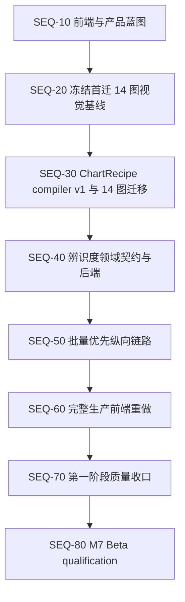

# PlotAgent 前端、P0 与产品辨识度实施顺序

> 状态：执行顺序基线已冻结，后续实施按阶段更新状态与证据
> 日期：2026-08-07
> 适用范围：前端改版、Origin 绘图 P0、批量绘图与自然语言画图/改图的产品辨识度
> 相关文档：[产品需求文档](./PRD.md)、[产品决策基线](./PRODUCT-DECISIONS.md)、[领域契约](./DOMAIN-CONTRACTS.md)、[渲染管线](./RENDERING-PIPELINE.md)、[实施计划](./IMPLEMENTATION-PLAN.md)、[Beta 测试与发布门禁](./PERFORMANCE-TEST-RELEASE.md)

## 1. 文档目的

本文件冻结“先做什么、后做什么、何时允许进入下一阶段”。它用于避免三类返工：

1. 在 ChartRecipe 和语义对象尚未稳定前重写精确编辑器、对象树与组合搭建器。
2. 在首批迁移图的视觉基线未冻结前迁移渲染架构，导致无法判断视觉差异来自旧问题还是迁移回归。
3. 把批量绘图和自然语言能力作为单图完成后的附加按钮，错失 PlotAgent 的产品辨识度。

本文件不扩大 v1 科学范围。任意单元格编辑、通用数据变换、分析/拟合、图像处理、LabTalk/Python/公式节点和插件市场仍不进入当前实现。

## 2. 已冻结的判断

- 前端蓝图阶段先冻结信息架构、关键流程、对象语法、状态和视觉系统，不立即接入全部生产页面；第一阶段后半程在真实批量链路稳定后完成全生产前端重做。
- ChartRecipe 第一阶段只迁移 14 个低风险图；这 14 图的视觉资格先于迁移完成，迁移不得通过修改旧 oracle 或放宽容差获得通过。其余 29 图继续使用现有路径并并行补齐视觉资格，不阻塞 compiler v1。
- ChartRecipe compiler 是对象树、完整图形模板和用户搭建器的候选共同底座，但第一阶段只验证有限结构单元和关系，不以完整表达 43 图或开放搭建器为目标。
- 第一阶段重做完整生产前端，而不是只改三张核心页面；信息架构与视觉蓝图先冻结，生产接入等待最小领域契约和真实批量链路稳定，避免把新界面绑定到临时对象。
- 产品辨识度的第一条纵向链路是“多数据导入 → 明确指定图形 → 一次映射 → 批量生成 → 缩略图审阅 → 选中/全局自然语言修改 → ChangeSet 核对 → 批量导出”。
- 主对话保持无常驻右栏；批量审阅和聚焦编辑使用独立全窗口工作模式。
- 用户必须明确指定图形。允许用户在自然语言中说出图形名称或 ID，不允许 Agent 推荐、猜测或静默替换图形。

## 3. P0 纯实现难度

难度只表示工程复杂度，不代表执行顺序。视觉资格的工程难度较低，但人工审计量较大；ChartRecipe 难度最高，但属于依赖根节点。

| 难度顺序 | P0 | 难度 | 主要风险 |
| --- | --- | --- | --- |
| 1 | 43 图完整视觉资格 | 2/5 | 人工证据量、参考图与同源数据缺口、非默认状态覆盖 |
| 2 | 样式预设复用 | 2.5/5 | 样式优先级、批量局部覆盖、版本与来源追溯 |
| 3 | 批量视觉审阅工作台 | 3/5 | 缩略图资源、选择状态、部分成功、局部重试和大批次性能 |
| 4 | Agent 可核对 ChangeSet | 3.5/5 | 精确目标、版本冲突、事务原子性、撤销和不适用项说明 |
| 5 | 数据替换与重放 | 3.5/5 | 字段签名变化、映射失配、旧版本保留和批次部分兼容 |
| 6 | 完整生产前端重做 | 4/5 | 全屏状态矩阵、桌面交互、现有功能回接、E2E、DPI、无障碍和视觉回归 |
| 7 | 精确编辑器与对象树 | 4/5 | 语义选择、多选、层级重排、实时预览和键盘路径 |
| 8 | ChartRecipe compiler v1 与首批 14 图迁移 | 4/5 | Schema、validator、compiler、动态布局、双 renderer、Origin parity 和 golden 迁移 |
| 9 | 完整图形模板 | 5/5 | 依赖 ChartRecipe；结构、槽位、轴关系、样式和兼容版本必须同时保存 |

“样式预设”和“完整图形模板”必须分开：前者只保存已有强类型样式状态，可以较早交付；后者保存图形结构和语义槽位，必须等待 ChartRecipe。

## 4. 总体依赖与执行顺序



可并行边界：

- SEQ-10 可以与视觉证据整理并行，但不得提交依赖未冻结领域对象的生产型精确编辑界面。
- 非首迁 29 图的视觉资格可与 SEQ-30–50 并行，但必须在 M7 Beta qualification 前收口；其现有 PlotSpec/Resolver/renderer 路径保持有效。
- SEQ-40 的 Schema 草案可在 SEQ-30 后半段开始；产品运行时接入必须等待 ChartRecipe compiler 和迁移 gate 通过。
- 前端 tokens、基础控件和无障碍原语可在 SEQ-10 后建设；完整生产页面接入在 SEQ-50 真实链路稳定后开始。
- 持久化样式预设、数据替换/重放、精确对象树、完整图形模板和用户搭建器属于第二阶段，不阻塞第一阶段前端重做或邀请制试用。

## 5. 阶段状态总表

状态取值固定为：`未开始`、`进行中`、`工程门禁通过`、`完成`、`阻塞`。`阻塞`必须记录稳定阻塞原因；一般工作未完成不能标为阻塞。

| 阶段 | 当前状态 | 进入条件 | 退出结果 |
| --- | --- | --- | --- |
| SEQ-10 前端与产品蓝图 | 进行中 | 本顺序基线确认 | 三工作区 IA、关键流程、对象语法、状态矩阵、设计方向冻结 |
| SEQ-20 首迁图视觉基线 | 进行中 | Phase A/B 工程门禁通过 | 首迁 14 图默认与代表性非默认状态的可追溯视觉基线；其余 29 图缺口持续登记 |
| SEQ-30 ChartRecipe v1 与迁移 | 未开始 | 首迁 14 图视觉基线完成 | 14 图由同一版本化配方运行时确定性生成，其余 29 图行为不变 |
| SEQ-40 辨识度契约与后端 | 未开始 | SEQ-30 gate 通过 | 精简 SelectionScope、AgentChangeSet 与 BatchReviewItem 可执行 |
| SEQ-50 批量优先纵向链路 | 未开始 | SEQ-40 最小闭环通过 | 一条从多数据到批量自然语言改图再到导出的真实链路 |
| SEQ-60 完整生产前端重做 | 未开始 | SEQ-50 用户路径稳定 | 所有现有生产页面迁入统一新前端，第一阶段真实对象和操作完整接入 |
| SEQ-70 第一阶段质量收口 | 未开始 | SEQ-60 前端功能对等 | 全应用视觉、交互、无障碍、错误、边界状态和回归收口 |
| SEQ-80 M7 Beta qualification | 未开始 | M6 全部退出条件通过 | 完整发布 evidence 和邀请制 Beta go/no-go |

## 6. SEQ-10：前端与产品蓝图

### 6.1 目标

先决定界面承载什么对象、用户如何从一种工作模式进入另一种工作模式，再决定具体页面外观。前端辨识度来自任务结构，不来自装饰。

### 6.2 必须冻结的三个工作区

1. **对话工作区：** 导入、明确选图、映射、创建任务、展示结构化结果、发起自然语言操作。
2. **批量审阅工作区：** 第一阶段使用真实缩略图网格、多选、状态筛选、异常标记、部分失败修复和批量导出；列表/轮播、自由排序和叠加比较后移。
3. **聚焦编辑工作区：** 第一阶段承载现有通用/专属强类型单图编辑；精确对象树、图层增删/排序和后续图形搭建属于第二阶段。

组合图继续使用全窗口专业模式，但其结构编辑待 ChartRecipe 稳定后定稿。

### 6.3 必须产出

- 三个工作区的低保真流程与导航关系。
- 桌面 1920×1080、100%/150% DPI 下的基础布局。
- 数据集、映射、批次、图、版本、ChangeSet、导出记录的一致对象语法。
- 作用对象和范围的选择规则：当前图、选中图、整个批次、组合图。
- 空状态、处理中、部分成功、失败、NeedsInput、Unsupported、版本冲突和撤销状态。
- 设计 tokens 和基础控件词汇；保持“校准工作台”、浅色克制、图形优先、无卡片堆叠。

### 6.4 本阶段禁止

- 不把当前所有页面先换皮。
- 不实现依赖 ChartRecipe 的最终对象树、图层增删、轴归属和完整模板 UI。
- 不用 mock 交互冒充 Core/Agent 已有能力。
- 不因追求辨识度改变无账号、本地优先、用户明确选图和无通用分析平台的边界。

### 6.5 退出证据

- 一份被确认的屏幕/流程清单。
- 每个关键操作对应稳定领域对象或明确标记“等待 SEQ-30/40”。
- 设计评审确认批量与自然语言是主流程，不是单图卡片后的附加操作。

### 6.6 入口对比审计（2026-08-07）

- 已完成参考前端 `C:\Users\pc\Desktop\PLOT-windows-local` / `http://127.0.0.1:8000/` 与当前 v3 的独立设计评审、运行时 DOM/ARIA 检查和确定性源码扫描。
- 审计结论：以 v3 的领域对象、桌面架构、本地信任边界和“校准工作台”为基线；参考页只借鉴提案确认、即时任务反馈、结果旁版本入口和编辑撤销/重做，不作为结构母版。
- 已冻结方向：项目包含多对话；主对话无常驻右栏；批量审阅与聚焦编辑使用全窗口模式；多数据可直接进入首批 14 图批量链路；指令前显示真实可用范围，指令后展示可核对 ChangeSet。
- 已登记 P1：连续对话历史、批量主链路、范围/ChangeSet 闭环、清除旧文案/假动作/演示数据。
- 已登记 P2：默认可读性、dialog 焦点进入/圈闭/恢复、统一状态语义、上下文帮助与批量状态视觉。
- 详细证据与实施选择见 [SEQ-10 前端差距审计](./SEQ-10-FRONTEND-GAP-AUDIT.md)。本记录是 SEQ-10 的入口证据，不代表阶段完成；低保真屏幕/流程、DPI 布局与基础控件规范仍待确认。

## 7. SEQ-20：冻结首迁 14 图视觉基线

### 7.1 当前基础

- Phase A 基础泛化和 Phase B 通用/专属编辑工程门禁已通过。
- 全部 43 个正式图已完成一次合并 Origin build/save/fresh-reopen 工程测试。
- 该工程测试不等于完整人工视觉资格。

### 7.2 必须完成

- 首迁 14 图默认状态的参考依据、同源数据、Matplotlib、Origin 并排证据。
- 首迁 14 图适用的非默认通用编辑、专属编辑和 Origin fresh-reopen 证据。
- X24/S07 继续明确标注为冻结合成视觉验证，不能冒充 Origin 官方同源证据。
- 其余 29 图缺少同源数据时不生成伪视觉结论；记录缺口和恢复条件，并继续通过现有路径运行。
- 固定 baseline hash、fixture、renderer/adapter/Origin exact version 和审计结论。

### 7.3 退出条件

- 首迁 14 图的迁移前视觉 baseline 可独立复现。
- 已知差异有明确 chart/state/evidence 归属。
- SEQ-30 不需要通过修改 SEQ-20 oracle 才能开始；其余 29 图视觉资格未完成不阻塞本门槛。

## 8. SEQ-30：ChartRecipe compiler v1 与首批 14 图迁移

### 8.1 冻结范围

第一阶段只证明“有限结构单元 + 封闭组合关系 → 现有 PlotSpec → 双 renderer”可行，不追求一次性同构全部 43 图。

首批迁移图固定为：

- **A 批，基础结构：** K01 折线、K02 线点、K03 散点、K08 柱图、K18 面积、X01 阶梯、X02 棒棒糖、X09 浮动区间柱。
- **B 批，组合关系：** K05 给定曲线/置信带、K09 分组柱、K10 堆积柱、S05 给定剂量反应、S25 连续谱、X03 哑铃。

compiler v1 只需覆盖：

- 结构单元：线、点、柱、面积、带、棒、区间柱；
- 关系：叠加、连接、分组、堆积和基线附着；
- 单个笛卡尔坐标系及线性/log10 轴；
- 数据无关、版本化、可规范化的 Recipe，并确定性编译为现有 PlotSpec。

其余 29 图明确暂缓迁移：

- **固定计算：** K06、K07、K11、K13–K17、K20、S61、X24、S07；
- **封装特殊结构：** S01、X05、X13、X38；
- **分面、多轴与整图布局：** K24、K25、X23、X35、X36；
- **色彩映射、矩阵或特殊尺度/布局：** K04、K12、K19、K21、K22、S21、S31、S34。

上述 29 图继续使用既有 PlotSpec/Resolver/renderer 实现，仍属于正式 43 图产品范围。第一阶段不新增 `FigureRecipe`、Pareto/火山图固定计算、跨坐标系尺度联动，也不开放用户自由搭建器。

### 8.2 实施顺序

1. 冻结 StructureUnitDefinition、ChartRecipe、语义端口和封闭关系 Schema。
2. 实现 graph validator、canonical normalization、version/hash 和稳定错误。
3. 实现 Recipe → 现有 PlotSpec 的确定性 compiler；compiler 不直接生成 Matplotlib 或 Origin 指令。
4. 迁移 A 批并通过单结构、baseline 和数据范围泛化门禁。
5. 迁移 B 批并通过 overlay/group/stack、动态组数和多系列门禁。
6. 九个 `internal_hidden` adapter 与非首迁 29 图保持现有内部回归，不扩大产品范围、不为迁移改写。
7. 对照 SEQ-20 验证 Matplotlib、SVG/PNG、OriginPlan、OPJU 和 fresh-reopen parity。

### 8.3 完成条件

- 首迁 14 图由版本化 ChartRecipe 确定结构，compiler 不新增按 chart ID 隐藏布局真值；数据驱动几何和版式继续由现有 Resolver 负责。
- 配方不包含真实数据、FieldId、文件路径、计算结果或可执行代码。
- 行数、系列数、组数、正负范围、误差与缺失值变化继续通过既有泛化 oracle；不发生柱重叠、图例错配、数据截断或半成品版本。
- 新旧路径同数据对照时，Matplotlib 与 Origin 的数据语义、视觉结构和导出结果一致；迁移不得修改旧视觉 oracle 获得通过。
- 非首迁 29 图与九个隐藏 adapter 的既有回归无退化；compiler 失败时稳定阻止或回退，不影响原版本。
- 用户搭建器、完整图形模板、FigureRecipe、双 Y、分面和跨轴关系不作为本阶段完成条件。

## 9. SEQ-40：辨识度领域契约与后端

### 9.1 最小新增对象

```text
SelectionScope
├─ current_plot
├─ selected_plots[]
└─ batch

AgentChangeSet
├─ source versions
├─ target scope
├─ accepted patches[]
├─ unsupported/skipped targets[]
├─ resulting versions
└─ reversible transaction reference

BatchReviewItem
├─ plot/version/preview
├─ execution state
├─ validation warnings
├─ selection state
└─ retry eligibility
```

### 9.2 约束

- ChangeSet 是本地校验后的实际执行结果，不是模型解释文本。
- 批量操作允许部分成功，但同一目标内部保持原子；失败项不改变原版本。
- 每个 ChangeSet 只要求一次整体撤销引用，不新增 ChangeSet 专属历史/分支、任意重放或长期操作脚本；既有 PlotSpec 版本 DAG 保持不变。
- 第一阶段不定义 `figure` 作用范围、持久化 `StylePreset` 或 `DataReplacementPlan`。

## 10. SEQ-50：批量优先辨识度纵向链路

### 10.1 必须实现的真实路径

```text
导入多份文件或多工作表
→ 选择同构数据范围
→ 用户用界面或自然语言明确指定图形
→ 系统准备一次字段映射并请求确认
→ 创建批次任务
→ 缩略图网格持续显示真实进度
→ 用户多选图或选择整个批次
→ 输入自然语言修改
→ 展示并执行可核对 ChangeSet
→ 查看成功、跳过和失败项
→ 撤销或继续修改
→ 导出 PNG/SVG/OPJU
```

### 10.2 第一阶段边界

- 一个批次只包含同一种用户明确指定的图形；一次对话可依次创建多个不同图形批次。
- 批量资格范围固定为首迁 14 图；其余 29 图继续支持既有单图创建、编辑和导出，不宣传为首阶段批量已验证范围。
- 一批数据只确认一次字段映射；仅在工作表/文件字段签名精确兼容时复用。缺列、歧义或类型不兼容进入 `NeedsInput`，不进行模糊猜测。
- 审阅只实现缩略图网格、多选、状态筛选、失败项局部重试和真实进度；不做轮播、图像叠加比较、自由排序或复杂看板。
- 批量统一编辑只对共同 capability 的字体、色板、画布、图例和适用坐标范围执行；不适用项进入 ChangeSet 的 skipped/unsupported 列表。
- 第一阶段可把当前图已有样式复制到选中图或整个批次，但不保存命名样式预设库。

### 10.3 产品辨识度验收

- 批量入口不依赖先完成一张单图。
- 同一批次至少支持“当前、选中、全部”三种真实作用范围。
- Agent 指令前后都显示精确对象和版本；不以笼统“修改成功”代替结果。
- 批次级统一字体、色板、画布、图例和适用坐标范围可以一次执行，并列出不适用项。
- 部分失败只修复和重试失败项，成功项不重复运行。
- 缩略图审阅显示真实 Core 产物，不使用占位图冒充。
- 导出记录保留批次版本、成员版本、ChangeSet 和 artifact hash。

## 11. SEQ-60：完整生产前端重做

### 11.1 实施范围

- 应用壳层、项目与对话导航。
- 首次启动三个入口、模型/网络模式设置和 Origin 可用性状态。
- 导入、工作表/文件选择、一次字段映射确认和 `NeedsInput` 修复。
- 对话中的数据、映射、批次、图、ChangeSet 和导出对象。
- 批量审阅工作区。
- 聚焦编辑器继续承载已经实现的通用和专属强类型编辑，不加入结构树、图层增删或任意属性入口。
- 加载、错误、部分成功、离线、Origin 不可用、版本冲突和取消状态。

前端重做覆盖所有现有生产页面和第一阶段新增页面，不保留一半旧壳、一半新壳的长期混合产品。尚未实现的第二阶段能力不显示假按钮、占位页或模拟结果。

### 11.2 接入顺序

1. 新应用壳层、设计 tokens、导航与基础状态原语。
2. 项目/对话、首次启动、设置和导入/映射页面。
3. 批量审阅、ChangeSet 核对、失败修复和批量导出。
4. 单图聚焦编辑及已有 43 图创建/导出入口迁入新壳。
5. 全页面错误、取消、离线、Origin 不可用与版本冲突状态接入。

生产接入必须调用真实 Core/Agent 对象；允许开发期使用 fixture 做组件测试，但不得把 mock 路径保留为可发布产品能力。

## 12. SEQ-70：第一阶段质量收口

### 12.1 设计约束

- 纯白图表画布，低色度工作区，品牌色只表达主操作、选择和状态。
- 不使用传统后台卡片网格、玻璃效果、装饰渐变、超大圆角或宽柔阴影。
- 参数渐进展开；主对话不长期显示复杂属性栏。
- 桌面工具优先使用熟悉的按钮、标签页、树、列表、选择和键盘路径，不为辨识度发明陌生控件。
- WCAG 2.2 AA、完整键盘路径、清晰焦点和 `prefers-reduced-motion` 是完成条件。

### 12.2 退出证据

- 真实桌面 build 的关键路径截图与交互录屏。
- 100%/150% DPI、最小支持窗口、长中英文和大批次状态验证。
- 前端 E2E、无障碍、视觉回归和错误状态矩阵通过。
- UI 中没有展示后端尚未实现的假按钮或模拟产品能力。

### 12.3 第一阶段完成边界

- 完成 14 图 compiler、14 图批量资格、精简作用范围/ChangeSet、一次字段映射、批量审阅和完整生产前端重做。
- 其余 29 图保留既有单图路径并继续完成正式 43 图发布证据；不要求其迁移到 ChartRecipe v1。
- 邀请制试用前不增加持久化样式库、数据替换/重放、精确对象树、完整图形模板或用户搭建器。

## 13. 第二阶段候选范围

第一阶段完成并取得真实试用反馈后，按价值与依赖重新确认以下项目，不自动视为已承诺范围：

1. 持久化命名样式预设与局部覆盖。
2. 数据替换与重放。
3. 精确对象树、图层增删/排序与轴归属。
4. 完整图形模板。
5. 从当前图开始的用户搭建器和进阶空白搭建。
6. 其余 29 图分批迁移、K25 `FigureRecipe`、双 Y/分面/跨轴关系及新增固定计算。

后续项目仍只能消费同一领域对象，不得建立前端私有模板 JSON、renderer 参数、自由脚本或第二套组合模型。

## 14. 不允许提前的实现

- 首迁 14 图的 SEQ-20 gate 未完成前，不迁移或重写其视觉 oracle；其余 29 图继续补齐证据但不阻塞 SEQ-30。
- SEQ-30 未完成前，不实现最终对象树、完整图形模板或用户搭建器；SEQ-30 完成也不代表其余 29 图已迁移。
- SEQ-40 未完成前，不让前端从模型文本自行推断 ChangeSet、选择范围或重试对象。
- SEQ-50 未通过前，不以单图参数数量增加冒充产品辨识度完成。
- SEQ-50 真实链路稳定前，不把全应用前端重做接入临时后端对象；设计系统与组件原语可按 SEQ-10 蓝图提前建设。
- 第一阶段不实现持久化样式库、数据替换/重放、精确对象树、完整模板、搭建器或其余 29 图迁移。
- M6 所有退出条件未通过前，不启动或宣称 M7 Beta qualification。

## 15. 后续对照与更新规则

每次进入或完成一个阶段时，在本文件“阶段状态总表”更新状态，并在对应阶段末尾追加一次 evidence 记录：

```text
日期：
阶段：SEQ-xx
提交：
完成范围：
测试与证据：
未完成项：
实现选择与原因：
是否允许进入下一阶段：是/否
```

更新状态不能只写“已实现”。必须给出提交、自动测试、Origin/视觉证据、已知差异和下一阶段进入判断。若后续用户确认改变顺序或范围，先更新 `PRODUCT-DECISIONS.md`，再同步本文件、PRD、领域契约和实施计划。
