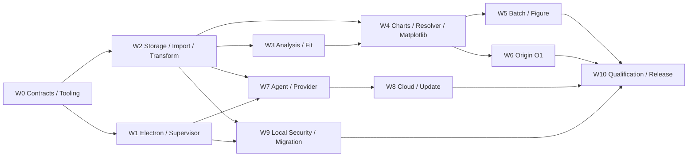

# PlotAgent v1 实施拆分与里程碑计划

> 状态：implementation-ready backlog；尚未实施真实后端/云/Origin qualification
> 日期：2026-08-05
> 适用范围：W0–W10 workstreams、依赖、风险 spikes、里程碑、验收证据与错误归属
> 相关文档：[规格索引与 Beta 设计基线](./SPEC-INDEX.md)、[小规模 Beta 性能测试与发布门禁契约](./PERFORMANCE-TEST-RELEASE.md)、[后端与 Agent 架构](./BACKEND-ARCHITECTURE.md)、[领域契约与 Schema 设计](./DOMAIN-CONTRACTS.md)、[产品需求文档](./PRD.md)、[产品决策基线](./PRODUCT-DECISIONS.md)

本文把已确认跨模块契约拆成可独立分工的工程 backlog。目录是计划中的实现入口；创建目录和代码属于后续实施，不是本次文档提交结果。

## 1. 共同执行规则

- 每个 workstream 先消费权威契约，不在代码中重新发明产品默认值。
- 跨进程/持久化 union 先进入 W0 Schema，再生成 TypeScript types；不得手写漂移镜像。
- Stable error code 只有明确 owner 可新增/修改；UI copy 可以本地化，code/fields/retryability 不能私自改变。
- Acceptance 必须链接可机器读取的 evidence；“代码已写”“手工看起来正常”不是完成定义。
- Risk spike 产物可以丢弃代码，但其 evidence、结论和 Decision 影响必须保存。
- W6/Origin 风险验证前置；不能等 31 图全部实现后才发现 O1 技术路径不成立。
- Workstream out-of-scope 不得通过“顺手实现”绕过依赖、权限或 release gate。

## 2. 依赖图与并行边界

W1 与 W2 可在 W0 contract freeze 后并行；W3 可与 W4 的纯 resolver/layout 基础并行，但任何 analysis-backed chart 等待 W3 ports；W5 与 W6 在 K01 vertical slice 后并行；W8 的协议 mock 可与 W7 后半段并行，但真实 proxy 只接固定 AgentDecision/ledger contract；W10 harness 从 W0 开始建设，最终 qualification 等待 W5/W6/W8/W9。

## 3. Workstreams

### W0 — Contracts、generated types、errors、fixtures 与 harness

- **Owner:** Core Contracts + QA Infrastructure。
- **Scope:** Pydantic strict models；JSON Schema Draft 2020-12；generated TS types；JSON-RPC/event envelopes；stable error registry；canonical hash rules；31图/analysis/security golden fixture manifest；test/evidence harness skeleton。
- **Out of scope:** 领域算法、真实 renderer、Electron业务 UI、云部署和 Origin automation。
- **Inputs/contracts:** DOMAIN-CONTRACTS、所有专门契约、PRODUCT-DECISIONS、PERFORMANCE-TEST-RELEASE。
- **Planned entries:** `src/plotagent/contracts/`、`schemas/`、`src/shared/generated/`、`tests/fixtures/`、`tests/evidence/`。
- **Deliverables:** Schema package/version manifest；codegen command与no-diff CI；error registry with owner/retryability；fixture IDs/hashes/licenses；MatrixKey reporter；contract/fuzz tests。
- **Dependencies/parallel:** 无实现依赖；先冻结最小跨模块 types。Fixture data生成与 Schema可并行，canonical hash在二者之前完成。
- **Acceptance evidence:** 合法/非法 union corpus；Pydantic↔JSON Schema↔TS round-trip；unknown fields rejection；ID/hash determinism；decision/error duplicate/coverage report。
- **Stable error ownership:** `SCHEMA_*`、`PROTOCOL_*`、`ERROR_CODE_UNKNOWN`；其他 W 提交 code proposal，W0 审核 registry shape。
- **Done:** 全部后续 W 所需跨模块 type有唯一 schema/version/owner，codegen clean，核心 fixtures 可被至少 Python/TS 两侧读取，harness 能产出规范 evidence record。

### W1 — Electron Main、preload、PythonSupervisor、单实例与任务事件

- **Owner:** Desktop Platform。
- **Scope:** secure BrowserWindow；sandbox/contextIsolation/no Node；typed preload；single instance/file-open forwarding；Python Core stdio framing/heartbeat/restart loop；task event bridge；close-with-active-tasks UX；Credential Manager facade（不暴露 secrets）。
- **Out of scope:** Core领域逻辑、ModelProvider网络、云令牌协议、renderer功能重做。
- **Inputs/contracts:** BACKEND-ARCHITECTURE、TASK-RUNTIME、LOCAL-SECURITY、W0 RPC/event/schema/errors。
- **Planned entries:** `src/main/`、`src/preload/`、`src/shared/generated/`、desktop E2E harness。
- **Deliverables:** PythonSupervisor state machine；narrow IPC allowlist；single-instance routing；heartbeat/crash-loop recovery；task/close events；security headers/link policy。
- **Dependencies/parallel:** W0→W1。Supervisor可与preload并行；task events等待W0 event schema；W7/W9复用网络/credential/安全边界。
- **Acceptance evidence:** Electron security assertion；IPC negative/fuzz；partial/malformed stdio framing；Core crash/heartbeat/restart loop；single-instance/open-file；active-task close三选项；renderer secret scan。
- **Stable error ownership:** `CORE_*`、`IPC_*`、`SINGLE_INSTANCE_*`、`CREDENTIAL_ACCESS_*`、`EXTERNAL_LINK_BLOCKED`。
- **Done:** App shell不等云可交互，Core可监管/恢复，renderer无Node/secret/任意IPC，任务事件和关闭路径满足contract并有E2E evidence。

### W2 — Storage、Import、DatasetVersion、Transform、Unit 与 Lineage

- **Owner:** Data Platform/Core Storage。
- **Scope:** catalog/project SQLite single writer；CAS；`.plotproj` snapshot/open；safe CSV/TSV/XLSX/import archive；ImportRecipe；DatasetVersion；semantic signature；TransformStep union；UnitSpec/pinned Pint；object/field/row lineage；resource delete guards。
- **Out of scope:** statistical AnalysisSpec、rendering、Agent、cloud sync、cell editing、arbitrary SQL/Python/UDF。
- **Inputs/contracts:** PROJECT-STORAGE、DATA-TRANSFORMS、LOCAL-SECURITY、DOMAIN-CONTRACTS、TASK-RUNTIME、W0。
- **Planned entries:** `src/plotagent/storage/`、`importing/`、`datasets/`、`transforms/`、`units/`、`lineage/`。
- **Deliverables:** schema migrations v1 seed；transaction/CAS APIs；Online Backup snapshot packaging；safe archive/parser pipeline；deterministic Dataset/field/row IDs；preflight diff；isomorphic signature；Transform/Unit engines。
- **Dependencies/parallel:** W0→W2。SQLite/CAS、parser、Transform/Unit可分组并行；DatasetVersion/hash/transaction contract先行。W3/W4/W7/W9消费immutable refs。
- **Acceptance evidence:** import atomic failure；100MB CSV/50MB XLSX budgets；archive traversal/link/bomb；macro/formula/external link nonexecution；lineage golden；unit algebra/temperature/opaque；join cardinality；WAL crash；package checksum/reopen。
- **Stable error ownership:** `IMPORT_*`、`ARCHIVE_*`、`FORMULA_*`、`DATASET_*`、`TRANSFORM_*`、`UNIT_*`、`LINEAGE_*`、`PROJECT_STORAGE_*`。
- **Done:** 数据从授权文件到immutable DatasetVersion/derived version端到端可复现，失败零正式污染，包/工作副本/同构/单位/血缘均有golden与fault evidence。

### W3 — AnalysisSpec/Result 与 FitSpec/Result

- **Owner:** Scientific Computing。
- **Scope:** v1 analysis registry；descriptive/interval/distribution/correlation/regression/smoothing/4PL/5PL/KM/log-rank/confusion；significance whitelist/corrections；FitSpec input level/weights/initializer/multistart/intervals；persisted result ports/tables/diagnostics/stale marking。
- **Out of scope:** arbitrary formula/Python、auto method/model selection、meta-analysis merge、Nyquist fitting、Cox/competing risk、model training/conclusions。
- **Inputs/contracts:** ANALYSIS-ENGINE、FITTING-SYSTEM、DATA-TRANSFORMS、DOMAIN-CONTRACTS、W2 immutable datasets/units/lineage、W0 fixtures。
- **Planned entries:** `src/plotagent/analysis/`、`fitting/`、scientific reference tests。
- **Deliverables:** versioned method registry；strict Analysis/Fit execution；float64/seed/missing policies；result ports/curve/bands/residuals/diagnostics；failure/warning taxonomy；materialization adapter。
- **Dependencies/parallel:** W2→W3。Independent method families可并行，但 registry/result envelope/precision/seed先冻结。W4只消费persisted ports。
- **Acceptance evidence:** approved reference datasets与tolerance；4PL/5PL formula/multistart/start diagnostics；KM/risk/Greenwood/log-rank；correction/comparison set；failure preserves raw points；batch same-spec partial success；stale-no-auto-recompute。
- **Stable error ownership:** `ANALYSIS_*`、`FIT_*`、`SCIENTIFIC_*`、`MISSING_SEMANTICS_*`、`CONVERGENCE_*`。
- **Done:** 每个白名单方法有reference/golden/edge fixture、版本化implementation和稳定ports；禁止能力不能被fallback，正式render/export无需重算。

### W4 — 31图 registry、PlotSpec、Resolver、Matplotlib、PNG/SVG

- **Owner:** Rendering + Chart Adapters。
- **Scope:** 31个纯数值 chart registry；PlotSpec/Patch；single resolver；axis/autoscale/ticks/SafeRichText/font/style/publication；thumbnail/interactive simplification；formal Matplotlib/PNG/SVG；validation/atomic export。
- **Out of scope:** 科研图像/地图、任意chart plugin、PDF/EPS/EMF、Origin construction、hidden analysis、renderer-specific autoscale。
- **Inputs/contracts:** RENDERING-PIPELINE、DOMAIN-CONTRACTS、ANALYSIS/FITTING ports、PRODUCT 31范围、W2/W3、W0 fixtures。
- **Planned entries:** `src/plotagent/charts/`、`plots/`、`rendering/resolver/`、`rendering/matplotlib/`、`exports/png_svg/`。
- **Deliverables:** registry metadata/capabilities；canonical PlotSpec/Patch；ResolvedRenderPlan hash；layout/axis/ticks/font engine；31 adapters；formal validators；preview simplification disclosure。
- **Dependencies/parallel:** W2→W4，analysis-backed charts需W3。Resolver/layout与chart adapters可并行；K01 vertical slice先完成。W5/W6依赖stable RenderPlan。
- **Acceptance evidence:** 每图 minimal/representative/edge；额外 preview/interactive；279基础中PNG/SVG 186 paths；golden spec/plan；100k formal full-data assertion；physical/color/tick tolerance；基于声明范围的SVG估计/warning/resource preflight；cancel/version conflict。
- **Stable error ownership:** `PLOT_*`、`PATCH_*`、`CHART_*`、`AXIS_*`、`RENDER_*`、`PNG_*`、`SVG_*`、`FONT_*`、`RESOURCE_LIMIT`（渲染维度）。
- **Done:** 31图全部通过适用preview/formal PNG/SVG与golden；任何unsupported/invalid请求稳定失败；无隐藏stats、formal抽稀或adapter默认漂移。

### W5 — Isomorphic Batch、审阅与 FigureSpec

- **Owner:** Plot Workflow + Desktop UX。
- **Scope:** BatchSpec/fan-out；完全同构一次mapping/Transform/Analysis/Plot模板；partial success；网格/列表/轮播/filter/sort；multi-select scope；temporary unified axes/overlay；exclude export；save-as-new；numeric-only fixed Figure layouts/panels/common legend。
- **Out of scope:** heterogeneous per-file exceptions、image panel/freeform layout、temporary compare auto-version、source plot reverse mutation。
- **Inputs/contracts:** PRD批量/组合、DOMAIN-CONTRACTS、TASK-RUNTIME、RENDERING、W2 semantic signatures、W4 Plot/Plan。
- **Planned entries:** `src/plotagent/batch/`、`figures/`、`src/renderer/.../batch/figure/`。
- **Deliverables:** Batch/Figure services；review query/state；selection scope reducer；temporary compare state；explicit save/export specs；fixed layout resolver integration。
- **Dependencies/parallel:** W4→W5；isomorphism from W2。Core fan-out与UI review可并行，shared scope/event schemas由W0/W1先行。
- **Acceptance evidence:** identical signature allowed/different blocked；single mapping；partial/cancel/retry；grid/list/carousel keyboard/accessibility；filter anomalies/fail/warn；temporary no-version then save-new；Figure version pins/common legend/numbering。
- **Stable error ownership:** `BATCH_*`、`ISOMORPHIC_*`、`REVIEW_*`、`FIGURE_*`、`SELECTION_SCOPE_*`。
- **Done:** Batch/Figure正式对象、临时审阅状态和任务提交边界分离清楚；数值组合/批量路径有E2E与fault evidence且无逐文件例外。

### W6 — OriginAdapter、O1 OPJU 与两阶段验证

- **Owner:** Origin Integration。
- **Scope:** versioned typed OriginExportPlan；signed template preflight；dedicated managed instances；31图O1 native adapters；target-scoped Data/Analysis/Graphs/Metadata；live validation；save/exit/fresh reopen/readback；atomic OPJU/export record/external modification。
- **Out of scope:** LabTalk、user Origin attach/kill、raster/SVG fallback、O2 first-release admission、OPJU import/round-trip/cloud Origin。
- **Inputs/contracts:** ORIGIN-EXPORT、RENDERING、PERFORMANCE Beta build declaration；W4 stable RenderPlan；W0 MatrixKey/evidence。
- **Planned entries:** `src/plotagent/origin/plan/`、`adapters/`、`worker/`、`validation/`、Origin qualification harness。
- **Deliverables:** K01 spike adapter first；单一exact-version adapter声明；preflight；managed process lifecycle；typed property maps；31 O1 adapters；fresh reopen validator；manifest/atomic export。
- **Dependencies/parallel:** W4→W6 for production, but M0 K01 risk spike begins as soon as minimal W0/W2/W4 slice exists。Adapter families可并行 only after K01 O1 proof and property map rules。
- **Acceptance evidence:** 当前Beta build唯一declared Origin exact version的93条O1 paths；edge expected errors；live+fresh readback data/links/axes/ticks/legend/page/style/missing；no LabTalk/raster/global template/user instance；cancel/hang/lock/external modification/atomic failure；P95 budgets。
- **Stable error ownership:** `NOT_INSTALLED`、`VERSION_UNSUPPORTED`、`LICENSE_UNAVAILABLE`、`CAPABILITY_MISSING`、`TEMPLATE_OR_FONT_MISSING`、`START/BUILD/SAVE/REOPEN/VALIDATION_FAILURE`、`TARGET_LOCKED`、`EXTERNAL_MODIFIED`、Origin `CANCELLED`。
- **Done:** Beta build唯一声明Origin exact version的31图均O1 qualification、93 paths零缺口；其他版本稳定`VERSION_UNSUPPORTED`，失败绝不发布文件/降级，实例与temp清理通过fault evidence。

### W7 — ContextBuilder、ModelProvider、AgentDecision 与本地 validator

- **Owner:** Agent Runtime + Privacy Engineering。
- **Scope:** local authoritative ConversationState reducer；ContextEnvelope/minimization；DataDisclosure/consent；deterministic sample/wide-field index；builtin/custom providers；P1/P2/P0 probe；exactly one repair；four-way AgentDecision；clarification；schema/version/capability/permission/business validation；ModelRunAudit/cancel。
- **Out of scope:** model tools/tool loop、provider-hosted conversation、filesystem/URL access、cloud invitation ledger，以及在本地另建任意命令/正则/规则解析器来绕过 `ModelProvider → AgentDecision → local validator` 契约。产品仍正式支持中文、英文和中英混合科研术语的自然语言需求，由 ModelProvider 在该结构化边界内理解。
- **Inputs/contracts:** AGENT-CONTEXT、DOMAIN-CONTRACTS、W1 credential/network cancellation、W2 objects/metadata、W0 schema/errors。
- **Planned entries:** `src/plotagent/agent/context/`、`providers/`、`decisions/`、`validation/`、`audit/`。
- **Deliverables:** ContextEnvelope builder/hash；state reducer；provider capability adapter；synthetic probe；P1/P2/P0；four-way union handling；disclosure/clarification UI contracts；local validators/audit.
- **Dependencies/parallel:** W2+W1→W7。Context/state与provider probe并行；execution handoff waits ActionPlan validator. W8 consumes fixed builtin adapter/usage events。
- **Acceptance evidence:** no-tool/no-path/no-URL schema；untrusted data prompt injection；≤20 rows/12 fields/200 scalars；>200 fields local filter；consent/revoke；Responses→Chat fallback；one repair only；target stale；stream cancel/no partial plan；secret/audit scan。
- **Stable error ownership:** `PROVIDER_*`、`TLS_*`、`AUTH_FAILED`（provider）、`SCHEMA_INVALID/REPAIR_EXHAUSTED`、`CONTEXT_TOO_LARGE`、`EGRESS_*`、`TARGET_STALE`、`RETENTION_UNACKNOWLEDGED`。
- **Done:** Provider只能产出单个已校验AgentDecision；四类union、出境、澄清、审计和取消全部evidence化，模型无工具/会话权威/partial执行路径。

### W8 — Invite、DeviceCredential、共享计数与 built-in proxy

- **Owner:** Beta Cloud Control Plane。
- **Scope:** InviteGrant/redeem；random installation ID与长期DeviceCredential；minimal scopes；InviteGrant原子共享计数；`client_run_id`请求幂等；QuotaSnapshot；payload-free proxy logging；admin revoke/device block。
- **Out of scope:** account/email/profile、device fingerprint、project sync/storage、remote science/Origin、custom provider billing、access/refresh rotation、reserve/settle/reconcile、CloudConfig、应用内更新、analytics/diagnostic upload。
- **Inputs/contracts:** CLOUD-CONTROL-PLANE、AGENT-CONTEXT、LOCAL-SECURITY、W7 fixed runs、W1 Credential Manager facade、W0 envelopes/errors。
- **Planned entries:** vendor-neutral `services/control-plane/` Beta contract implementation、credential client、cloud integration tests。
- **Deliverables:** redeem/credential auth/status；atomic shared counter/client-run record；model proxy；admin revoke/block；人工安装包hash/signature verification说明/工具入口。
- **Dependencies/parallel:** W7→W8；redeem/credential和counter/proxy可在fixed client_run semantics后并行。不建设更新或生产计费子系统。
- **Acceptance evidence:** multi-device shared quota/reinstall；timeout/restart同client_run最多一次扣减与上游调用；revoke only builtin；quota/custom/local unaffected；cloud unreachable startup；payload log scan；strict local_only zero packet；人工安装包signature/hash/code-sign阻断。
- **Stable error ownership:** `INVITE_*`、`DEVICE_CREDENTIAL_INVALID`、`DEVICE_BLOCKED`、`QUOTA_*`、`RATE_LIMITED`、`IDEMPOTENCY_CONFLICT`、`RUN_OUTCOME_UNKNOWN`、cloud `PROVIDER_UNAVAILABLE`；`INSTALLER_*`由W10拥有。
- **Done:** Beta最小控制面通过共享计数/幂等/降级/日志矩阵；无账号、硬件身份、项目依赖或隐藏第二次扣费，strict local_only不访问控制面。

### W9 — local_only、安全导入、本地诊断与已知版本兼容

- **Owner:** Local Security + Project Lifecycle。
- **Scope:** strict NetworkMode policy；fixed-disk workspace；temp ACL/cleanup；Electron/data rendering hardening；log allowlist/rotation；LocalDiagnosticBundle preview/save；schema stable reject；按需实现一个明确source→target一次性迁移；legacy component handling。
- **Out of scope:** project encryption/secure erase、memory dumps、analytics、diagnostic upload、update_only、通用N→N+1 registry、daily backup/recovery UI、downgrade writer、cloud backup、automatic rollback、arbitrary link opening。
- **Inputs/contracts:** LOCAL-SECURITY、PROJECT-STORAGE、TASK-RUNTIME、CLOUD strict-local boundary、W1/W2/W0。
- **Planned entries:** `src/plotagent/security/`、`diagnostics/`、`compatibility/`、`src/main/network-policy/`。
- **Deliverables:** strict network policy；archive/Excel negative guards（with W2）；temp manager；structured logger；local bundle builder/scrubber；schema compatibility gate；可选known-pair migrator/validator/atomic switch。
- **Dependencies/parallel:** W2+W1→W9。Logging/network/temp可并行；known-pair migration只在实际版本对确定后依赖storage schema/CAS，不建设提前泛化框架。
- **Acceptance evidence:** strict local_only zero packet；offline manual/3 exports；ACL/cleanup；archive/macro/formula；logs/bundle forbidden-field scan且bundle仅本地保存；未知schema稳定拒绝；known-pair每阶段crash保持源项目和semantic hash。
- **Stable error ownership:** `NETWORK_BLOCKED_LOCAL_ONLY`、`WORKSPACE_*`、`TEMP_*`、`LOG/DIAGNOSTIC_*`、`SCHEMA_VERSION_UNSUPPORTED`、`KNOWN_MIGRATION_*`、`LEGACY_COMPONENT_MISSING`。
- **Done:** Security/zero-egress/schema/diagnostic矩阵通过；任何失败保持原项目，日志与本地Bundle无禁止内容，任务崩溃后temp可清理且用户可明确重试。

### W10 — E2E、reference性能、安全、打包与 Beta gates

- **Owner:** QA/Release with all domain owners。
- **Scope:** E2E harness；31图MatrixKey；单一Origin exact version；scientific references；cancel/crash/security/privacy/known-pair migration；single reference profile performance/memory；人工安装包signature/hash/code-sign；dependency/fixture hashes；Beta checklist/known issues；first beta success evaluation。
- **Out of scope:** 修复归属领域的业务缺陷、缩减声明逃避gate、多OS/DPI/minimum-machine qualification、长soak、SBOM流程、完整云攻击矩阵、商业级多角色签署。
- **Inputs/contracts:** PERFORMANCE-TEST-RELEASE、SPEC-INDEX、W0 harness、W5/W6/W8/W9 deliverables及所有W evidence。
- **Planned entries:** `tests/e2e/`、`tests/performance/`、`tests/security/`、`tests/origin/`、`release/evidence/`、installer pipeline。
- **Deliverables:** deterministic test orchestration；单一Windows reference profile；279 formal基础矩阵报告；独立preview/interactive报告；单一Origin exact version完整93条OPJU报告；reference performance；fault/security；人工签名安装包证据；Beta checklist/known issues。
- **Dependencies/parallel:** W5/W6/W8/W9→final W10；harness/performance fixtures从W0持续并行。失败回流到唯一owner，不在gate层打补丁。
- **Acceptance evidence:** 本workstream产物就是PERFORMANCE §11 Beta build checklist；另需first 10–15 user success structured results for second-batch go/no-go。
- **Stable error ownership:** `TEST_HARNESS_*`、`EVIDENCE_*`、`INSTALLER_*`；领域失败code仍由原W拥有，W10只验证与聚合。
- **Done:** 不可豁免blocker、coverage缺口和reference performance越线均为零；commit/build/dependency/fixture/installer hashes与known issues固定，由Beta release owner记录go/no-go，否则不得分发。

## 4. 全面编码前四个 Risk Spikes

### Spike 1 — K01 本地到 O1 的垂直切片

`import → manual ActionPlan → PlotSpec → ResolvedRenderPlan → formal PNG/SVG → typed OriginExportPlan → O1 OPJU → exit → fresh reopen readback`。

- **Purpose:** 最早验证核心对象边界、formal parity、originpro typed mapping、进程生命周期和O1 readback。
- **Evidence:** fixed dataset hash；all spec/plan/artifact hashes；PNG/SVG validators；当前Beta唯一Origin exact version live+fresh report；no LabTalk/raster/user instance；atomic failure injection。
- **Decision:** O1失败必须调整adapter/contract或产品范围并新增Decision，不能把失败留到W6末期。

### Spike 2 — 100k preview 与 formal SVG resource preflight

- **Purpose:** 验证≤20k interactive primitives deterministic simplification、100k full-data range/stats/analysis、声明规模内formal full data与基于实际资源的SVG估计/warning/RESOURCE_LIMIT。
- **Evidence:** 100k dataset hash；preview/full count；range parity；≤3s preview；≤2GB peak；SVG estimate vs actual；cancel/warning/atomic output。

### Spike 3 — Core crash 与 SQLite commit boundary recovery

- **Purpose:** 在preparing/running/committing前后注入崩溃，证明single writer、CAS staging、阶段记录、interrupted、no partial current state与明确重试。
- **Evidence:** transaction/CAS/object/ref snapshots；heartbeat/restart log；recovery disposition；idempotent rerun；original project integrity。

### Spike 4 — Custom Provider P1/P2

- **Purpose:** 合成连接probe，验证Responses优先/Chat回退、P1 strict、P2 exactly one repair、P0 reject、no tool loop、cancel/no partial。
- **Evidence:** synthetic payload only；protocol trace scrubbed；schema invalid/repair exhausted；tool-like output reject；target/context hash；secret/renderer/SQLite scan。

## 5. Milestones

### M0 — Contract/tooling 与四个 risk spikes

- **Entry:** Decision baseline与专门契约已冻结；W0 owners确定。
- **Exit evidence:** Schema/codegen/error/fixture/evidence harness最小集；四个spike报告和Decision disposition；K01在目标Beta Origin exact version的O1路径技术可行或明确阻断。

### M1 — Manual K01 完整本地路径

- **Entry:** M0通过；W1/W2最小事务/监督稳定。
- **Exit evidence:** safe CSV/XLSX import→DatasetVersion→manual ActionPlan→K01 PlotSpec/Plan→preview→formal PNG/SVG；项目重开/取消/crash/version conflict；无Agent/云依赖。

### M2 — Data/Analysis 与 31图 PNG/SVG

- **Entry:** M1；W2 Transform/Unit/Lineage与W3 registry contract稳定。
- **Exit evidence:** W2/W3 scientific/lineage golden；31图 minimal/representative/edge；186 formal PNG/SVG基础paths和额外preview/interactive；full-data assertions/性能preflight。

### M3 — Batch 与 Figure

- **Entry:** M2 chart/Plan stable。
- **Exit evidence:** isomorphic one-map batch/partial/cancel/review/temporary compare/export exclusion；numeric fixed Figure/version refs/common legend；UI accessibility/E2E。

### M4 — Agent/Provider

- **Entry:** M1 local ActionPlan executor和W1 credential/network boundaries；W2 object context。
- **Exit evidence:** Context/Disclosure/four-way decision/P1/P2/P0/local validators/audit/cancel；no tool/session authority/data over-egress。

### M5 — 全部 O1 Origin

- **Entry:** K01 spike通过，M2 31 RenderPlans稳定。
- **Exit evidence:** 当前Beta build唯一Origin exact version的93条OPJU O1；其他版本`VERSION_UNSUPPORTED`；live+fresh reopen、atomic/cancel/hang/external modification、P95 budgets。

### M6 — 简化 Cloud、Local Security、人工安装包与兼容

- **Entry:** M4 fixed run/usage；W1/W2 lifecycle稳定。
- **Exit evidence:** DeviceCredential、shared atomic quota/client-run idempotency、cloud-offline degradation、strict local_only、local diagnostic privacy、未知schema拒绝/已知pair迁移、人工安装包签名/hash/code-sign matrices。

### M7 — Beta Qualification

- **Entry:** M3/M5/M6通过；RC commit/installer/dependency lock fixed。
- **Exit evidence:** PERFORMANCE-TEST-RELEASE Beta checklist；无不可豁免 blocker；固定commit/build/dependency/fixture/installer hashes与单一owner go/no-go；first beta成功指标在进入第二批前单独go/no-go。

里程碑只按exit evidence完成，不能按“代码写完”“PR合并”或日历日期宣告完成。

## 6. Change control

- Workstream scope/dependency/contract变化必须更新本文件与SPEC-INDEX。
- 产品行为或跨模块契约变化必须新增/更新Decision ID并同步权威专门文档/PRD。
- 每图/每算法的完整参数表由对应W3/W4/W6 adapter backlog在公共Schema边界内细化；不得借此改变已冻结的用户行为、科学默认或导出语义。
- 若risk spike证明契约不可行，先回到Decision变更，不允许实现层静默偏离。
