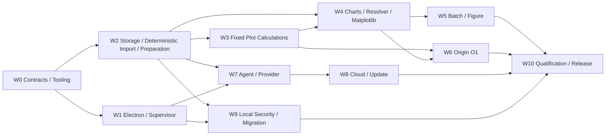

# PlotAgent v1 实施拆分与里程碑计划

> 状态：原 M0–M6 工程切片已实现；正式范围为43图、九个P1 adapter内部隐藏；M6 Phase A基础泛化与Phase B逐图编辑/Origin样式已完成当前工程门禁，Phase C内部可组合绘图底座待实现；M7邀请制Beta qualification尚未执行
> 日期：2026-08-07
> 适用范围：W0–W10 workstreams、依赖、风险 spikes、里程碑、验收证据与错误归属
> 相关文档：[规格索引与 Beta 设计基线](./SPEC-INDEX.md)、[小规模 Beta 性能测试与发布门禁契约](./PERFORMANCE-TEST-RELEASE.md)、[后端与 Agent 架构](./BACKEND-ARCHITECTURE.md)、[领域契约与 Schema 设计](./DOMAIN-CONTRACTS.md)、[产品需求文档](./PRD.md)、[产品决策基线](./PRODUCT-DECISIONS.md)

本文把已确认跨模块契约拆成可独立分工的工程 backlog。目录是计划中的实现入口；创建目录和代码属于后续实施，不是本次文档提交结果。

## 1. 共同执行规则

- 每个 workstream 先消费权威契约，不在代码中重新发明产品默认值。
- 跨进程/持久化 union 先进入 W0 Schema，再生成 TypeScript types；不得手写漂移镜像。
- Stable error code 只有明确 owner 可新增/修改；UI copy 可以本地化，code/fields/retryability 不能私自改变。
- Acceptance 必须链接可机器读取的 evidence；“代码已写”“手工看起来正常”不是完成定义。
- Risk spike 产物可以丢弃代码，但其 evidence、结论和 Decision 影响必须保存。
- W6/Origin 风险验证前置；不能等全部正式图实现后才发现 O1 技术路径不成立；已有31图与新增12图证据分别记录。
- Workstream out-of-scope 不得通过“顺手实现”绕过依赖、权限或 release gate。
- M6 新范围严格分三阶段：A 冻结并通过基础泛化矩阵、修复基础函数；B 固化43图编辑 capability、Origin 对齐符号/色板并完成跨 renderer 测试；C 实现 ChartRecipe compiler 和43个正式图迁移。九个隐藏图只做内部回归；generator/oracle 与组合架构不得在同一阶段变更。

## 2. 依赖图与并行边界

W1 与 W2 可在 W0 contract freeze 后并行；W3 可与 W4 的纯 resolver/layout 基础并行，但固定计算图等待 W3 result，预计算图等待 W2 字段契约；W5 与 W6 在 K01 vertical slice 后并行；W8 的协议 mock 可与 W7 后半段并行；W10 harness 从 W0 开始建设，最终 qualification 等待 W5/W6/W8/W9。

## 3. Workstreams

### W0 — Contracts、generated types、errors、fixtures 与 harness

- **Owner:** Core Contracts + QA Infrastructure。
- **Scope:** Pydantic strict models；JSON Schema Draft 2020-12；generated TS types；JSON-RPC/event envelopes；stable error registry；canonical hash rules；43 official/9 internal_hidden availability与ChartEditCapabilityProfile；MarkerSymbol/Interior/PaletteRef；StructureUnitDefinition/ChartRecipe/semantic port/closed relation schemas；约30个导入 golden、43图字段/准备/固定计算/预计算/security fixture manifest；冻结泛化/style generator/manifest；test/evidence harness skeleton。
- **Out of scope:** 领域算法、真实 renderer、Electron业务 UI、云部署和 Origin automation。
- **Inputs/contracts:** DOMAIN-CONTRACTS、所有专门契约、PRODUCT-DECISIONS、PERFORMANCE-TEST-RELEASE。
- **Planned entries:** `src/plotagent/contracts/`、`schemas/`、`src/shared/generated/`、`tests/fixtures/`、`tests/evidence/`。
- **Deliverables:** Schema package/version manifest；codegen command与no-diff CI；error registry with owner/retryability；recipe graph validator/canonical serializer；fixture IDs/hashes/licenses；MatrixKey/generalization reporter；contract/fuzz tests。
- **Dependencies/parallel:** 无实现依赖；先冻结最小跨模块 types。Fixture data生成与 Schema可并行，canonical hash在二者之前完成。
- **Acceptance evidence:** 合法/非法 union corpus；Pydantic↔JSON Schema↔TS round-trip；unknown fields rejection；ID/hash determinism；decision/error duplicate/coverage report。
- **Stable error ownership:** `SCHEMA_*`、`PROTOCOL_*`、`ERROR_CODE_UNKNOWN`；其他 W 提交 code proposal，W0 审核 registry shape。
- **Done:** 全部后续 W 所需跨模块 type有唯一 schema/version/owner，codegen clean，核心 fixtures 可被至少 Python/TS 两侧读取，harness 能产出规范 evidence record。

### W1 — Electron Main、preload、PythonSupervisor、单实例与任务事件

- **Owner:** Desktop Platform。
- **Scope:** secure BrowserWindow；sandbox/contextIsolation/no Node；typed preload；single instance/file-open forwarding；Python Core stdio framing/heartbeat/restart loop；task event bridge；close-with-active-tasks UX；Credential Manager facade（不暴露 secrets）。
- **Out of scope:** Core领域逻辑、ModelProvider网络、云令牌协议、renderer功能重做。
- **Inputs/contracts:** BACKEND-ARCHITECTURE、TASK-RUNTIME、LOCAL-SECURITY、W0 RPC/event/schema/errors。
- **Planned entries:** `src/main/`、`src/preload/`、`src/shared/generated/`、desktop E2E harness。
- **Deliverables:** PythonSupervisor state machine；narrow IPC allowlist；single-instance routing；heartbeat/crash-loop recovery；task/close events；security headers/link policy。
- **骨架实现选择（2026-08-05）：** Core 入口固定为 `python -m plotagent.desktop_core`，现已实现常驻同步控制循环、有界 worker/task registry、1 MiB/32 层限制的 UTF-8 单行 JSON + `\n`、`protocol_version=1.0`、严格 ID/幂等冲突/净化错误、initialize/ready/heartbeat/health/shutdown 与 task snapshot/cancel/event；启动/心跳/请求/退出超时分别为 10s/7.5s/10s/5s，心跳间隔 2.5s，60s 内最多自动重启 3 次（250/500/1000ms）。单实例只接收 `.plotproj` 并在 Main 内换成 `resourceId`；preload 不暴露 path、stdio、secret 或通用 IPC。当前手写 desktop contract 待 W0 发布 Schema 后以 generated TS 同形替换并执行 no-diff 检查。
- **Windows sidecar 边界（2026-08-05）：** development 继续运行 `python -m plotagent.desktop_core`；packaged build 不回退系统 Python，也不接受环境变量覆盖，固定启动 `resources/core/plotagent-core/plotagent-core.exe` 的 PyInstaller onedir sidecar。sidecar 与开发态使用同一 `plotagent.desktop_core` runtime，后续领域服务只通过窄 `ServiceRegistry` 注册，不另设打包专用 mock dispatcher。
- **产品 IPC 与本地资源边界（2026-08-05）：** renderer 每个产品动作只对应一个 typed preload 方法，不暴露通用 `invoke/send`、任意 path、stdio 或凭据。CSV/TSV/TXT/DAT/XLS/XLSX/XLSM 导入、`.plotproj` 打开及 PNG/SVG/OPJU 保存位置均由 Electron Main 原生对话框授权；Main 为授权源、项目包、预览和导出登记随机 resource ID，并生成 idempotency key 与新对象 ID。Core 返回的 artifact path 在 Main 内立即转换为随机资源描述并从结果中删除；PNG/SVG 预览只通过 `plotagent-resource:` 只读协议提供，协议复核 registry、kind、扩展名、MIME、文件类型、32 MiB 上限及 SVG 主动内容，CSP 仍保持 renderer 零网络。示例入口使用 Main 内置 CSV 写入受控应用目录后真实执行 `projects.create/open → datasets.import`，失败时返回真实错误而不伪造对象。
- **Dependencies/parallel:** W0→W1。Supervisor可与preload并行；task events等待W0 event schema；W7/W9复用网络/credential/安全边界。
- **Acceptance evidence:** Electron security assertion；IPC negative/fuzz；partial/malformed stdio framing；Core crash/heartbeat/restart loop；single-instance/open-file；active-task close三选项；renderer secret scan。
- **Stable error ownership:** `CORE_*`、`IPC_*`、`SINGLE_INSTANCE_*`、`CREDENTIAL_ACCESS_*`、`EXTERNAL_LINK_BLOCKED`。
- **Done:** App shell不等云可交互，Core可监管/恢复，renderer无Node/secret/任意IPC，任务事件和关闭路径满足contract并有E2E evidence。

### W2 — Storage、确定性 Import、SourceDataset 与受控 Preparation

- **Owner:** Data Platform/Core Storage。
- **Scope:** catalog/project SQLite single writer；CAS；`.plotproj` snapshot/open；安全 `.xlsx/.xls/.xlsm` 多 sheet 与仪器 TXT/CSV 导入；ImportRecipe/SourceDataset；region candidates/minimal question；FieldMapping；封闭 PreparationSpec/PreparedDataset；UnitSpec 校验；source coordinates；同构签名；resource delete guards。
- **Out of scope:** 通用 TransformPipeline/derived dataset、filter/dedupe/join/unit conversion/arithmetic/normalize、AnalysisSpec/FitSpec、rendering、Agent、cloud sync、cell editing、SQL/Python/UDF。
- **Inputs/contracts:** PROJECT-STORAGE、DATA-TRANSFORMS、LOCAL-SECURITY、DOMAIN-CONTRACTS、TASK-RUNTIME、W0。
- **Planned entries:** `src/plotagent/storage/`、`importing/excel/`、`importing/text/`、`datasets/source/`、`preparation/`、`units/`、`provenance/`。
- **Deliverables:** transaction/CAS APIs；Online Backup snapshot packaging；safe archive/parser pipeline；Excel sheet/TXT block candidates；ImportRecipe；SourceDataset IDs/source coordinates；FieldMapping compiler；PreparationSpec/PreparedDataset；isomorphic signature。
- **本轮实现取舍：** W0 `contracts` 是 SourceDataset/FieldMapping/PreparationSpec/PreparedDataset 的唯一公共模型；导入层只保留 ImportRecipe、结构候选和内存/Parquet artifact envelope。`.xlsx/.xlsm` 使用 `openpyxl` 双只读视图读取既有公式缓存并禁用 links/VBA，`.xls` 使用轻量 `xlrd`；文本检测采用封闭、确定性 BOM/UTF-8/UTF-16/Windows-1252 与 delimiter/decimal/header 规则。SourceDataset 表格以 Parquet 持久化完整值和来源坐标，Golden manifest 在测试前冻结。项目存储只实现每项目 SQLite 单写入、项目内 immutable CAS、temp→register 和最小 catalog，不实现跨项目去重、通用迁移或自动备份。`.plotproj` 本轮只交付完整项目包：活动数据库经 SQLite Online Backup 生成快照，仅打包快照引用的项目内 CAS；同盘 temp 中生成并完整复验后原子替换。外部包先复制到同盘私有任务 temp，流式校验严格 manifest/checksums、路径/entry 类型与数量、展开大小和压缩比，全部通过后才原子发布工作副本并注册 catalog；catalog 以 package SHA-256 或原项目 ID 回用工作副本，`as_new_copy` 重写项目 UUID。结果项目包稳定返回 unsupported，不扩展自动备份、恢复 UI 或通用迁移。
- **Dependencies/parallel:** W0→W2。SQLite/CAS 与 Excel/TXT parser 可并行；SourceDataset/hash/transaction contract先行。W3/W4/W7/W9消费immutable refs。
- **Acceptance evidence:** 约30个 import goldens（Excel10/TXT10/clarify5/reject5）；100MB CSV/50MB XLSX budgets；archive traversal/link/bomb；macro/formula/external link nonexecution；`0/False`/NaN/Inf；source coordinates；no cross-sheet join；Preparation/hash；WAL crash；package checksum/reopen。
- **Stable error ownership:** `IMPORT_*`、`MAPPING_*`、`PREPARE_*`、`ARCHIVE_*`、`FORMULA_*`、`SOURCE_DATASET_*`、`UNIT_*`、`PROJECT_STORAGE_*`。
- **Done:** 授权文件到不可变 SourceDataset、一次 FieldMapping 和受控 PreparedDataset 可复现；正确导入/一个追问/可操作拒绝三种结果有 golden，失败零正式污染且无通用变换后门。

### W3 — PlotCalculationSpec/Result 与预计算字段契约

- **Owner:** Plot Calculation + Scientific Integrity。
- **Scope:** 九类封闭 kind；FD/Sturges/constant histogram；Tukey box；Gaussian/Scott KDE；ECDF；五类 summary/error；percent stack；matrix projection；confusion normalization；fixed jitter；`fail/exclude_with_report`；用户预计算字段 validators。
- **Out of scope:** AnalysisSpec/Result、FitSpec/Result、统计检验/相关/回归/KM/4PL/5PL、平滑/基线/归一化、任意公式/代码、新 kind、自由串联或通用数据物化。
- **Inputs/contracts:** ANALYSIS-ENGINE、FITTING-SYSTEM、DATA-TRANSFORMS、DOMAIN-CONTRACTS、W2 PreparedDataset/Unit/source refs、W0 fixtures。
- **Planned entries:** `src/plotagent/plot_calculations/`、`precomputed_inputs/`、calculation golden tests。
- **Deliverables:** strict union/registry；versioned deterministic algorithms；PlotCalculationResult tables/masks/hashes；precomputed requirements/validators；failure/warning taxonomy。
- **实现选择（2026-08-05）：** 九类固定计算统一使用无 I/O 的 `PlotCalculationService` 与 `algorithm_version=1.0.0`，仅依赖 NumPy/SciPy；完整行对齐列/规则矩阵经 `fail|exclude_with_report`、Log10 与领域约束校验后生成内嵌 strict geometry table，table 与外部 `ContentTableRef` 以 canonical SHA-256 强绑定，并持久化 included mask、逐行排除、非有限计数、算法分支/带宽/类别顺序等 renderer 所需元数据，Matplotlib/SVG/Origin 只消费该结果。
- **Dependencies/parallel:** W2→W3。九个 kind 可在 result envelope/hash/missing policy 冻结后并行；W4/W6只消费持久化结果。
- **Acceptance evidence:** 每个 kind golden/edge；完整数据与 hash 可复现；Log10/duplicates/nonnegative/n≥2 等阻断；预计算九图有效/缺失/非法；batch same-spec partial；renderer/origin no-recompute。
- **Stable error ownership:** `PLOTSPEC_CALCULATION_*`、`PLOTSPEC_PRECOMPUTED_*`、`MISSING_SEMANTICS_*`；`PREPARE_*`仍归W2。
- **Done:** 九类固定计算与预计算字段全部有冻结算法/Schema/evidence；禁止科学计算无 fallback，结果可供三 renderer 一致消费。

### W4 — 43图正式 registry、编辑/样式、Recipe Compiler、Resolver、Matplotlib、PNG/SVG

- **Owner:** Rendering + Chart Adapters。
- **Scope:** 43个 `official` 与九个 `internal_hidden` chart registry；43图逐图 `ChartEditCapabilityProfile`；12种Origin对齐符号、闭合符号3种interior与`plus/cross`非适用拒绝、16个冻结sRGB色板；PlotSpec/Patch；StructureUnit/ChartRecipe registry、graph validator与deterministic compiler；数据驱动动态布局；single resolver；axis/autoscale/ticks/SafeRichText/font/style/publication；thumbnail/interactive simplification；formal Matplotlib/PNG/SVG；validation/atomic export。
- **Out of scope:** 科研图像/地图、任意chart plugin、PDF/EPS/EMF、Origin construction、hidden analysis、renderer-specific autoscale。
- **Inputs/contracts:** RENDERING-PIPELINE、DOMAIN-CONTRACTS、PlotCalculation/precomputed contracts、PRODUCT 正式43/内部52分层、W2/W3、W0 fixtures/generalization/style manifests。
- **Planned entries:** `src/plotagent/charts/`、`src/plotagent/recipes/`、`plots/`、`rendering/resolver/`、`rendering/matplotlib/`、`exports/png_svg/`。
- **Deliverables:** availability-aware registry；43图 canonical edit capability profiles；MarkerSymbol/Interior/PaletteRef registry；allowed/unsupported Patch validator；canonical StructureUnitDefinition/ChartRecipe/PlotSpec/Patch；recipe compiler与ResolvedRenderPlan hash；data-driven layout/axis/ticks/font/style engine；43个正式 adapter同构迁移；formal validators；preview simplification disclosure。
- **实现选择（2026-08-05）：** 31 个 ID 由显式 registry 与少量 `xy/bar/distribution/matrix/special/facet` adapter family 驱动；每图仍有独立字段、计算来源和限制。Matplotlib Agg 是 preview、PNG、SVG 的唯一 raster/vector 实现，62 条真实导出路径共享同一 resolver，formal 保留全数据。S05 的 log10 tick 使用 ASCII 科学计数标签，避免目标 Windows 字体缺字且不改变数值语义。运行依赖已删除未使用的 Plotly/Kaleido、Pandas、OpenAI SDK、orjson 与 multipart；Provider 直接复用受策略约束的 httpx，避免重复网络栈和打包体积。
- **实现选择（2026-08-06，Origin P1 扩展）：** registry 扩为52个稳定ID，但 availability 分为43个正式与九个隐藏。正式新增为 X01/X02/X03/X05/X09/X13/X23/X24/X35/X36/X38/S07；X07/X11/X12/X15/X16/X17/X18/X19/X37 不暴露 create/export。新增几何继续复用现有 adapter family 与 chart-specific fixed resolver。X09/X35 使用 Origin 原生 XYY Floating Column；双Y使用重叠原生layer、独立左右scale/labels并隐藏重复X轴；X02使用原生 Scatter + Drop Lines 并连接已解析Y轴可见下边界。X23/X24/X35/X36 两侧轴默认统一中性、正常字重、非加粗细线，显式style patch才着色。Origin worker UTF-8、ASCII Unicode escape与3000字符Manifest分块保持不变。当前10个新增图有A/C级同源视觉审计，X24/S07须用冻结合成视觉基线并明确标识，九个隐藏图不计产品证据。
- **M6补充执行顺序：** Phase A 只扩充 renderer/resolver 泛化测试并修复基础逻辑；Phase B 实现 availability/capability profiles、Patch allow/deny、12符号/适用interior/非适用拒绝、16 palette和Matplotlib/Origin parity；Phase C 才实现 recipe schemas/validator/compiler，并把43个正式图迁移到同一运行时。M6 不实现用户搭建器、个人配方库 UI、代码/公式节点或任意画布。
- **Dependencies/parallel:** W2→W4，固定计算图需W3；预计算图需W2/W3字段验证。M6 Phase A→B→C；W6 的代表性泛化验证等待A，编辑/style readback等待B，官方图recipe parity等待C。
- **Acceptance evidence:** 正式43图 minimal/representative/edge；隐藏九图无产品capability；冻结变体覆盖组数1/2/3/5、类别/点数、尺度/平移、跨零/全负、误差与长标签；有限几何/无重叠/堆积/误差绑定/range/series-color-legend invariants；逐图allowed/unsupported Patch；全部12种marker、闭合marker的3种interior与`plus/cross`非适用拒绝、16 palette frozen RGB、>15联合编码、双Y默认轴；完整Matplotlib matrix；golden recipe/spec/plan；100k formal full-data assertion；physical/color/tick tolerance；SVG/resource preflight；cancel/version conflict。
- **Stable error ownership:** `PLOT_*`、`PATCH_*`、`CHART_*`、`AXIS_*`、`RENDER_*`、`PNG_*`、`SVG_*`、`FONT_*`、`RESOURCE_LIMIT`（渲染维度）。
- **Done:** 正式43图全部通过适用preview/formal PNG/SVG、基础泛化、逐图编辑与样式门禁并由版本化recipe编译；九个隐藏图不进入产品capability；任何unsupported/invalid请求稳定失败；无隐藏统计/拟合、formal抽稀、写死双组布局、循环颜色、本机Origin palette漂移或adapter默认漂移。

### W5 — Isomorphic Batch、审阅与 FigureSpec

- **Owner:** Plot Workflow + Desktop UX。
- **Scope:** BatchSpec/fan-out；完全同构一次 FieldMapping/Preparation/PlotCalculation/Plot模板；partial success；网格/列表/轮播/filter/sort；multi-select scope；temporary unified axes/overlay；exclude export；save-as-new；numeric-only fixed Figure layouts/panels/common legend。
- **Out of scope:** heterogeneous per-file exceptions、image panel/freeform layout、temporary compare auto-version、source plot reverse mutation。
- **Inputs/contracts:** PRD批量/组合、DOMAIN-CONTRACTS、TASK-RUNTIME、RENDERING、W2 semantic signatures、W4 Plot/Plan。
- **Planned entries:** `src/plotagent/batch/`、`figures/`、`src/renderer/.../batch/figure/`。
- **Deliverables:** Batch/Figure services；review query/state；selection scope reducer；temporary compare state；explicit save/export specs；fixed layout resolver integration。
- **核心服务实现选择（2026-08-05）：** `src/plotagent/batch/` 已提供纯 Python 同构
  fan-out service，并通过 repository/executor protocols 注入后续 W2/W4 实现；提交只接受一份已确认
  FieldMapping、PreparationSpec、可选 PlotCalculationSpec、Plot 模板和共享样式，逐项暂存/原子提交，
  最终状态复用桌面 `queued/preparing/running/committing/...` task state。输出槽使用
  `(task_id, action_id, output_slot)` 幂等键；Selected/All export scope 默认排除失败、取消、未确认和
  审阅排除项。`src/plotagent/figures/` 仅组合 repository 声明为 numeric-only 的明确 PlotSpec
  版本，支持有限 1×N/N×1/2×2/2×3 布局、对齐、共享/独立轴和公共图例；源图更新只返回提示，
  显式升级以 expected version 原子创建新 Figure version。该底层模块本身不反向依赖
  renderer/import/Origin/Agent；DesktopApplication 与 typed React IPC 已在上层完成组合，开放式布局仍不进入首轮。
- **Dependencies/parallel:** W4→W5；isomorphism from W2。Core fan-out与UI review可并行，shared scope/event schemas由W0/W1先行。
- **Acceptance evidence:** identical signature allowed/different blocked；single mapping；partial/cancel/retry；grid/list/carousel keyboard/accessibility；filter anomalies/fail/warn；temporary no-version then save-new；Figure version pins/common legend/numbering。
- **Stable error ownership:** `BATCH_*`、`ISOMORPHIC_*`、`REVIEW_*`、`FIGURE_*`、`SELECTION_SCOPE_*`。
- **Done:** Batch/Figure正式对象、临时审阅状态和任务提交边界分离清楚；数值组合/批量路径有E2E与fault evidence且无逐文件例外。

### W6 — OriginAdapter、O1 OPJU 与两阶段验证

- **Owner:** Origin Integration。
- **Scope:** versioned typed OriginExportPlan；signed template preflight；dedicated managed instances；当前正式图O1 native adapters；recipe/PlotSpec/Plan parity；direct Raw Data 与 fixed/user-precomputed Plot Data；target-scoped Data/Analysis/Graphs/Metadata；live validation；save/exit/fresh reopen/readback；atomic OPJU/export record/external modification。
- **Out of scope:** Origin Analysis Template/worksheet formula/Fit Function/重算链、任意或未登记 LabTalk、user Origin attach/kill、raster/SVG fallback、O2 first-release admission、OPJU import/round-trip/cloud Origin。
- **Inputs/contracts:** ORIGIN-EXPORT、RENDERING、PERFORMANCE Beta build declaration；W4 stable RenderPlan；W0 MatrixKey/evidence。
- **Planned entries:** `src/plotagent/origin/plan/`、`adapters/`、`worker/`、`validation/`、Origin qualification harness。
- **Deliverables:** K01 spike adapter first；单一exact-version adapter声明；preflight；managed process lifecycle；typed property maps；正式43 O1 adapters；marker/interior/palette/编辑style原生映射；fresh reopen validator；manifest/atomic export。
- **Dependencies/parallel:** W4→W6 for production, but M0 K01 risk spike begins as soon as minimal W0/W2/W4 slice exists。Adapter families可并行 only after K01 O1 proof and property map rules。
- **Acceptance evidence:** 当前 Beta build 唯一 declared Origin exact version 的43图代表性O1 live+fresh-reopen matrix；原31历史报告与新增12补充报告分开；每种结构签名至少一个冻结泛化变体；43图allowed/unsupported编辑、12种marker/适用interior/非适用拒绝、16 palette、双Y默认/显式style typed build+readback；minimal/edge/error离线contract；direct/fixed/precomputed data-link/manifest；无Analysis Template/formula/任意LabTalk/raster/global template/user instance；cancel/hang/lock/external modification/atomic failure。
- **Stable error ownership:** `NOT_INSTALLED`、`VERSION_UNSUPPORTED`、`LICENSE_UNAVAILABLE`、`CAPABILITY_MISSING`、`TEMPLATE_OR_FONT_MISSING`、`START/BUILD/SAVE/REOPEN/VALIDATION_FAILURE`、`TARGET_LOCKED`、`EXTERNAL_MODIFIED`、Origin `CANCELLED`。
- **Done:** Beta build 唯一声明 Origin exact version 的43图代表性数据均完成O1 live+fresh-reopen qualification，逐图编辑与Origin样式读回通过；九图隐藏且无导出承诺；其他版本稳定 `VERSION_UNSUPPORTED`，minimal/edge/error不重复启动86次Origin，而由离线契约、验证器和fault evidence覆盖；失败绝不发布文件或降级。

#### W6/M5 实现说明（2026-08-05）

- 31 个 registry chart ID 统一编译为 typed `OriginExportPlan`，由独立 build/reopen worker 调用 `originpro` 原生对象 API；实机矩阵为 31/31 通过，用时约 19 分钟。静态测试禁止任意/未登记 LabTalk、脚本、公式、raster/SVG fallback 与任意用户模板路径。
- 冻结环境为 Origin 2024 SR1，`DisplayVersion=10.10.178`、runtime `10.100178`、64-bit `Origin64.exe`、`originpro=1.1.15`。随包模板为 `PlotAgent89x60.otpu`，SHA-256 `08a2f8f8f18d0d689e40d2c520d0416d7ee97b1945f613168f52337626feaedf`。
- GraphPage 必须先激活，再通过 typed `PutWidth/PutHeight` 重申解析后的物理画布尺寸；这是 Origin 在创建 layer/plot 后可能延迟尺寸的兼容处理。该顺序已用非模板尺寸 178×120 mm 的 build 与 fresh reopen 实机验证。
- 桌面 Core 对 plot、batch、figure 使用同一 export compiler。为避免 M6 引入数据库迁移，现有 `export_records` 外键仍以目标中的首个 plot 作为内部归属；API 响应和 OPJU manifest 始终保存真实 target kind/id/version/scope。该实现不改变用户可见导出范围，未来若需要按 batch/figure 查询导出历史，再升级为通用 target foreign key。
- `OriginExportSuccess` 表示临时文件已经通过 fresh reopen 并跨过原子发布点；若取消请求恰好在该点后到达，Core 必须进入 committing、写入导出记录并标记成功，不能留下“文件已发布但项目无记录”的裂缝。发布点前的取消仍由 worker cooperative cancellation 稳定终止。

### W7 — ContextBuilder、ModelProvider、AgentDecision 与本地 validator

- **Owner:** Agent Runtime + Privacy Engineering。
- **Scope:** 单对话编排 Agent；local authoritative ConversationState reducer；多个 FigureTask/BatchTask 与 active target；ContextEnvelope/minimization；DataDisclosure/consent；deterministic sample/wide-field index；builtin/custom providers；P1/P2/P0 probe；exactly one repair；four-way AgentDecision；clarification；schema/version/capability/permission/business validation；ModelRunAudit/cancel。
- **Out of scope:** 多 Agent、model tools/tool loop、provider-hosted conversation、filesystem/URL access、模型输出 pandas/Python/Matplotlib/Origin/文件/SQL/table ID/处理步骤、cloud invitation ledger，以及在本地另建命令/正则/规则解析器绕过 `ModelProvider → AgentDecision → local validator`。产品仍支持中文、英文和中英混合科研术语，由 ModelProvider 在该边界内理解。
- **Inputs/contracts:** AGENT-CONTEXT、DOMAIN-CONTRACTS、W1 credential/network cancellation、W2 objects/metadata、W0 schema/errors。
- **Planned entries:** `src/plotagent/agent/context/`、`providers/`、`decisions/`、`validation/`、`audit/`。
- **Deliverables:** ContextEnvelope builder/hash；state reducer；provider capability adapter；synthetic probe；P1/P2/P0；four-way union handling；disclosure/clarification UI contracts；local validators/audit.
- **Dependencies/parallel:** W2+W1→W7。Context/state与provider probe并行；execution handoff waits ActionPlan validator. W8 consumes fixed builtin adapter/usage events。
- **Acceptance evidence:** no-tool/no-path/no-URL schema；untrusted data prompt injection；≤20 rows/12 fields/200 scalars；>200 fields local filter；consent/revoke；Responses→Chat fallback；one repair only；target stale；stream cancel/no partial plan；secret/audit scan。
- **Stable error ownership:** `PROVIDER_*`、`TLS_*`、`AUTH_FAILED`（provider）、`SCHEMA_INVALID/REPAIR_EXHAUSTED`、`CONTEXT_TOO_LARGE`、`EGRESS_*`、`TARGET_STALE`、`RETENTION_UNACKNOWLEDGED`。
- **Done:** Provider只能产出单个已校验AgentDecision；同类结构错误二次即停；四类union、出境、澄清、审计和取消全部evidence化，模型无工具/多Agent/内部处理步骤/会话权威/partial执行路径。

#### W7/M4 最小实现说明（2026-08-05）

- `src/plotagent/agent/` 现提供单 orchestrator 闭环；每次从本地 `ConversationState` 与权威对象重建 `ContextEnvelope`，只接收一个完整 `AgentDecision`，没有 provider session、model tool、tool loop、partial plan 或多 Agent 路径。手动 UI 计划复用同一 validator，`local_only` 在调用 provider 前稳定阻断。
- ContextBuilder 固定默认 `20 rows / 12 fields / 200 scalars / 64 KiB` 上限，按稳定 field/row 规则裁剪并生成 context/disclosure hash；超宽表只选最多 12 个字段。Disclosure 未确认、类别未授权、target 与常驻 current target 不一致时分别稳定拒绝，不记录原始样本或完整请求。
- Builtin provider 仅通过可注入 cloud client 使用 W8 `ModelInvokeRequest` 边界；custom provider 先探测 Responses strict structured output，再回退 Chat strict/JSON-only。P1 结构失败直接拒绝，P2 最多一次固定 context/schema 的 repair，P0 与第二次失败不进入本地执行链。
- Provider 输出先做完整 JSON 与四类 union 校验，再做 tool/code/path/URL/SQL/renderer/处理步骤载荷拒绝，最后一次性执行 target/version/stale/capability/permission/action-scope/no-partial validator；模型不承担图形推荐、替代或本地命令解析。
- Prompt template、每次 provider response、ContextEnvelope、DataDisclosure、AgentDecision 与 ModelRunAudit 均有 SHA-256 metadata；audit 只保存 provider/model/schema/usage/target/version/count/hash/稳定错误，不保存 secret、reasoning、消息、字段值或样本。测试全部使用 fake client/transport 与 synthetic payload，覆盖 P1/P2/P0、Responses→Chat、timeout/cancel、stale/no-partial、egress budget/Disclosure 和 local_only zero-call。
- 生产 provider factory 现在按 `builtin_proxy/custom_provider/local_only` 构造唯一允许的 adapter；`local_only` 在创建任何 RawTransport 前返回零网络 provider。custom API key 不进入 `CustomProviderConfig`、Context 或 audit，而由 credential resolver 在 HTTP 发包边界注入 `Authorization`。built-in 桌面客户端覆盖 redeem、credential verify/revoke、quota、model-run invoke/status；同步 HTTP 通过 `asyncio.to_thread` 适配现有 async provider 接口，显式重试必须复用同一 `client_run_id`，客户端不自动重放业务请求。
- Desktop renderer 只提交 instruction、稳定 target/scope 与当前对象版本；Electron Main 不覆盖 `network_mode` 或临时伪造 provider。Core 从本机已保存配置选择 custom/builtin/local-only provider，因此配置与执行只有一个权威来源，断网或未配置时返回明确 NeedsInput/阻断，不悄悄回退到另一服务。
- `scope` 与 target kind 在 Core 白名单内成对校验：current/selected 对应 plot，batch 对应 BatchSpec，figure 对应 FigureSpec。对 batch/Figure 的同类 plot patch 由一个已校验 ActionPlan 在本地展开到其固定 plot refs，逐个创建新 PlotSpec 版本，再原子保存引用这些新版本的 BatchSpec/FigureSpec 新版本；任一别名越界或目标/范围不匹配均在执行前拒绝。任务 ID 加入进程内随机 nonce，保证一次多目标计划可创建多个独立 task record，幂等业务键仍由 plan/action/plot/patch 位置固定。

### W8 — Invite、DeviceCredential、共享计数与 built-in proxy

- **Owner:** Beta Cloud Control Plane。
- **Scope:** InviteGrant/redeem；random installation ID与长期DeviceCredential；minimal scopes；InviteGrant原子共享计数；`client_run_id`请求幂等；QuotaSnapshot；payload-free proxy logging；admin revoke/device block。
- **Out of scope:** account/email/profile、device fingerprint、project sync/storage、remote science/Origin、custom provider billing、access/refresh rotation、reserve/settle/reconcile、CloudConfig、应用内更新、analytics/diagnostic upload。
- **Inputs/contracts:** CLOUD-CONTROL-PLANE、AGENT-CONTEXT、LOCAL-SECURITY、W7 fixed runs、W1 Credential Manager facade、W0 envelopes/errors。
- **Planned entries:** vendor-neutral `services/control-plane/` Beta contract implementation、credential client、cloud integration tests。
- **Deliverables:** redeem/credential auth/status；atomic shared counter/client-run record；model proxy；admin revoke/block；人工安装包hash/signature verification说明/工具入口。
- **Dependencies/parallel:** W7→W8；redeem/credential和counter/proxy可在fixed client_run semantics后并行。不建设更新或生产计费子系统。
- **Acceptance evidence:** multi-device shared quota/reinstall；timeout/restart同client_run最多一次扣减与上游调用；revoke only builtin；quota/custom/local unaffected；cloud unreachable startup；payload log scan；strict local_only zero packet；人工安装包signature/hash/code-sign阻断。
- **Stable error ownership:** `INVITE_*`、`DEVICE_CREDENTIAL_INVALID`、`DEVICE_BLOCKED`、`QUOTA_*`、`RATE_LIMITED`、`IDEMPOTENCY_CONFLICT`、`RUN_OUTCOME_UNKNOWN`、cloud `PROVIDER_UNAVAILABLE`；`INSTALLER_*`由W10拥有。
- **Done:** Beta最小控制面通过共享计数/幂等/降级/日志矩阵；无账号、硬件身份、项目依赖或隐藏第二次扣费，strict local_only不访问控制面。

#### W8/M6 最小实现说明（2026-08-05）

仓库现已提供 `src/plotagent/control_plane/` 的独立 FastAPI + SQLite Beta 控制面切片；
运行入口为 `python -m plotagent.control_plane`，这不表示真实云部署、W7 桌面接入或完整 M6 已完成。

- SQLite 使用 `BEGIN IMMEDIATE` 在同一事务内检查 `(invite_id, client_run_id)`、校验
  grant/device/profile、插入 run 并扣减 InviteGrant 共享额度；并发测试覆盖不超扣与同 ID
  不双扣。installation ID 仅校验为随机 UUID 形态，不持久化，不建立设备数限制或硬件身份。
- 接受事务一旦提交就消耗固定 quota unit，不做 release/settle/reconcile。上游 timeout、服务进程在
  accepted/invoking 后重启或短期幂等响应过期时固定为 `RUN_OUTCOME_UNKNOWN`，不得用新 ID
  静默重放；可证明的 provider 不可用固定为 `PROVIDER_UNAVAILABLE`。控制面请求若根本未到达
  服务端则没有记录或扣减，客户端应复用原 `client_run_id` 重试。
- 完成响应默认保留 24 小时，可通过经校验的环境配置在 60 秒至 7 天之间固定；启动和后续
  model-run 请求清理到期 body，只保留无 payload 的 run/额度元数据。默认 access log 关闭，应用日志
  只接受 allowlist 元数据；验证错误、adapter 异常与 5xx 不回显 token、prompt、字段或样本。
- custom provider 没有本控制面的端点或账本路径，额度耗尽、grant/device 撤销只影响 built-in
  model-run API。当前凭据可自助撤销；grant revoke/device block 作为 operator store hook，不引入账号或
  admin profile。上游只通过 `ProviderAdapter` 注入，测试与默认入口不发真实网络请求。

### W9 — local_only、安全导入、本地诊断与已知版本兼容

- **Owner:** Local Security + Project Lifecycle。
- **Scope:** strict NetworkMode policy；fixed-disk workspace；temp ACL/cleanup；Electron/data rendering hardening；log allowlist/rotation；LocalDiagnosticBundle逐项预览/默认结构统计hash/单次同意脱敏数据/save；schema stable reject；按需实现一个明确source→target一次性迁移；legacy component handling。
- **Out of scope:** project encryption/secure erase、memory dumps、analytics、diagnostic upload、update_only、通用N→N+1 registry、daily backup/recovery UI、downgrade writer、cloud backup、automatic rollback、arbitrary link opening。
- **Inputs/contracts:** LOCAL-SECURITY、PROJECT-STORAGE、TASK-RUNTIME、CLOUD strict-local boundary、W1/W2/W0。
- **Planned entries:** `src/plotagent/security/`、`diagnostics/`、`compatibility/`、`src/main/network-policy/`。
- **Deliverables:** strict network policy；archive/Excel negative guards（with W2）；temp manager；structured logger；local bundle builder/scrubber；schema compatibility gate；可选known-pair migrator/validator/atomic switch。
- **Dependencies/parallel:** W2+W1→W9。Logging/network/temp可并行；known-pair migration只在实际版本对确定后依赖storage schema/CAS，不建设提前泛化框架。
- **Acceptance evidence:** strict local_only zero packet；offline manual/3 exports；ACL/cleanup；archive/macro/formula；logs/bundle forbidden-field scan且bundle仅本地保存；未知schema稳定拒绝；known-pair每阶段crash保持源项目和semantic hash。
- **Stable error ownership:** `NETWORK_BLOCKED_LOCAL_ONLY`、`WORKSPACE_*`、`TEMP_*`、`LOG/DIAGNOSTIC_*`、`SCHEMA_VERSION_UNSUPPORTED`、`KNOWN_MIGRATION_*`、`LEGACY_COMPONENT_MISSING`。
- **Done:** Security/zero-egress/schema/diagnostic矩阵通过；任何失败保持原项目，日志与本地Bundle无禁止内容，任务崩溃后temp可清理且用户可明确重试。

#### W9/M6 生产网络与凭据边界补充（2026-08-05）

- `HttpxRawTransport` 使用同步 `httpx.Client`，固定 connect/read/write/pool timeout、`follow_redirects=False`、TLS/hostname 校验开启、HTTP 自动重试为零，并在流式读取时执行 response body 上限；request/response header 均经窄 allowlist，异常只暴露稳定错误，不拼接 URL、header、body 或底层异常文本。`PolicyTransport` 继续在每个 redirect hop 发包前重新 gate，绝对 redirect 越出配置 endpoint 时第二个 server 收不到请求。
- Windows 仅通过 ctypes 的 Credential Manager generic credential adapter 保存固定 DeviceCredential target 与按受限 provider config ID 派生的 custom API key target；无账号、用户名、硬件指纹、项目密钥或任意 target API。非 Windows 与测试使用 process-local in-memory adapter。loopback fake-server evidence 覆盖 custom endpoint、越界 redirect、strict local-only 零调用、remote HTTP 配置拒绝、Bearer 日志/异常扫描及显式请求不自动重试。

### W10 — E2E、reference性能、安全、打包与 Beta gates

- **Owner:** QA/Release with all domain owners。
- **Scope:** E2E harness；约30个导入 golden；正式43图字段/准备/固定计算/预计算与387 MatrixKey；43图正式泛化与九图可选内部回归；逐图编辑capability、12种符号/适用interior、16色板、类别容量和双Y默认样式；单一Origin exact version；cancel/crash/security/privacy/known-pair migration；single reference profile performance/memory；人工安装包signature/hash/code-sign；dependency/fixture hashes；Beta checklist/known issues；first beta success evaluation。
- **Out of scope:** 修复归属领域的业务缺陷、缩减声明逃避gate、多OS/DPI/minimum-machine qualification、长soak、SBOM流程、完整云攻击矩阵、商业级多角色签署。
- **Inputs/contracts:** PERFORMANCE-TEST-RELEASE、SPEC-INDEX、W0 harness、W5/W6/W8/W9 deliverables及所有W evidence。
- **Planned entries:** `tests/e2e/`、`tests/performance/`、`tests/security/`、`tests/origin/`、`release/evidence/`、installer pipeline。
- **Deliverables:** deterministic program tests、fixed-model contract tests、real-model quality eval 分离；导入分层快照/回放；单一 Windows reference profile；43图 formal PNG/SVG minimal/representative/edge离线矩阵；43图冻结泛化Matplotlib与按结构签名代表性Origin报告；逐图allowed/unsupported、隐藏无暴露、12种符号/适用interior/非适用拒绝、16色板RGB/readback、>15联合编码和双Y默认样式报告；独立preview/interactive报告；单一Origin exact version的43图代表性live+fresh-reopen与离线edge/error报告；reference performance；fault/security；人工签名安装包证据；Beta checklist/known issues。
- **Dependencies/parallel:** W5/W6/W8/W9→final W10；harness/performance fixtures从W0持续并行。失败回流到唯一owner，不在gate层打补丁。
- **Acceptance evidence:** 本workstream产物就是PERFORMANCE §11 Beta build checklist；另需first 10–15 user success structured results for second-batch go/no-go。
- **Stable error ownership:** `TEST_HARNESS_*`、`EVIDENCE_*`、`INSTALLER_*`；领域失败code仍由原W拥有，W10只验证与聚合。
- **Done:** 不可豁免blocker、coverage缺口和reference performance越线均为零；commit/build/dependency/fixture/installer hashes与known issues固定，由Beta release owner记录go/no-go，否则不得分发。

#### W10/M6 Windows 人工包最小实现说明（2026-08-05）

仓库现提供单一 `scripts/release-windows.ps1` 人工入口、PyInstaller onedir spec、electron-builder NSIS allowlist 与独立离线 verifier。入口只清理 `release/windows`，从 wheel staging 构建 sidecar，随后构建 Electron/NSIS 并为 `publish` 精确文件集生成 SHA-256 manifest；`.venv`、tests、原始项目数据、secrets 与仓库宽泛 glob 均不进入打包配置。默认产物固定标为 `unsigned-development`，严格 verifier 会阻断；只有显式 `-Sign`、PFX/SecureString 和可选 timestamp 参数才执行 Authenticode 与 detached CMS signing。

离线 verifier 固定检查 detached manifest signature、publisher subject/thumbprint allowlist、manifest 文件存在/缺失/多余项、size/SHA-256 与 executable Authenticode，分别返回 `INSTALLER_PUBLISHER_SIGNATURE_INVALID`、`INSTALLER_HASH_INVALID`、`INSTALLER_WINDOWS_CODE_SIGNATURE_INVALID`。纯逻辑与安全 dry-run 覆盖 unsigned、tampered、wrong publisher、额外文件和 builder allowlist。该切片不实现自动更新、下载器、CloudConfig、云发布、Docker/CI/CD、SBOM 或商业签署，也不表示 W10 qualification、生产证书签名或领域 Core 已完成。

## 4. 全面编码前四个 Risk Spikes

### Spike 1 — K01 本地到 O1 的垂直切片

`deterministic import → SourceDataset → manual ActionPlan → FieldMapping/PreparationSpec → PlotSpec → ResolvedRenderPlan → formal PNG/SVG → typed OriginExportPlan → O1 OPJU → fresh reopen`。

- **Purpose:** 最早验证核心对象边界、formal parity、originpro typed mapping、进程生命周期和O1 readback。
- **Evidence:** fixed dataset hash；all spec/plan/artifact hashes；PNG/SVG validators；当前Beta唯一Origin exact version live+fresh report；no LabTalk/raster/user instance；atomic failure injection。
- **Decision:** O1失败必须调整adapter/contract或产品范围并新增Decision，不能把失败留到W6末期。

#### 2026-08-05 实机 spike 状态

- **结论：** K01 风险路径已经扩展为完整 31 图 registry 的 typed O1 adapter；代表性数据矩阵全部通过临时 OPJU build、退出构建实例、新空白受控实例 fresh reopen/readback 与原子发布。
- **冻结环境：** Origin 2024 SR1，注册表 `DisplayVersion=10.10.178`，runtime `10.100178`，`Origin64.exe`/Python 均为 64-bit，`originpro=1.1.15`，随包 `PlotAgent89x60.otpu` SHA-256 `08a2f8f8f18d0d689e40d2c520d0416d7ee97b1945f613168f52337626feaedf`。当前 build 只声明该 exact Origin/originpro/bitness 组合；其他 Origin 版本稳定返回 `VERSION_UNSUPPORTED`。
- **实现入口：** `src/plotagent/origin/` 提供 typed plan/result/error、精确 preflight、独立 `probe/build/reopen` worker、按图数量封顶 300 秒的阶段 timeout、live/fresh validator 与同盘临时文件原子发布。应用代码没有 user attach、用户提供的 LabTalk/脚本、worksheet formula、Origin analysis chain 或 raster/SVG fallback；Set 选项只允许分组柱间距 `-vg 70`、森林图区间连接 `-l 2` 和严格 `#RRGGBB` 类型生成的 area fill `-cf color(...)`，AST 测试拒绝其他参数。
- **实跑命令与结果：** `$env:PLOTAGENT_RUN_ORIGIN_LIVE_MATRIX='1'; .\.venv\Scripts\python.exe -m pytest tests/origin/test_live_matrix.py -q`，31/31 通过，用时 1158.39 秒。动态画布 178×120 mm 另经 build 与 fresh reopen 验证。
- **失败边界：** 单元与 fault 测试覆盖 fresh-reopen 失败不替换既有目标、未知 plan 字段拒绝、目标后缀/既有 hash 与版本拒绝、取消、阶段 timeout、外部修改和源码无 attach/script/formula 调用。minimal/edge/error 采用离线契约与稳定错误测试，不把工程成熟度扩大为 93 次昂贵 Origin 实跑。

### Spike 2 — 100k preview 与 formal SVG resource preflight

- **Purpose:** 验证≤20k interactive primitives deterministic simplification、100k full-data range/PlotCalculation、声明规模内formal full data与基于实际资源的SVG估计/warning/RESOURCE_LIMIT。
- **Evidence:** 100k dataset hash；preview/full count；range parity；≤3s preview；≤2GB peak；SVG estimate vs actual；cancel/warning/atomic output。

### Spike 3 — Core crash 与 SQLite commit boundary recovery

- **Purpose:** 在preparing/running/committing前后注入崩溃，证明single writer、CAS staging、阶段记录、interrupted、no partial current state与明确重试。
- **Evidence:** transaction/CAS/object/ref snapshots；heartbeat/restart log；recovery disposition；idempotent rerun；original project integrity。

### Spike 4 — Custom Provider P1/P2

- **Purpose:** 合成连接probe，验证Responses优先/Chat回退、P1 strict、P2 exactly one repair、P0 reject、no tool loop、cancel/no partial。
- **Evidence:** synthetic payload only；protocol trace scrubbed；schema invalid/repair exhausted；tool-like output reject；target/context hash；secret/renderer/SQLite scan。

## 5. Milestones

### M0 — Contract/tooling 与四个 risk spikes

- **Entry:** Decision baseline与专门契约已冻结；W0 owners确定。
- **Exit evidence:** Schema/codegen/error/fixture/evidence harness最小集；四个spike报告和Decision disposition；K01在目标Beta Origin exact version的O1路径技术可行或明确阻断。

### M1 — Manual K01 完整本地路径

- **Entry:** M0通过；W1/W2最小事务/监督稳定。
- **Exit evidence:** safe CSV/XLSX import→SourceDataset→FieldMapping/PreparationSpec→manual ActionPlan→K01 PlotSpec/Plan→preview→formal PNG/SVG；项目重开/取消/crash/version conflict；无Agent/云依赖。

### M2 — Deterministic Data/Plot Calculations 与 31图 PNG/SVG

- **Entry:** M1；W2 Import/Preparation/Unit/Provenance 与 W3 PlotCalculation/precomputed contract 稳定。
- **Exit evidence:** 约30个 import golden及分层回放；九类固定计算与预计算图 fixtures；31图 minimal/representative/edge；186 formal PNG/SVG基础paths和额外preview/interactive；full-data assertions/性能preflight。

### M3 — Batch 与 Figure

- **Entry:** M2 chart/Plan stable。
- **Exit evidence:** isomorphic one-map batch/partial/cancel/review/temporary compare/export exclusion；numeric fixed Figure/version refs/common legend；UI accessibility/E2E。

### M4 — Agent/Provider

- **Entry:** M1 local ActionPlan executor和W1 credential/network boundaries；W2 object context。
- **Exit evidence:** Context/Disclosure/four-way decision/P1/P2/P0/local validators/audit/cancel；no tool/session authority/data over-egress。

### M5 — 全部 O1 Origin

- **Entry:** K01 spike通过，M2 31 RenderPlans稳定。
- **Exit evidence:** 当前 Beta build 唯一 Origin exact version 的 31 图代表性 OPJU O1 live+fresh reopen；其他版本 `VERSION_UNSUPPORTED`；minimal/edge/error 离线契约与稳定失败测试；atomic/cancel/hang/external modification。

### M6 — 轻量可靠工程收口、基础泛化与内部可组合绘图底座

- **Entry:** 原 M6 工程切片通过；内部52图registry和既有render/export链可回归；正式43/隐藏九图范围、逐图编辑/Origin样式与StructureUnit/ChartRecipe契约已冻结。
- **Exit evidence:** 保留原 DeviceCredential、quota、offline/local_only、diagnostic、compatibility 与人工包证据；新增正式43图冻结泛化矩阵及不变量、按结构签名代表性Origin、43图capability allow/deny、隐藏九图无暴露、12种符号/适用interior/非适用拒绝、16色板、类别容量、双Y默认样式、StructureUnit/ChartRecipe graph validator与canonical compiler、43个正式图同构迁移、recipe→PlotSpec→Plan确定性和三renderer parity。Phase A泛化→Phase B编辑/style→Phase C组合compiler的证据顺序不可逆。
- **当前实现（2026-08-05）：** 原工程收口已具备完整本地 Core、真实桌面 typed IPC、31 图/批量/Figure/Agent/PNG/SVG/OPJU 工作流，以及可执行 unsigned development 构建、显式可选签名入口、精确 SHA-256 manifest 与离线稳定阻断测试。邀请制 built-in cloud 保持轻量独立控制面；无账号、无设备数限制。新增基础泛化与内部配方底座尚未完成，因此 M6 当前为 reopened；不宣称签名 RC 或 M7 Beta qualification。
- **当前回归证据（2026-08-06）：** Python 常规门禁为 674 passed、53 个真实 Origin marker skipped，Ruff 与 mypy 全通过；Node/Electron 为 16 files、67 tests，lint、两套 TypeScript typecheck 与 production build 全通过；Windows release tools 离线测试通过。内部代码面为52图（每图3组离线fixture）；正式新增中10图已有同源Matplotlib/Origin/fresh-reopen视觉审计，X24/S07须按冻结合成视觉测试补齐并显式标识，九图已移出产品覆盖。逐图编辑与Origin样式实现/证据仍在M6 reopened范围。

#### M6 基础泛化 Phase A 基线（2026-08-06）

- 冻结 `GENERALIZATION_SEED=20260806`，新增 155 项门禁：全部 52 图重复解析的 plan/hash 确定性、有限 geometry、坐标覆盖和 Matplotlib canvas 实绘；高风险结构另覆盖折线 1/2/101 点与大小量级平移缩放、分组柱 1/2/3/5 组及 1/4/12 类别、堆积/百分比堆积 1/2/3/5 组件、正负分离累计、零/对称/非对称误差、热图/等高线网格尺寸、可选角色缺失、缺失行、长标签、NaN/Inf 阻断和代表性 PNG/SVG。
- 测试发现纵轴纳零曾依赖 chart ID 白名单，导致 K15 及若干柱/直方子层可能裁掉零基线；现改为按每个面板实际 geometry 与 `bottom` 数据决定，浮动柱非零底不被错误强塞零点。K15 portable golden 随独立结构不变量更新，并完成一次 Origin build/fresh-reopen 实机验证。
- 本阶段提交为 `e9a0e57`；组合、StructureUnit 和 ChartRecipe 尚未实现。按结构签名的完整 Origin 代表性泛化报告、Phase B编辑/style与Phase C recipe compiler/43图迁移仍是M6未完成项，因此不得据此启动M7或宣称组合底座完成。

#### M6 逐图编辑与 Origin 样式 Phase B（2026-08-06）

- 先把 registry availability 固定为 43 `official` + 9 `internal_hidden`，并由同一 `ChartEditCapabilityProfile` 生成图形库、Agent Context、参数面板和本地 validator 能力；隐藏 ID 的直接 create/export 必须稳定失败。
- 以 PRD §8.5 为43图逐图白名单。实现优先复用少量强类型PlotPatch与semantic target，不建立任意Origin property、通用JSON path或按chart ID复制的命令层；固定计算参数继续由W3创建新PlotCalculationResult。
- 内置样式 registry 固定12种MarkerSymbol、`solid/open/hollow`和16个Origin对照PaletteRef的实际8-bit sRGB值/version/hash。Matplotlib/Origin均从ResolvedRenderPlan消费同一解析结果；原生 Origin 导出仅使用已限定安装目录中 source hash 完全匹配的官方资产，用户文件、修改资产或同名替代品均不可用。类别超过15改用颜色+符号联合编码，不循环颜色。
- X23/X24/X35/X36 默认左右轴均中性、正常字重、非加粗；显式且白名单允许的patch才可分别着色。测试覆盖allowed/unsupported、事务与版本、marker/interior语义、palette RGB/parity/fresh-reopen、官方资产hash fail-closed、15/16/超容量边界和双Y默认/显式样式。
- Phase B 可在不修改Phase A generator/oracle和不开始组合compiler的前提下独立提交；全部通过后才能进入Phase C。

**2026-08-06 可移植编辑核心实现节点：** 已实现版本化的系列颜色/线宽/线型/符号大小/12 种符号与适用 interior、分类身份颜色、16 色板及反向、轴标题/linear-log10/固定范围、图例显示/位置和画布尺寸；UI、自然语言 Agent、本地 validator、Matplotlib RenderPlan 与 OriginPlan 使用同一生成 capability/style catalog。参数面板只提交 Core PlotPatch，并从新 PlotSpec 版本回填真实系列、轴、图例与画布状态。类别数 9–15 使用冻结 `ColorBlindSafe15`，16–180 使用不重复的颜色+符号组合，超过 180 稳定失败。原生 Origin 色板仅使用限定安装目录中 source hash 完全匹配的官方资产，并已通过一次构建、关闭、fresh-reopen 的 32 个合法符号/interior 组合与 16 色板正反向读回测试。

**2026-08-07 Phase B 收口节点：** 通用编辑已补齐图题/字体、刻度间隔与数字格式；专属编辑以七个强类型状态组覆盖柱/面积、误差/带、色带、双 Y、分面、Y 偏移及 X01/X02/X24/S07 固定图形参数，并贯通 PlotSpec/Patch、Agent intent、能力校验、桌面聚焦编辑、Resolver、Matplotlib 与 Origin。柱宽按系列/组数动态解析并由无重叠门禁保护；X02 baseline 固定在数据坐标，Origin 横轴交点同步；原生色带使用 `Spectrum1` 与 plot `zlevels`，标题因锁定 `originpro` 的类型化 API 限制使用相邻原生可编辑文本对象，不开放 LabTalk。

正式 43 图已通过一次合并 typed-plan → Origin build → save → fresh blank instance reopen/readback 的当前工程资格门禁；另以非默认值覆盖上述七组专属状态的代表性实机读回。该节点只证明 Phase B 运行时和当前机器/Origin 组合的工程回归，不替代 387 MatrixKey、性能、安全、签名安装包、人工视觉复核与完整 Beta qualification。Phase C 仍必须保持 Phase A/B oracle 不变后再开始，因此 M6 整体仍为 reopened。

**当前回归证据（2026-08-07）：** Python 默认全量为 789 passed、57 个显式 Origin live case skipped，Ruff 与 mypy 全通过；Node/Electron 为 17 files、78 tests，lint 与两套 TypeScript typecheck 全通过。显式开启的新门禁为 2 passed：一份 OPJU 覆盖 10 个非默认专属编辑代表图，另一份 OPJU 覆盖全部 43 个正式图；两者均完成 build validation 与独立空白 Origin 实例 fresh-reopen validation 的精确一致检查。测试临时产物不进入仓库。

#### M6 真实 Provider 与视觉审计实现说明（2026-08-06）

- 桌面配置入口常驻左侧栏；custom provider 配置与 API key 分离，endpoint/model/留存确认写入本机配置，key 仅写 Windows Credential Manager。单实例进程复用 capability probe 结果，保存或清除凭据时失效缓存；重启不会丢配置，也不会把 secret 写入项目、仓库或诊断包。
- DeepSeek `deepseek-v4-flash` 的生产链路采用 P1 strict structured output，遇到服务端不支持 strict JSON Schema 的通用 `invalid_request_error` 时降级到 P2 JSON object；P2 请求携带完整 `agent_decision_schema`，仍经本地 Pydantic、精确 target alias/field alias 和 ActionPlan 执行器验证，不增加 tool loop 或通用数据处理权限。
- `scripts/run_real_llm_visual_audit.py` 固定执行 import → 真实自然语言 create → 真实自然语言 edit → formal Matplotlib PNG → native OPJU → fresh Origin reopen → Origin PNG，并明确标注独立参考图与仅用于回归的 v2 target。`scripts/rebuild_visual_audit_origin.py` 只复用已经接受并落盘的 PlotSpec 重建渲染器产物，不读取凭据、不重复调用模型。
- 本轮真实链路覆盖 K01/K03/K04/K09/K22/S21。Origin 视觉修复保持 native data binding：气泡用 scatter 的 size/color column modifier；普通/分组柱用 Column，分组柱固定 70% gap；森林图区间用 2-point segment、权重符号用 size modifier；矩阵图先按原生数据初始化 colormap range，再写 typed levels，K22 固定 Viridis 并翻转为低值深色。所有产物继续通过 fresh reopen/readback，未加入 raster fallback。

### M7 — Beta Qualification

- **Entry:** M3/M5通过；重新打开的 M6 新旧 exit evidence 全部通过；RC commit/installer/dependency lock fixed。
- **Exit evidence:** PERFORMANCE-TEST-RELEASE Beta checklist；无不可豁免 blocker；固定commit/build/dependency/fixture/installer hashes与单一owner go/no-go；first beta成功指标在进入第二批前单独go/no-go。

里程碑只按exit evidence完成，不能按“代码写完”“PR合并”或日历日期宣告完成。

## 6. Change control

- Workstream scope/dependency/contract变化必须更新本文件与SPEC-INDEX。
- 产品行为或跨模块契约变化必须新增/更新Decision ID并同步权威专门文档/PRD。
- 每图/每固定计算的完整参数表由对应W3/W4/W6 adapter backlog在公共Schema边界内细化；未来通用分析/拟合必须另行 Decision，不得借 adapter backlog 改变已冻结边界。
- 若risk spike证明契约不可行，先回到Decision变更，不允许实现层静默偏离。
