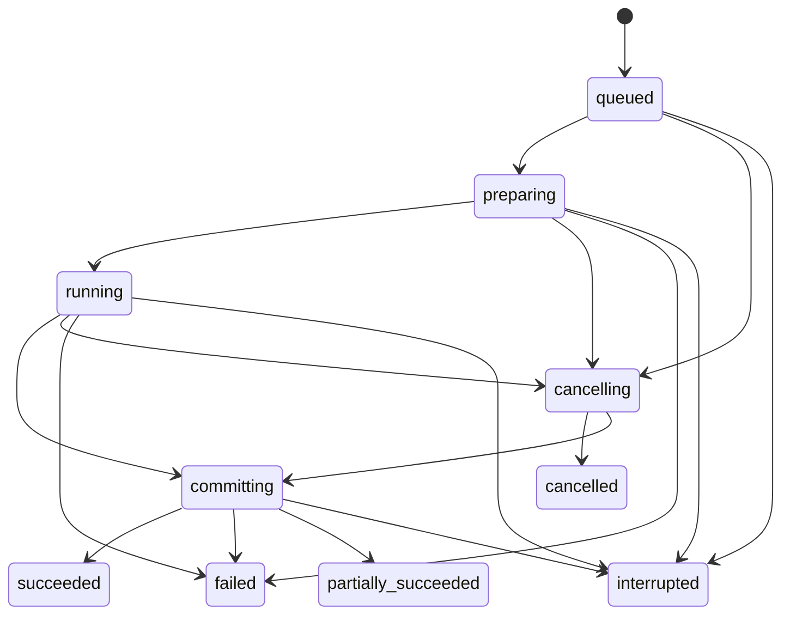

# PlotAgent 任务运行时、取消与崩溃恢复

> 状态：第一轮任务运行时基线已确认  
> 日期：2026-08-05  
> 适用范围：InteractionRun、ExecutionTask、三通道调度、提交边界、取消、版本冲突、崩溃恢复与桌面任务体验  
> 相关文档：[Agent 上下文、模型供应商与数据出境契约](./AGENT-CONTEXT-AND-PROVIDERS.md)、[后端与 Agent 架构](./BACKEND-ARCHITECTURE.md)、[领域契约与 Schema 设计](./DOMAIN-CONTRACTS.md)、[项目存储、项目包与数据导入](./PROJECT-STORAGE.md)、[产品决策基线](./PRODUCT-DECISIONS.md)、[产品需求文档](./PRD.md)

## 1. 两类运行对象

### 1.1 InteractionRun

`InteractionRun` 表示一次模型交互与结构化规划：

- 构建 ContextEnvelope、调用模型并校验唯一 AgentDecision 结果。
- 用户可以停止模型生成；停止只结束当前规划，不代表取消已经存在的本地任务。
- `NeedsInput`、`Unsupported` 和 `NoChange` 都结束当前 InteractionRun；本地 validator 拒绝的 ActionPlan 也以稳定错误结束。
- `NeedsInput` 只在来源对话中展示必要问题，不创建 ExecutionTask，不进入任务中心，也不计入后台任务数。
- 只有通过本地校验并被接受的 `ActionPlan` 才能展开为一个或多个 ExecutionTask。

### 1.2 ExecutionTask

`ExecutionTask` 表示由 Python Core 管理的本地执行单元：

- 固定输入对象与版本、expected versions、Action、输出槽和提交粒度。
- 可被调度、取消、恢复检查和持久化审计。
- 不依赖模型继续在线；模型停止、断网或 InteractionRun 结束不会自动取消已开始的 ExecutionTask。

InteractionRun 与 ExecutionTask 使用不同 ID、状态和 UI。来源关系可以追溯，但不能把“停止生成”与“取消任务”合并成一个控制。

## 2. ExecutionTask 状态机

状态含义：

- `queued`：任务已持久化，等待调度。
- `preparing`：解析固定输入、验证资源和准备隔离工作目录。
- `running`：执行解析、计算、渲染或 Origin 操作。
- `committing`：验证暂存结果并提交正式对象或原子替换文件。
- `succeeded`：全部承诺输出已提交。
- `cancelling`：已收到取消请求，等待安全边界。
- `cancelled`：没有未声明的正式输出；已允许提交的批量完成项由批次对象明确记录。
- `failed`：任务失败且没有达到部分成功契约。
- `partially_succeeded`：批量任务保留部分已完成结果，同时明确失败或取消项。
- `interrupted`：Core、工作进程或 Origin 实例异常结束，任务需要用户检查后决定恢复或重跑。

`committing` 必须短暂且不可取消，避免数据库或文件停在半提交状态。第一轮不提供暂停或继续；界面不显示 `paused`，调度器也不持久化暂停状态。

## 3. 三个执行通道

### 3.1 控制与提交通道

- 运行在 Python Core，负责队列、状态转换、取消 token、SQLite 单写入和事务提交。
- 不承担可隔离的重计算，避免长任务阻塞控制、心跳和取消响应。
- 所有项目数据库写入和正式对象注册都回到该通道顺序执行。

### 3.2 计算通道

- 默认最多使用 2 个隔离工作进程执行解析、分析、Matplotlib 渲染和可隔离的数值任务。
- 检测到内存压力时，新的计算并发下降为 1；已经进入 `committing` 的任务不被抢占。
- 交互预览高于普通后台批次任务。
- 同一图的新预览可以 supersede 尚未开始的旧预览；被替代任务直接结束为 `cancelled` 并记录 superseding task ID。
- 已经开始的正式任务或预览不会仅因出现更新请求而被静默终止。

### 3.3 Origin 通道

- Origin 任务严格串行，只允许一个 PlotAgent 管理的 Origin Worker 操作受控实例。
- 队列与计算通道分离，Origin 阻塞不占用全部普通计算容量。
- 不连接或终止用户自己打开的 Origin 实例。

## 4. 提交粒度

### 4.1 原子任务

以下任务以一个领域事务原子提交：

- 创建单图或修改单图。
- 一次分析。
- 创建一份派生数据。
- 一次多文件导入会话。

多文件导入的任何来源解析或注册失败时，整个导入会话不创建正式 DatasetVersion；临时对象按 [项目存储、项目包与数据导入](./PROJECT-STORAGE.md) 清理。

### 4.2 批量绘图

- 批量绘图按图项暂存和验证，完成项可以成为正式结果。
- 用户取消或部分项目失败时，已完成结果保留，批次对象记录成功、失败、取消和未开始项。
- 最终任务状态为 `cancelled` 或 `partially_succeeded`，不得把不完整批次标记为成功。
- 整条批次命令仍是可审计、可整体撤销的操作记录。

### 4.3 文件导出

PNG、SVG 和 OPJU 每个目标文件分别执行：

1. 写入同目标文件系统上的临时文件。
2. 完成格式、尺寸、内容或 Origin 重新打开验证。
3. 验证通过后原子替换最终路径。
4. 验证或替换失败时保留既有正式文件，并清理未注册临时文件。

多文件导出允许单项失败，但每个正式文件本身必须满足原子提交契约。

## 5. 取消协议

### 5.1 Cooperative cancellation

- 取消请求先把任务置为 `cancelling` 并设置 cooperative cancellation token。
- 解析分块、算法迭代、渲染阶段、文件写入和批次项目之间设置明确安全检查点。
- 安全点负责关闭句柄、结束临时写入并报告已完成单位。
- `committing` 不检查取消 token；提交结束后再响应关闭应用等后续动作。

### 5.2 宽限期与进程终止

- 任务在宽限期内没有到达安全边界时，只终止承载该任务的隔离计算工作进程。
- 不为取消单个任务强制终止 Python Core；Core 保留队列、数据库单写入器和其他任务状态。
- 被终止工作进程的任务按已提交边界进入 `cancelled`、`partially_succeeded` 或 `interrupted`，并由调度器重建干净工作进程。

### 5.3 Origin 取消

- 先请求 Origin Worker 在安全边界停止并退出 PlotAgent 管理实例。
- Origin 无响应时，终止并重建 PlotAgent 管理的 Worker 与受控 Origin 实例。
- 不强杀 Python Core，不影响用户自己打开的 Origin，也不把未验证 OPJU 注册为成功。

## 6. 版本、引用与幂等

- 每个任务创建时固定 DatasetVersion、PlotSpec、AnalysisResult、FigureSpec 等输入引用。
- 写操作携带 `expected_version`；提交时不匹配则返回版本冲突，绝不覆盖较新的修改。
- 冲突结果可以由用户选择基于旧版本形成分支，或使用最新版本重新运行；系统不能静默选择。
- 被 queued、preparing、running、committing 或 cancelling 任务引用的数据和对象禁止删除，资源库必须展示活跃任务依赖。
- 每个输出使用幂等键 `(task_id, action_id, output_slot)`；重放状态事件或恢复检查不得创建重复对象、版本或导出。

## 7. 持久化与崩溃恢复

### 7.1 任务预写

ExecutionTask 进入队列前，Python Core 持久化：

- task ID、项目、来源对话与可选 InteractionRun ID。
- 固定输入引用、expected versions 和 ActionPlan/Action。
- 当前阶段、尝试记录、幂等输出槽和暂存目录。
- 任务类型、提交粒度、调度通道和取消状态。

任务只能在阶段边界写恢复点，不保存算法内部任意栈状态，也不把不完整阶段伪装为可恢复成功。

### 7.2 Core 监督

- Electron Main 监督 Python Core 心跳和进程退出。
- Core 重新启动后，将遗留的 `preparing`、`running`、`committing` 或 `cancelling` 任务标记为 `interrupted`。
- 重新检查 SQLite 事务、暂存目录、不可变对象和正式输出，界面展示可恢复、可重跑或需清理的明确结果。
- 正式导入、分析、绘图、批次和导出任务不自动重试。
- 无副作用的预览与缓存任务可以根据固定输入自动重建，不生成正式版本或导出记录。
- 如果 Core 持续崩溃形成重启循环，Electron 停止自动重启并展示恢复入口、诊断信息和安全退出选项。

## 8. 进度与桌面体验

- 进度使用实际单位：已解析行/总行、已处理文件/总文件、已绘制图/总图、已写入字节或明确阶段。
- 只有已知分母时才显示百分比，不使用随时间增长的虚假进度。
- 任务卡留在来源对话中，显示状态、实际进度、取消入口、结果范围和可执行下一步。
- 项目标题区域显示全局后台 ExecutionTask 数量；NeedsInput 和已结束 InteractionRun 不计入。
- 第一轮不发送 Windows 系统通知；任务结果在应用内呈现。

## 9. 关闭应用

存在活动任务时，关闭应用只提供：

- **等待完成。** 保持应用打开，任务结束后再次关闭。
- **取消并退出。** 对可取消任务发出 cooperative cancellation，等待安全边界与必要提交完成后退出。
- **返回。** 关闭确认框并继续工作。

如果任务处于 `committing`，取消并退出必须等待该短阶段结束，不能中断 SQLite 提交或文件原子替换。退出后仍未完成的任务在下次启动时按 `interrupted` 恢复流程处理。

## 10. 第一轮运行时测试

- InteractionRun 停止生成与 ExecutionTask 取消互不混淆。
- NeedsInput 不创建任务、不占后台计数。
- 全部合法状态转换与非法转换拒绝。
- `committing` 不可取消且不会留下半提交对象。
- 计算并发 2→1 降级、Origin 串行和预览 supersede。
- 单图、导入会话、批量与各导出格式的提交粒度。
- cooperative token、宽限期终止隔离进程和 Origin Worker 重建。
- expected-version 冲突、活跃引用删除保护和幂等输出槽。
- Core 心跳丢失、阶段恢复点、interrupted 标记和崩溃循环停止。
- 实际单位进度、任务来源定位和三选项关闭流程。
